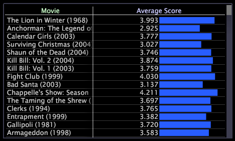

# Tableaux{#tables}

Un tableau peut afficher une ou plusieurs mesures sur une ou plusieurs dimensions de données.

L’exemple suivant montre un tableau dans lequel la Note moyenne pour chaque film est affichée en tant que valeur, mais également représentée par la longueur de sa barre.

