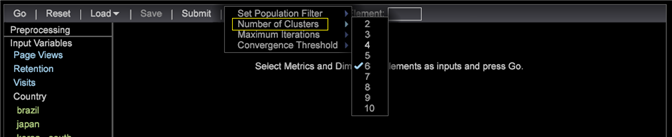

# Création des clusters{#building-clusters}

{{eol}}

Sélectionnez des variables d’entrée, le nombre de grappes et une population cible (si vous le souhaitez) pour définir des grappes dans votre jeu de données.

**Création des clusters**

1. Ouvrez le **[!UICONTROL Cluster Builder]**.

   Cliquez sur **Visualisation** > **Analyses prédictives** > **Clusterisation** > **Créateur de clusters**.

   

1. Sélectionnez des variables d’entrée.

   * Ajoutez des mesures à la variable **[!UICONTROL Input Variables]** en sélectionnant dans la liste **[!UICONTROL Metric]** dans la barre d’outils.

      

   * Ajoutez des éléments de dimension à la variable **[!UICONTROL Input Variables]** en les faisant glisser depuis le tableau d’une Dimension.

      Press **[!UICONTROL Ctrl + Alt]** et faites glisser les éléments de dimension sélectionnés sur le **[!UICONTROL Input Variables]** ou au **[!UICONTROL Element]** dans la barre d’outils.

      
   Par défaut, la mise en grappe est effectuée sur l’ensemble du jeu de données. Toutes les variables d’entrée sont visibles à gauche. **[!UICONTROL Preprocessing]** volet.
1. Utilisez la variable **[!UICONTROL Options]** pour sélectionner le nombre de grappes souhaité.

   

1. Si vous souhaitez regrouper un sous-ensemble de visiteurs dans votre jeu de données, vous pouvez définir un filtre de population.

   

   Commencez par définir le sous-ensemble souhaité à l’aide de sélections dans votre espace de travail ou en utilisant le **[!UICONTROL Filter Editor]**. Une fois que le sous-ensemble souhaité est sélectionné, définissez la population cible dans la variable **[!UICONTROL Options]** . Il est recommandé de donner au groupe ciblé un nom d&#39;identification.

   Le **[!UICONTROL Options]** menu comporte également des paramètres pour contrôler le nombre maximal de passages et le seuil acceptable pour la convergence centrale.

1. Une fois les entrées et les options configurées, cliquez sur le bouton **Aller** pour exécuter la mise en grappe localement ou appuyez sur **[!UICONTROL Submit]** pour envoyer la tâche au serveur Analytics prédictif. Les envois vers le serveur enregistrent la dimension résultante dans le jeu de données une fois la convergence terminée.

   Lors de l’exécution locale, le Créateur de clusters se déplace au cours de quatre étapes de mise en grappe de la canopée, car il définit des centres intelligents en fonction des entrées.

   Une fois que les centres des grappes ne changent plus que le seuil de convergence spécifié, la Dimension de cluster est convergée et le Créateur de grappes affiche des informations supplémentaires sur la pertinence d’une entrée pour chaque grappe.

1. Personnalisez les grappes.

   Un clic droit sur la barre de couleur des statistiques ouvre un menu contextuel qui vous permet de personnaliser les seuils de pertinence et, dans le cas de la répartition des éléments de dimension, de choisir le test qui s’affiche.

   

   Les entrées de mesure fournissent un test en t pour chaque grappe, tandis que les entrées d’élément de dimension fournissent trois tests de distribution (le &quot;chi au carré&quot;, une statistique U d’entropie et la statistique V de Cramer) pour chaque grappe.

   >[!NOTE]
   >
   >Si vous ajoutez ou supprimez des entrées lors de la convergence, le processus sera interrompu jusqu’à ce que vous utilisiez la touche **Aller** encore une fois.

   Après avoir créé des grappes, vous pouvez ouvrir le sélecteur de couleurs pour attribuer des couleurs à différents résultats de distribution.

   

1. Une fois la Dimension de grappe convergée, vous pouvez ajouter des mesures au tableau et effectuer des sélections normalement. Vous pouvez également cliquer avec le bouton droit sur les noms d’éléments (Grappe 1, Grappe 2, etc.) pour ouvrir le menu contextuel afin de les renommer en un élément plus significatif.

   

1. Si vous souhaitez utiliser cette dimension de cluster dans d’autres visualisations, vous pouvez **[!UICONTROL Save]** il est local ou **[!UICONTROL Submit]** au serveur.

Si vous souhaitez réexécuter la convergence ou voir la pertinence des entrées, Cluster Builder peut également charger les dimensions de cluster existantes.

>[!TIP]
>
>Lorsque cette option est sélectionnée, **[!UICONTROL Reset]** libère complètement toutes les variables d’entrée et vous offre une visualisation vierge du créateur de cluster pour définir de nouvelles grappes.
