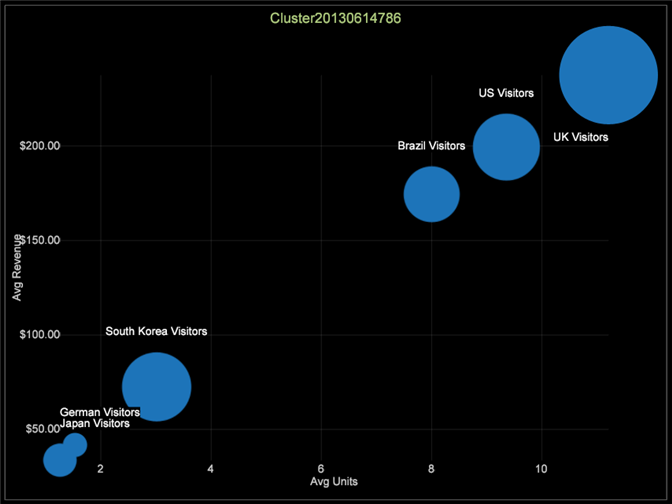
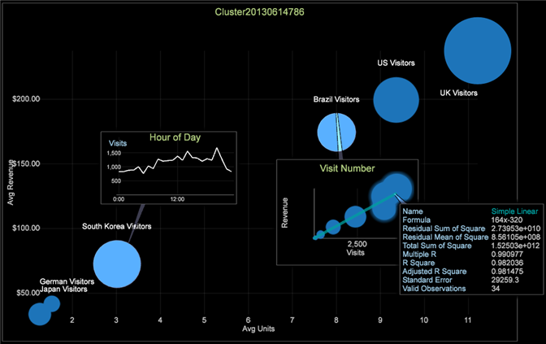

# Exploration des grappes{#exploring-clusters}

Une fois une dimension de cluster créée, vous pouvez l’enregistrer et l’examiner à l’aide de l’Explorateur de clusters.

1. Sélectionnez Visualisation > Analyses prédictives > Mise en grappe > Explorateur de grappes > Clusters. Sélectionnez la dimension de cluster enregistrée que vous souhaitez explorer.

   

1. Cliquez avec le bouton droit sur le titre de la visualisation et cliquez sur Basculer les étiquettes pour les activer. Vous pouvez utiliser ce menu pour modifier la dimension de grappe que vous explorez, modifier la mesure de rayon, ajouter des lignes de tendances et afficher la corrélation.

   

1. Pour modifier la dimension de cluster que vous explorez, modifiez la mesure de rayon, ajoutez des lignes de tendances et affichez la corrélation à l’aide de ce menu.

   

   L’Explorateur de grappes affiche les centres des grappes le long de deux axes d’entrée à la fois. Cela vous permet d&#39;examiner leur séparation dans un espace multidimensionnel.

1. Cliquez avec le bouton droit de la souris sur la grappe pour afficher le menu et choisissez parmi les types de légende : Annotation d’image ou de texte, légende de mesure, tableau, graphique de ligne ou graphique de dispersion.

   

