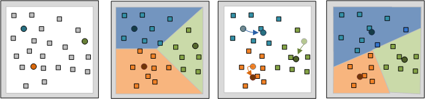

# Clusterisation de visiteur{#visitor-clustering}

La mise en grappe des visiteurs vous permet d’exploiter les caractéristiques des clients pour classer de manière dynamique les visiteurs et générer des jeux de clusters basés sur des entrées de données sélectionnées, ce qui permet d’identifier les groupes présentant des intérêts et des comportements similaires pour l’analyse et le ciblage des clients.

**Processus de mise en grappe**

Le processus de mise en grappe nécessite l’identification des mesures et des éléments de dimension à utiliser comme entrées et vous permet de choisir une population de cibles spécifique pour appliquer ces éléments à la création de grappes spécifiques. Lorsque vous exécutez le processus de mise en grappe, le système utilise les entrées de mesure et de dimension pour déterminer les centres initiaux appropriés pour le nombre spécifié de grappes. Ces centres sont ensuite utilisés comme point de départ pour appliquer l&#39;algorithme K-Means.

* Les centres initiaux sont choisis intelligemment par un laissez-passer de Clustering Canopy.
* Les grappes de données sont créées en associant chaque point de données au centre le plus proche.
* La moyenne de chaque groupe K devient le nouveau centre.
* L’algorithme est répété aux étapes 2 et 3 jusqu’à ce que la convergence soit atteinte. Cela peut prendre plusieurs passes.

Le **[!UICONTROL Maximum Iterations]** dans le menu **[!UICONTROL Options]** permet à l&#39;analyste de spécifier le nombre maximal d&#39;itérations à effectuer par l&#39;algorithme de mise en grappe. La définition de cette option peut accélérer le processus de mise en grappe en fonction du plafond d&#39;itérations maximum, au détriment de la convergence exacte des centres de cluster.

>[!NOTE]
>
>Une fois les grappes définies, la Dimension de grappes peut être enregistrée pour une utilisation identique à toute autre dimension. Il peut également être chargé dans l&#39;Explorateur de clusters pour examiner la séparation des centres de cluster.

Dans le Créateur de clusters, vous pouvez sélectionner **[!UICONTROL Options]** > **[!UICONTROL Algorithm]** pour sélectionner des algorithmes lors de la définition de grappes. Actuellement, il existe 3 algorithmes pris en charge :

* KMeans
* Keans`++`
* Optimisation des attentes

Il existe deux façons d’exécuter le processus de mise en grappe :

* Méthode 1 - Cliquez sur **[!UICONTROL Go]** dans la fenêtre de visualisation du cluster.
* Méthode 2 - Cliquez sur **[!UICONTROL Submit]** dans la fenêtre de visualisation du cluster, qui envoie directement la tâche de mise en grappe au serveur. Vous pouvez suivre la progression de l’opération via l’option &quot;Statut détaillé de la Requête&quot;.

L’algorithme est soumis aux restrictions suivantes :

1. Si vous utilisez la méthode 1, vous pouvez sélectionner n’importe quel algorithme de mise en grappe pris en charge.
1. Si vous utilisez la méthode 2, vous pouvez sélectionner keans ou keans++. L’option Maximisation de l’attente n’est pas disponible.

>[!NOTE]
>
>Dans le fichier [!DNL DPU.cfg], la valeur de &quot;Requête, Memory Limit&quot; est définie sur 500 Mo par défaut. Cette valeur doit être augmentée lors de l’exécution de plusieurs tâches de mise en grappe. Par exemple, si vous exécutez 5 tâches de mise en grappe en parallèle, augmentez cette valeur à 1 Go. Il n&#39;existe aucun moyen d&#39;annuler la tâche de mise en grappe sans redémarrer le serveur.

**Recommandations**

Le nombre d&#39;itérations (nombre de fois où les données sont analysées) et le seuil de convergence que vous configurez affectent grossièrement les performances de la mise en grappe. Le tableau suivant fournit des instructions plus générales que vous pouvez suivre :

| Nombre de grappes | Algorithme | Itérations | Seuil de convergence | Normalisation |
|---|---|---|---|---|
| 6 | Keans | 25 500 | 1e-3 | Min-Max |
| 6 | Keans | 25 500 | 1e-6 | Min-Max |
| 6 | Keans++ | 50 | 1e-6 | Min-Max |
