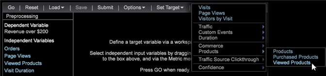

# Configuration d’un score de propension{#setting-up-propensity-scoring}

Pour utiliser la visualisation Score de propension, procédez comme suit.

1. Ouvrez un nouvel espace de travail et cliquez sur **[!UICONTROL Add]** > **[!UICONTROL Visualization]** > **[!UICONTROL Predictive Analytics]** > **[!UICONTROL Scoring]** > **[!UICONTROL Propensity Score]**.

   

1. Définissez la **[!UICONTROL Target]** (variable dépendante).

   Définissez la variable dépendante en sélectionnant :

* **Éléments** de Dimension : Cliquez avec le bouton droit de la souris dans l’espace de travail et sélectionnez  **[!UICONTROL Table]**. Sélectionnez ensuite un élément de Dimension comme variable dépendante.

   OR

* **[!UICONTROL Filter Editor]**. Cliquez sur **[!UICONTROL Add]** > **[!UICONTROL Visualization]** > **[!UICONTROL Filter Editor]** pour ouvrir la visualisation de l’éditeur de filtres.

   

   Après avoir sélectionné un élément de Dimension ou Filtrer comme variable dépendante, cliquez sur **[!UICONTROL Set Target]**, saisissez un nom pour décrire la variable dépendante. Cliquez ensuite sur **[!UICONTROL OK]** (et assurez-vous que la zone de filtre est mise en surbrillance) pour définir la Cible.

   

   Le nom que vous donnez à la cible est la variable dépendante qui apparaîtra dans le volet de gauche.
1. Ajouter des variables indépendantes.

   Ajoutez les variables indépendantes à l’aide de Mesures ou d’éléments de Dimension.

   

* **Mesures**. Dans la barre d’outils Score de propension, sélectionnez une mesure dans le menu **[!UICONTROL Metrics]**.

* **Éléments** de Dimension : Cliquez avec le bouton droit de la souris dans l’espace de travail et sélectionnez  **[!UICONTROL Table]**. Sélectionnez un ou plusieurs éléments de Dimension et faites-les glisser dans la colonne de gauche sous **[!UICONTROL Independent Variables]** ou dans la zone **[!UICONTROL Element]** à l&#39;aide des touches `<Ctrl>` + `<Alt>`.

1. Définir **[!UICONTROL Training Filter]**. Vous pouvez définir l’ensemble de visiteurs à marquer en cliquant sur **[!UICONTROL Options]** > **[!UICONTROL Set Training Filter]** dans la barre d’outils Score de propension. Vous obtiendrez ainsi un sous-ensemble de données créées en utilisant uniquement les visiteurs que vous souhaitez marquer. Par exemple, les visiteurs du dernier mois, les visiteurs résidant en Australie ou les visiteurs qui ont consulté des produits spécifiques.

   Le filtre par défaut est **[!UICONTROL Train on Everyone]**, mais vous pouvez le modifier en activant **[!UICONTROL Dimension Elements]** dans un tableau ou en créant un filtre à l&#39;aide de **[!UICONTROL Filter Editor]**.

   Après avoir sélectionné un élément de Dimension ou créé un filtre et activé, cliquez sur **Options** > **Définir le filtre de formation**, saisissez un nom pour décrire le filtre, puis cliquez sur **[!UICONTROL OK]**.
1. Une fois que vous avez identifié toutes vos entrées, appuyez sur **[!UICONTROL Go]**.

   

   Le processus de notation commence par transmettre les données à plusieurs reprises. Il affiche ensuite les résultats sous forme de graphiques à barres sur une ligne de pourcentage.
1. Enregistrer le score de propension.

   A compter de la version 6.1, vous disposez désormais d’une option lors de l’utilisation de la commande Enregistrer la score de propension :

* Dimension
* Dimension et mesure

   Vous pouvez finir avec deux fichiers enregistrés, à la fois une dimension et une mesure définie.

   >[!NOTE]
   >
   >Si vous envoyez le score de propension pour traitement, vous obtenez uniquement une dimension.

   La mesure dérivée est la mesure de score moyen associée.
1. Vérifiez la précision.

   Le système affiche **[!UICONTROL Model Complete]** et génère un modèle de notation une fois le processus terminé.

   Cliquez avec le bouton droit sur **[!UICONTROL Model Complete]** pour identifier la précision du modèle de notation tel que défini par le système. Les valeurs comprises entre 0 % et 100 % identifieront la probabilité que les visiteurs correspondent à la variable **[!UICONTROL Target]**.

   La matrice de confusion présente quatre valeurs en fonction de la combinaison des valeurs Positif réel (AP), Négatif réel (AN), Positif prédit (PP) et Négatif prédit (PN). Ces chiffres sont obtenus en appliquant le modèle de notation obtenu aux données de test retenues à 20 %, dont nous connaissons la véritable réponse. Si le score est supérieur à 50 %, il est prédit comme un cas positif (correspondant au événement défini).

   

<table id="table_154BDD6D294C4ED1B8C15EC33B74B199"> 
 <tbody> 
  <tr> 
   <td colname="col1"><b> Précision</b> </td> 
   <td colname="col2"> Indique la précision du modèle en identifiant les prédictions correctes par rapport à toutes les prédictions. 
(TP + TN)/(TP + FP + TN + FN) 
 </td> 
  </tr> 
  <tr> 
   <td colname="col1"><b> Rappel</b> </td> 
   <td colname="col2"> Identifie la possibilité de réidentifier le modèle de notation. 
<b>TP / (TP + FN)</b> 
 </td> 
  </tr> 
  <tr> 
   <td colname="col1"><b> Précision</b> </td> 
   <td colname="col2">Identifie le niveau d’incohérence. 
TP / (TP + FP) 
 </td> 
  </tr> 
 </tbody> 
</table>

1. Ouvrez un [Diagramme d&#39;effet élévateur ou de gain](../../../../home/c-get-started/c-analysis-vis/c-visitor-propensity/c-propensity-gain-lift-chart.md#concept-0d049f6baf534f7fb97f271843ba6c4a) ou la [Visionneuse de modèles](../../../../home/c-get-started/c-analysis-vis/c-visitor-propensity/c-propensity-model-viewer.md#concept-9f2593a8218140b7bd132a4c74e159f9).

   Cliquez avec le bouton droit sur la visualisation **Modèle complet** et sélectionnez **[!UICONTROL Lift Chart]**, **[!UICONTROL Gain Chart]** ou **[!UICONTROL Model Viewer.]**.
