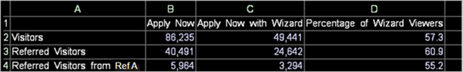

# Expressions des feuilles de calcul{#worksheet-expressions}

Informations conceptuelles sur les expressions de la feuille de calcul et l’utilisation des références de cellule.

La feuille de calcul suivante fournit des détails sur les visiteurs qui vue la page Assistant de demande de service financier fournie sur le formulaire de demande de service financier en ligne du site Web d’une banque.

* La colonne A présente une liste des catégories des visiteurs évalués : visiteurs, visiteurs référents et visiteurs de l&#39;Parrain A.
* La colonne B indique le nombre de visiteurs dans chaque catégorie qui ont consulté la page Appliquer maintenant.
* La colonne C affiche les visiteurs qui ont consulté les pages Appliquer maintenant et Assistant Application.
* La colonne D contient les pourcentages des visionneuses Appliquer maintenant dans les trois catégories qui ont également consulté la page Assistant Application.

La feuille de calcul montre qu&#39;environ 55 % des visiteurs provenant du Parrain A qui a affiché la page Appliquer maintenant ont également consulté la page Assistant Application.

Le tableau suivant fournit des exemples de formules pour la feuille de calcul de l&#39;exemple précédent :

<table id="table_0F5EFDB58040465AB599E6BE93324822"> 
 <thead> 
  <tr> 
   <th colname="col1" class="entry"> Cellule de feuille de calcul </th> 
   <th colname="col2" class="entry"> Formule </th> 
  </tr> 
 </thead>
 <tbody> 
  <tr> 
   <td colname="col1"> 
B2 
 
Visiteurs qui ont consulté la page Appliquer maintenant 
 </td> 
   <td colname="col2"> 
 =Visiteur[Page="/applynow/default.asp"] 
 </td> 
  </tr> 
  <tr> 
   <td colname="col1"> 
B3 
 
Visiteurs référents qui ont consulté la page Demander ma carte maintenant 
 </td> 
   <td colname="col2"> 
 =Visiteurs_référencés[Page="/applynow/default.asp"] 
 </td> 
  </tr> 
  <tr> 
   <td colname="col1"> 
B4 
 
Visiteurs référencés du Parrain A qui ont consulté la page Demander ma carte maintenant 
 </td> 
   <td colname="col2"> 
  =Visiteurs_référencés[Page="/applynow/default.asp"   
 
 ET  Parrain="Ref A"] 
 </td> 
  </tr> 
  <tr> 
   <td colname="col1"> 
C2 
 
Visiteurs qui ont consulté la page Appliquer maintenant et la page Assistant Application 
 </td> 
   <td colname="col2"> 
  =Visiteur[Page="/applynow/default.asp"   
 
 ET  Page="/applynow/appwizard.asp"] 
 </td> 
  </tr> 
  <tr> 
   <td colname="col1"> 
C3 
 
Visiteurs référents qui ont consulté la page Appliquer maintenant et la page Assistant Application 
 </td> 
   <td colname="col2"> 
  =Visiteurs_référencés[Page="/applynow/default.asp"   
 
 ET  Page="/applynow/appwizard.asp"] 
 </td> 
  </tr> 
  <tr> 
   <td colname="col1"> 
C4 
 
Visiteurs référencés du Parrain A qui ont consulté la page Appliquer maintenant et la page Assistant Application 
 </td> 
   <td colname="col2"> 
  =Visiteurs_référencés[Page="/applynow/default.asp" 
 
 ET  Page="/applynow/appwizard.asp" 
 
 ET  Parrain="Ref A"] 
 </td> 
  </tr> 
  <tr> 
   <td colname="col1"> 
D2 
 
Pourcentage de Visiteurs qui ont consulté la page Demander ma carte maintenant et la page Assistant d'application 
 </td> 
   <td colname="col2"> 
 =C2/B2*100 
 </td> 
  </tr> 
  <tr> 
   <td colname="col1"> 
D3 
 
Pourcentage de Visiteurs référents qui ont consulté la page Appliquer maintenant et la page Assistant Application 
 </td> 
   <td colname="col2"> 
 =C3/B3*100 
 </td> 
  </tr> 
  <tr> 
   <td colname="col1"> 
D4 
 
Pourcentage de Visiteurs référents du Parrain A qui ont consulté la page Appliquer maintenant et la page Assistant Application 
 </td> 
   <td colname="col2"> 
 =C4/B4*100 
 </td> 
  </tr> 
 </tbody> 
</table>

Comme pour les autres visualisations, les feuilles de calcul sont automatiquement mises à jour lorsque vous effectuez une sélection dans une autre visualisation de l’espace de travail. Pour plus d’informations sur les sélections, voir [Sélections dans Visualisations](../../../../home/c-get-started/c-vis/c-sel-vis/c-sel-vis.md#concept-012870ec22c7476e9afbf3b8b2515746).

Dans l’exemple de données Web suivant, plusieurs jours de données de session ont été sélectionnés dans la visualisation Sessions par jour. La feuille de calcul montre qu&#39;au cours de la période sélectionnée, environ 69 % des visiteurs du Parrain A qui ont consulté la page Appliquer maintenant ont également consulté la page Assistant Application. Sans cette sélection (comme indiqué dans l&#39;exemple ci-dessus), environ 55 % des visiteurs du Parrain A ont consulté la page Appliquer maintenant ainsi que la page Assistant Application.

## Utilisation des références de cellule {#section-0004e315c9c94d359b1a8a39794ba555}

Vous pouvez remplacer n’importe quelle chaîne, seule ou dans une autre expression de la feuille de calcul, par une référence de cellule.

* **Référence de cellule simple :** La cellule A2 contient les Visiteurs de texte, qui sont utilisés comme en-tête. La cellule B2 contient [!DNL eval(A1)], qui renvoie [!DNL =Visitors].

* **Référence de cellule de filtre :** la cellule A5 contient la date d’hier. La cellule B5 contient [ ! DNL Visiteurs[ Day=A5 ]], qui évalue le nombre de Visiteurs hier.

* **Référence de cellule concaténée :** la cellule A5 contient la date du jour et la cellule A6 contient la période d’une heure comprise entre 08:00 et 08:59. La cellule B6 contient [ ! DNL Visiteurs[ Heure=A5+&quot;&quot;+A6 ]], qui évalue le nombre de Visiteurs aujourd&#39;hui entre 8 h et 9 h.
