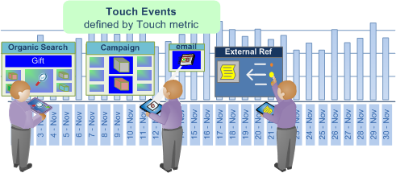
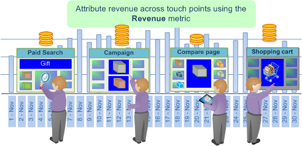
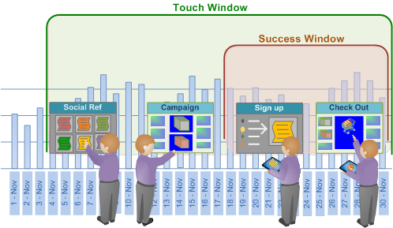

# Attribution de l’ajustement optimal{#best-fit-attribution}

{{eol}}

L’attribution de l’ajustement optimal est une approche d’apprentissage automatique permettant d’affecter des valeurs d’attribution sur les différents canaux d’un événement de conversion réussi. Data Workbench évalue automatiquement les contributions à la réussite sur une fenêtre de temps par canal, puis crée un modèle d’attribution basé sur les modèles d’interaction réels de vos clients.

**[!UICONTROL Best Fit Attribution]** vous permet de comparer les interactions, ou les touches, qui ont contribué à une vente réussie, à l’inscription par e-mail ou à d’autres indicateurs de performances. L’analyse d’attribution attribue automatiquement du poids aux touches les plus importantes et fournit un modèle d’attribution par canal en fonction de vos données et en phase avec votre marché et vos protocoles internes.

Par exemple, si un client visite votre site par le biais d’une recherche organique, s’engage dans une campagne, puis s’inscrit à un e-mail, [Attribution basée sur des règles](/help/home/c-get-started/c-attribution-profiles/c-rules-attrib/c-rules-attrib.md) identifierait la Première touche ou la Dernière touche ou distribuerait uniformément l’attribution de succès sur tous les points de contact à l’aide de modèles d’attribution prédéfinis. Lorsque l’attribution basée sur des règles est définie par l’utilisateur, les attributs Ajuster définissent les valeurs par le biais d’un algorithme en calculant la probabilité d’une conversion en fonction des points de contact observés.

>[!NOTE]
>
>Pour exécuter **Attribution de l’ajustement optimal** dans Data Workbench, vous devez mettre à jour le certificat de votre serveur ( [!DNL .pem file]) pour prendre en charge Adobe Analytics Premium. Vous devez également ajouter **Premium** à votre [!DNL Profile.cfg] pour le client et recevez de nouveaux certificats du service à la clientèle Adobe pour le serveur et le serveur de rapports.

## Configuration de base {#section-db597eaee462412ea7280d1426366c61}

Voir [Création d’une attribution d’ajustement optimale](../../../../home/c-get-started/c-attribution-profiles/c-attrib-algorithmic/c-attrib-building.md#concept-fede6fc4f592475fa8b351b1765a522d) pour obtenir des instructions détaillées.

**Définition de la mesure de succès**
Définissez une mesure représentant un événement de succès.

La mesure de succès est souvent *Commandes*, mais vous pouvez utiliser Data Workbench pour définir une mesure de succès très complexe conjointement avec la fenêtre de succès.

**Définition de la mesure tactile** (facultatif)

Identifiez les interactions dont le suivi a débouché sur une conversion réussie, puis définissez la mesure tactile sur laquelle l’attribution sera calculée.

>[!NOTE]
>
>La définition d’une mesure tactile n’est nécessaire que si vous l’utilisez pour dériver les mesures de canal des éléments de Dimension par glisser-déposer au lieu d’utiliser les mesures de canal existantes.

Si aucune mesure n’est définie pour les campagnes ou les canaux, mais que les dimensions représentent les canaux, l’Attribution la plus adaptée peut les créer automatiquement en fonction de la mesure tactile.

Par exemple, avec la mesure tactile définie comme *Accès*, et à partir d’une dimension appelée *Type de média* avec les éléments inclus *Email*, *Communiqué de presse*, *Imprimer la publicité*, et *Réseaux sociaux*, la visualisation génère les mesures de canal du formulaire. [!DNL Hits where Media Type = Email] lorsque vous faites glisser et déposez le ou les éléments sur la visualisation.

La mesure tactile détermine ensuite l’attribution des scores d’attribution afin d’identifier les interactions marketing considérées comme influentes pour la réussite, ce qui vous permet de qualifier les touches marketing pour la population identifiée dans la fenêtre de succès. Vous pouvez définir des mesures telles que *Pages vues* ou *Accès* ou utiliser des mesures tactiles personnalisées spécifiques à vos besoins.

Dans de nombreux cas, la fenêtre tactile doit inclure la fenêtre de succès pour évaluer un long délai dans le cycle de vente.

**Définissez la mesure Recettes.**

Vous pouvez choisir d’identifier les recettes sur plusieurs points de contact en définissant une mesure de recettes appropriée. Si spécifié, le modèle affiche la distribution des recettes sur les canaux d’entrée. 

Vous pouvez définir une mesure des recettes avec les types de données de devise pour affecter le succès à tous les principaux points de contact définis et analysés. Cette mesure ventile les recettes de vente finales et les alloue en fonction de la pondération allouée par l’algorithme.

**Définissez les fenêtres de succès et de contact.**

La fenêtre Réussite définit la population à examiner et la période des événements réussis, ce qui vous permet d’indiquer les fenêtres temporelles et l’étendue de la population à prendre en compte pour l’analyse au moyen d’une sélection d’espace de travail. Le **Succès** définit la période et la population à examiner pour les événements de succès. Le **Touche** indique l’historique de la période à examiner pour les interactions de canal menant aux événements de succès.

>[!NOTE]
>
>La définition d’une mesure tactile n’est nécessaire que si vous tentez de créer automatiquement des mesures de succès en faisant glisser des éléments de dimension sur la visualisation.

Vous pouvez définir un jour, un mois, une année ou toute période disponible pour limiter votre évaluation du succès et les événements tactiles pendant le cycle de vente ou pour des audiences spécifiques qui accèdent à votre site. La création de fenêtres pour limiter l’attribution vous permet de concentrer votre analyse sur les périodes appropriées à vos besoins spécifiques.

Dans de nombreux cas, vous souhaiterez que la fenêtre tactile inclut la fenêtre de succès afin que vous puissiez étendre votre analyse sur un long délai en fonction de votre fenêtre de vente. Vous pouvez également effectuer un suivi et analyser les modifications séparément de l’événement de succès.

**Sélectionnez les Canaux.**

Lorsque vous entrez dans un canal, vous avez deux possibilités.

**Ajout de la mesure tactile et des éléments de Dimension aux canaux**

Dans de nombreux cas, vous souhaiterez ventiler les principaux points de contact par éléments de dimension pour définir des canaux spécifiques. En fonction des valeurs d’élément, l’option Ajuster sélectionne automatiquement les plus performants et les classe en fonction du pourcentage, puis les affiche dans une visualisation sous forme de graphique.

Un modèle d’attribution sera créé en fonction des visiteurs qui ont interagi pendant votre fenêtre de succès et en examinant les écrans tactiles du canal pendant la fenêtre tactile qui ont généré ou non un événement réussi.

## Ventilation par canal {#section-a30592b84bc84f57bd2b988824e852d4}

Deux options s’offrent à vous lors de la saisie de canaux :

* Ajouter un **Mesure tactile** puis ajoutez **Éléments de Dimension** pour les canaux.

   **ou**

* Créez des mesures qui filtrent les éléments de canal que vous souhaitez évaluer.

**Option 1 : Ajout d’une mesure tactile et d’éléments de Dimension pour les canaux**.

C&#39;est l&#39;approche la plus facile. L’attribution adéquate crée automatiquement les mesures à évaluer pour l’attribution. Dans l’exemple ci-dessous, la mesure tactile est ***Accès*** et les canaux sont les suivants : ***Afficher les campagnes***, ***Campagnes par e-mail***, et ***Campagnes SEM***.

À l’aide de cette méthode, l’option Attribution adéquate crée une mesure en arrière-plan pour évaluer l’attribution entre les canaux (mais vous ne voyez jamais la mesure générée automatiquement et elles ne sont pas enregistrées). Dans l’exemple ci-dessous, trois mesures sont créées pour lesquelles les accès sont filtrés pour chacun des trois canaux (par exemple, *Afficher les campagnes*, *Campagnes par e-mail*, et *Campagnes SEM*). Il s’agit du plus facile, car vous laissez la fonction d’attribution d’ajustement créer les mesures pour vous.

**Option 2 : Création d’une mesure**.

Dans la seconde option, vous créez et enregistrez les mesures pour les canaux que vous souhaitez évaluer en filtrant un canal spécifique. Vous trouverez ci-dessous un exemple d’une telle mesure.

Ensuite, au lieu de saisir une mesure tactile et des éléments de Dimension pour les canaux, vous pouvez cliquer sur la barre de menus dans la visualisation et sélectionner **Entrées** > **Ajouter un canal** puis sélectionnez les mesures que vous avez créées.

Voir l’exemple de la deuxième méthode ci-dessous. Vous pouvez constater que les résultats des deux options sont identiques.
