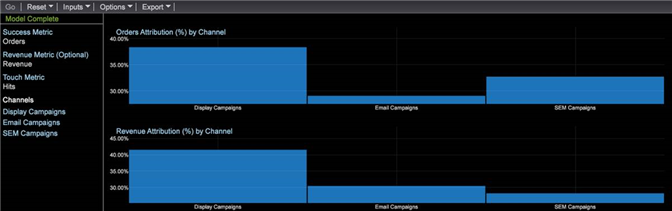

# Attribution de l’ajustement optimal{#best-fit-attribution}

L’attribution adéquate est une approche d’apprentissage automatique permettant d’attribuer des valeurs d’attribution sur les différents canaux d’un événement de conversion réussi. Les outils de données évaluent automatiquement les contributions à la réussite sur une fenêtre de temps par canal, puis créent un modèle d’attribution basé sur les modèles d’interaction réels de vos clients.

**[!UICONTROL Best Fit Attribution]** vous permet de comparer les interactions, ou les touches, qui ont contribué à une vente réussie, à l’inscription par courrier électronique ou à d’autres indicateurs de performances. L’analyse d’attribution attribue automatiquement du poids aux touches les plus importantes et fournit un modèle d’attribution par canal basé sur vos données et adapté à votre marché et à vos protocoles internes.

Par exemple, si un client visite votre site par le biais d’une recherche organique, s’engage dans une campagne, puis s’abonne à un courriel, l’attribution [basée sur des](/help/home/c-get-started/c-attribution-profiles/c-rules-attrib/c-rules-attrib.md) règles identifie la première ou dernière touche ou distribue uniformément l’attribution de succès à tous les points de contact à l’aide de modèles d’attribution prédéfinis. Lorsque l’attribution basée sur des règles est définie par l’utilisateur, les attributs Ajuster le mieux définissent les valeurs par le biais d’un algorithme en calculant la probabilité d’une conversion en fonction des points de contact observés.

>[!NOTE]
>
>Pour exécuter **l’attribution** adaptée dans les Outils de données, vous devez mettre à jour votre certificat de serveur ( [!DNL .pem file]) afin de prendre en charge Adobe Analytics Premium. Vous devez également ajouter **Premium** à votre profil personnalisé [!DNL Profile.cfg] pour le client et recevoir de nouveaux certificats d’Adobe ClientCare pour Server et Report Server.

## Configuration de base {#section-db597eaee462412ea7280d1426366c61}

Voir [Création d’une attribution](../../../../home/c-get-started/c-attribution-profiles/c-attrib-algorithmic/c-attrib-building.md#concept-fede6fc4f592475fa8b351b1765a522d) adaptée pour obtenir des instructions étape par étape.

**Définir la mesure** de réussite Définissez une mesure représentant un événement de réussite.

La mesure de réussite est souvent *des commandes*, bien que vous puissiez tirer parti des outils de données pour définir une mesure de réussite très complexe conjointement avec la fenêtre de réussite.

**Définition de la mesure** tactile (facultatif)

Identifiez les interactions pour suivre celles qui ont abouti à une conversion réussie, puis définissez la mesure Touch sur laquelle l’attribution sera calculée.

>[!NOTE]
>
>La définition d’une mesure tactile n’est requise que si vous l’utilisez pour dériver les mesures de canal des éléments de dimension par glisser-déposer au lieu des mesures de canal existantes.

Si aucune mesure n’est définie pour les campagnes ou les canaux, mais que les dimensions représentent les canaux, l’Attribution adéquate peut les créer automatiquement en fonction de la mesure Tactile.

Par exemple, avec la mesure tactile définie comme *Accès* et avec une dimension appelée Type *de* média avec des éléments tels que *Courriel*, Communiqué de *presse, Imprimer l’annonce et les de médias sociaux, la visualisation génère des mesures Canal du de formulaire lorsque vous faites glisser et déposez les éléments sur la visualisation.*****[!DNL Hits where Media Type = Email]

La mesure Tactile détermine ensuite l’attribution des scores d’attribution afin d’identifier les interactions marketing considérées comme influentes pour la réussite, ce qui vous permet de qualifier les touches marketing pour la population identifiée dans la fenêtre Réussite. Vous pouvez définir des mesures telles que *Pages vues* ou *Accès*, ou utiliser des mesures tactiles personnalisées spécifiques à vos besoins.

Dans la plupart des cas, la fenêtre Touche doit inclure la fenêtre Réussite pour évaluer un long délai d&#39;avance dans le cycle de ventes.

**Définissez la mesure Recettes.**

Vous pouvez choisir d’identifier les recettes sur plusieurs points de contact en définissant une mesure de recettes appropriée. Le cas échéant, le modèle affiche la répartition des recettes sur les canaux d’entrée. 

Vous pouvez définir une mesure des recettes avec des types de données de devise afin d’affecter la réussite à tous les points de contact principaux définis et analysés. Cette mesure ventile les recettes de vente finales et les répartit en fonction de la pondération allouée par l’algorithme.

**Définissez les fenêtres de réussite et de contact.**

La fenêtre Réussite définit la population à examiner et la période pour les événements réussis, ce qui vous permet d’indiquer les fenêtres de temps et d’étendue de population à prendre en compte pour l’analyse par le biais d’une sélection d’espace de travail. La fenêtre **Réussite** définit la période et la population à examiner pour les événements de réussite. La fenêtre **tactile** spécifie la période historique à examiner pour les interactions des canaux menant aux événements de réussite.

>[!NOTE]
>
>La définition d’une mesure tactile n’est requise que si vous tentez de créer automatiquement des mesures de réussite en faisant glisser des éléments de dimension sur la visualisation.

Vous pouvez définir un jour, un mois, une année ou toute autre période disponible pour limiter votre évaluation des événements de réussite et de contact pendant le cycle de ventes ou pour des audiences spécifiques sur votre site. La création de fenêtres pour limiter l’attribution vous permet de concentrer votre analyse sur les périodes appropriées pour répondre à vos besoins spécifiques.

Dans de nombreux cas, vous souhaiterez que la fenêtre Touche inclue la fenêtre Réussite pour vous permettre d&#39;étendre votre analyse sur un long délai en fonction de votre fenêtre de ventes. Vous pouvez également effectuer un suivi et analyser les touches séparément de l’événement de réussite.

**Sélectionnez les canaux.**

Lorsque vous saisissez des canaux, vous avez deux choix.

**Ajouter la mesure tactile et ajouter des éléments de dimension aux canaux**

Dans de nombreux cas, vous souhaitez ventiler les points de contact principaux par éléments de dimension pour définir des canaux spécifiques. En fonction des valeurs d’élément, l’option Attribution adéquate sélectionne automatiquement les meilleurs résultats et les classe en fonction du pourcentage et les affiche dans une visualisation graphique.

Un modèle d’attribution sera créé en s’appuyant sur les visiteurs qui ont interagi pendant votre fenêtre de réussite et en examinant les contacts du canal pendant la fenêtre de contact qui ont eu ou n’ont pas abouti à un événement de réussite.

## Ventilation par canaux {#section-a30592b84bc84f57bd2b988824e852d4}

Lorsque vous saisissez des canaux, vous avez deux options :

* Ajoutez une mesure **** tactile, puis ajoutez des éléments **de** dimension pour les canaux.

   **ou**

* Créez des mesures qui filtrent les éléments de canal que vous souhaitez évaluer.

**Option 1 : Ajoutez une mesure tactile et ajoutez des éléments de dimension pour les canaux**.

C&#39;est l&#39;approche la plus facile. L’attribution adéquate crée automatiquement les mesures à évaluer pour l’attribution. Dans l’exemple ci-dessous, la mesure tactile est ***Accès*** et les canaux sont : ***Afficher les campagnes***, les campagnes par ***courriel et les campagnes********* MMR.

Cette méthode permet de créer une mesure en arrière-plan pour évaluer l’attribution sur les canaux (mais la mesure générée automatiquement n’est jamais visible et elle n’est pas enregistrée). Dans l’exemple ci-dessous, trois mesures sont créées pour lesquelles les accès sont filtrés pour chacun des trois canaux (par exemple, Campagnes *d’affichage*, Campagnes *par* courriel et Campagnes ** MMR). C’est le plus facile car vous laissez l’Attribution Ajuster le mieux créer les mesures pour vous.

**Option 2 : Création d’une mesure**.

Dans la seconde option, vous créez et enregistrez les mesures pour les canaux que vous souhaitez évaluer en filtrant un canal spécifique. Vous trouverez ci-dessous un exemple d’une telle mesure.

Ensuite, au lieu de saisir une mesure tactile et des éléments de dimension pour les canaux, vous pouvez cliquer sur la barre de menus dans la visualisation et sélectionner **Entrées** > **Ajouter un canal** , puis sélectionner les mesures que vous avez créées.

Voir l’exemple de la deuxième méthode ci-dessous. Vous pouvez voir que les résultats des deux options sont identiques.
