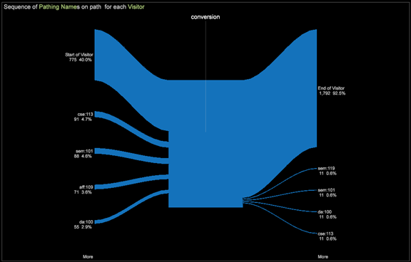

# Modèles d’attribution{#attribution-models}

Sept modèles d’attribution différents sont fournis à utiliser avec le profil d’attribution pour illustrer et quantifier le parcours marketing client.

**Premier et dernier** **modèle**

Les premiers modèles d’attribution sont les touches traditionnelles **Première** et **Dernière** . Comprendre la première étape de la conversion d’une vente ou de la dernière touche avant de retirer et d’acheter un produit permet de comprendre les types de campagne (pour la sensibilisation, la Première touche et pour l’appel à l’action, la Dernière touche).

**Même** **modèle**

La vue de l’engagement marketing est élargie avec l’introduction de **l’option &quot;Même**&quot;. Chaque interaction marketing éligible reçoit une part égale de la commande suivante et des recettes générées par la conversion.

**Starter, Player et Closer****model**

Et au-delà d&#39;une allocation égale, le modèle **Starter, Player et Closer** fournit un modèle de pondération basé sur la position avec une pondération ajustable. Les pondérations peuvent être explorées lors de l’analyse.

Prenons l’exemple suivant : Le lanceur (ou le premier) obtient 30 pour cent des recettes converties, le plus proche (ou le dernier) 30 pour cent, et tous les joueurs (ceux qui sont intermédiaires) partagent une part égale des 40 pour cent restants.

>[!NOTE]
>
>Il est assez courant de réaffecter l’attribution aux interactions marketing en fonction des recettes ou de l’occurrence de la commande. Ces deux modèles suivants attribuent des caractéristiques différentes aux interactions marketing afin d’exposer d’autres dynamiques de réussite.

**Modèle de jonction**

Le modèle Adjacence offre une visibilité sur la position marketing en dehors de la conversion, répondant à la question suivante : Le canal marketing est-il généralement éloigné de la réussite des 1`st` (plus proche), 5`th`ou 10`th` interactions de canal marketing ?

**Modèle de latence**

Le modèle de **latence** permet de décrire le délai entre l’interaction avec le canal marketing et l’occurrence de succès. Cela s’avère utile pour présenter les campagnes de sensibilisation par rapport aux campagnes de type appel à l’action et pour savoir quels leviers l’entreprise peut tirer pour obtenir une réponse plus rapide d’un public cible. (Une valeur de zéro (0) jour signifie que l’interaction marketing s’est produite le même jour que la réussite.)

**Modèle de cheminement**

Le modèle de cheminement propose différentes approches pour explorer l’engagement du client envers le marketing et sa conversion réussie, établissant les relations entre les interactions marketing dans le parcours du client. Explorez les mappages de processus pour comprendre les flux de haut niveau entre la prise en charge des canaux marketing et la réussite. Evaluez les interactions marketing séquentielles directes avec le navigateur de chemins.

Visualisation du navigateur de chemins

**Visualisation 2D de Process Map**

**Visualisation de la carte des processus 3D**

