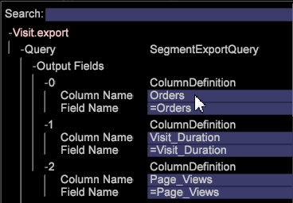

# Exportation de segments avec des en-têtes personnalisés{#segment-export-with-custom-headers}

Créez des en-têtes d’exportation de colonne personnalisés pour vos fichiers d’exportation de segments afin d’ajouter des descriptions faciles à comprendre pour les segments exportés. Cette fonction d’exportation vous permet également de générer des fichiers au format TSV et CSV.

De nouvelles fonctionnalités ont été ajoutées à l’exportation de segments, y compris la possibilité d’exporter avec un en-tête, ou aux formats CSV et TSV.

Vous pouvez créer des en-têtes de colonne pour vos fichiers d’exportation.

## Création d’une exportation de segment {#section-cffff55855f8467ea468b71393ab7676}

1. Ouvrez un espace de travail et cliquez avec le bouton droit de la souris **[!UICONTROL Tools]** > **[!UICONTROL Detail Table]**.

1. Cliquez avec le bouton droit de la souris et sélectionnez **[!UICONTROL Add Level > Extended]** > Choisir un élément.
1. Cliquez avec le bouton droit sur le titre et sélectionnez **[!UICONTROL Add Attribute.]** Sélectionner une dimension dans le menu.

1. Cliquez avec le bouton droit sur le titre et sélectionnez **[!UICONTROL Add Metric.]** Sélectionner une mesure dans le menu.

1. Cliquez avec le bouton droit sur le titre et sélectionnez **[!UICONTROL New Segment Export]**.

   

   **[!UICONTROL New Segment Export with Header]** renseigne automatiquement le nom de la colonne avec le nom de la mesure. **[!UICONTROL New Segment Export]** vous oblige à définir un nom personnalisé. 

   >[!NOTE]
   >
   >Le champ Nom de colonne ne peut pas rester vide ou l’en-tête ne sera pas présent.

1. Cliquez avec le bouton droit de la souris et nommez le segment, puis cliquez sur **[!UICONTROL Save Export File]**.

   Une fenêtre d’exportation s’ouvre.

1. Cliquez avec le bouton droit sur le nom de l’exportation et cliquez sur **[!UICONTROL Enregistrer sous<export filename>]**.

   

1. Cliquez avec le bouton droit [!DNL Admin] > [!DNL Profile Manager] > [!DNL Expand Export]. Recherchez le fichier d’exportation que vous venez de créer et enregistrez-le dans un profil existant.

   

