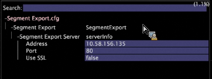

# Exportation des segments{#segment-export}

Vous pouvez facilement créer une définition d’exportation de segment à partir de la visualisation Tableau de détail dans le client Data Workbench.

En outre, [!DNL Segment Exports] combinent automatiquement leurs résultats à un seul serveur, plutôt que de produire des résultats partiels sur chaque DPU que vous devez combiner à l’aide d’un processus externe. Vous pouvez créer un fichier d’exportation de segments, l’enregistrer dans la balise [!DNL Profile Manager] et charger le fichier de sortie sur un serveur de votre choix.

**Pour configurer le serveur d’exportation de segments**

La fonction [!DNL Segment Export] crée un fichier de sortie unique sur le serveur d’exportation de segments, plutôt que des fichiers de sortie distincts créés sur chaque DPU. Le serveur d’exportation de segments est généralement configuré pour s’exécuter sur le FSU.

Dans le répertoire Jeu de données\ de [!DNL Profile Manager], ouvrez la balise [!DNL Segment Export.cfg] dans Workstation, puis indiquez l’adresse de votre serveur. (Votre adresse peut être une adresse IP ou un nom de domaine complet.) :



Il s’agit de l’adresse IP du serveur du Data Workbench recevant les résultats de l’exportation de segments. C&#39;est une configuration unique. Si [!DNL Segment Export.cfg] n’est pas présent, les exportations ne s’exécutent pas.

**Pour configurer les répertoires d’export**

Pour des raisons de sécurité, les fichiers d’exécution ou de lot exécutés après une exportation de segments doivent se trouver dans le répertoire Scripts\ configurables du serveur d’exportation de segments.

La [!DNL .part] et la sortie finale doivent se trouver dans le répertoire Exports configurable. La commande à exécuter existe dans les Arguments de commande et de commande. Les instances de %file% dans les Arguments de commande seront remplacées par le chemin d’accès du fichier de sortie.

>[!NOTE]
>
>Nouveau dans Data Workbench 5.4, le dossier \Exports est automatiquement créé. Les répertoires d’exportation précédents configurés avant la version 5.4 nécessitaient un préfixe Exports\ avant le nom de fichier pour chaque exportation de segments. L’ajout de ce préfixe est désormais redondant.

1. Dans [!DNL Communications.cfg] sur le serveur de destination pour [!DNL Segment Exports], ajoutez un SegmentExportServer à la liste des serveurs. (Exemple illustré en rouge).

   

   Répertoire des exportations : Spécifie l’emplacement où placer les fichiers [!DNL .part] et de sortie. Il peut s’agir d’un répertoire partagé.

   Répertoire des scripts : Spécifie le répertoire d’exécution de tous les fichiers exécutables ou batch.

1. [!DNL Access Control.cfg], sur le même serveur, ajoutez un accès en lecture-écriture à l’URI /SegmentExportServer/ au groupe d’accès des serveurs de cluster :

   

1. Modifiez vos fichiers [!DNL .export] :

   

1. Pour chaque profil, [!DNL Segment Export.cfg] se trouve dans le répertoire Jeu de données\ , avec les contenus suivants :

   ```
   Segment Export = SegmentExport:
   Segment Export Server = serverInfo:
   Port = int: 80
   Address = string: 192.168.5.128 (for example) Use SSL = bool: false
   ```

1. Assurez-vous que les répertoires référencés dans Exports Directory et Scripts Directory existent.

   Seuls les fichiers d’exécution et de lot du répertoire Scripts peuvent être exécutés comme commande d’un export de segment.

**Pour créer un fichier d’exportation de segments**

1. Dans un espace de travail, créez un tableau détaillé présentant les sous-ensembles de données (Visualisation > Tableau des détails) et ajoutez des attributs.
1. Si vous le souhaitez, effectuez des sélections dans l’espace de travail. (Toutes les sélections ou tous les filtres sont appliqués à l’exportation.)

   

1. Dans l’en-tête Tableau des détails, cliquez avec le bouton droit de la souris et sélectionnez **[!UICONTROL Create Segment Export File]**.
1. Dans [!DNL Save as], saisissez le nom du fichier [!DNL .export].
1. Dans le fichier [!DNL .export], configurez les paramètres selon vos besoins.

   Toutes les sélections ou tous les filtres de l’espace de travail sont incorporés dans le fichier d’exportation.

1. Enregistrez le fichier [!DNL .export].

   Le fichier enregistré s’affiche dans la balise [!DNL Profile Manager] pour que vous puissiez l’enregistrer sur le serveur. Lorsque vous enregistrez le fichier sur le serveur, l’exportation démarre.
