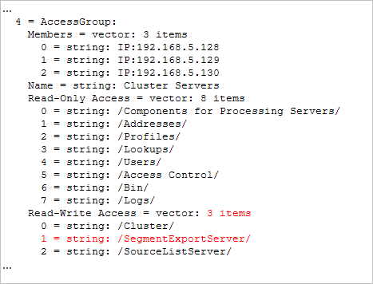

# Exportation des segments{#segment-export}

Vous pouvez facilement créer une définition d’exportation de segment à partir de la visualisation Tableau des détails dans le client Data Workbench.

En outre, [!DNL Segment Exports] combine automatiquement leurs résultats à un seul serveur, plutôt que de produire des résultats partiels sur chaque unité de traitement de données que vous devez combiner à l&#39;aide d&#39;un processus externe. Vous pouvez créer un fichier d’exportation de segments, l’enregistrer dans [!DNL Profile Manager] et télécharger le fichier de sortie sur un serveur de votre choix.

**Pour configurer le serveur d’exportation de segments**

La fonction [!DNL Segment Export] crée un fichier de sortie unique sur le serveur d’exportation de segments, plutôt que des fichiers de sortie distincts créés sur chaque unité de traitement de données. Le serveur d’exportation de segments est généralement configuré pour s’exécuter sur le FSU.

Dans le répertoire Dataset\ dans [!DNL Profile Manager], ouvrez [!DNL Segment Export.cfg] dans Workstation, puis spécifiez l&#39;adresse de votre serveur. (Votre adresse peut être une adresse IP ou un nom de domaine complet.) :


Il s’agit de l’adresse IP du serveur Data Workbench recevant les résultats de l’exportation de segments. Il s&#39;agit d&#39;une configuration unique. Si [!DNL Segment Export.cfg] n&#39;est pas présent, les exportations ne s&#39;exécutent pas.

**Pour configurer les répertoires d’exportation**

Pour des raisons de sécurité, les exécutables ou les fichiers par lots qui s’exécutent après l’exportation d’un segment doivent résider dans le répertoire Scripts\ configurables du serveur d’exportation de segments.

La sortie [!DNL .part] et la sortie finale doivent résider dans le répertoire Exports configurable. La commande à exécuter existe dans les arguments de commande et de commande. Les instances du fichier %file% dans les arguments de commande seront remplacées par le chemin d&#39;accès du fichier de sortie.

>[!NOTE]
>
>Nouveau dans Data Workbench 5.4, le dossier \Exports est créé automatiquement. Les répertoires d&#39;exportation précédents configurés avant la version 5.4 nécessitaient un préfixe Exports\ avant le nom de fichier pour chaque exportation de segment. Ajouter ce préfixe est désormais redondant.

1. Dans [!DNL Communications.cfg] sur le serveur de destination pour [!DNL Segment Exports], ajoutez un SegmentExportServer à la liste des serveurs. (Exemple illustré en rouge).

   

   Exports Directory : Indique l’emplacement où placer [!DNL .part] et les fichiers de sortie. Il peut s’agir d’un répertoire partagé.

   Répertoire des scripts : Indique le répertoire d’où sont exécutés tous les fichiers exécutables ou par lots.

1. [!DNL Access Control.cfg], sur le même serveur, ajoutez l’accès en lecture-écriture à l’URI /SegmentExportServer/ au Groupe d’accès des serveurs de cluster :

   

1. Modifiez vos fichiers [!DNL .export] :

   

1. Pour chaque profil, le répertoire [!DNL Segment Export.cfg] se trouve dans le répertoire Dataset\, avec le contenu suivant :

   ```
   Segment Export = SegmentExport:
   Segment Export Server = serverInfo:
   Port = int: 80
   Address = string: 192.168.5.128 (for example) Use SSL = bool: false
   ```

1. Assurez-vous que les répertoires mentionnés dans Exports Directory et Scripts Directory existent.

   Seuls les exécutables et les fichiers de commandes du répertoire Scripts peuvent être exécutés comme commande d’une exportation de segments.

**Pour créer un fichier d’exportation de segment**

1. Dans un espace de travail, créez un tableau détaillé présentant des sous-ensembles de données (Visualisation > Tableau des détails) et ajoutez des attributs.
1. Si vous le souhaitez, effectuez des sélections dans l’espace de travail. (Toute sélection ou tout filtres est appliqué à l’exportation.)

   

1. Dans l’en-tête Tableau des détails, cliquez avec le bouton droit de la souris et sélectionnez **[!UICONTROL Create Segment Export File]**.
1. Dans [!DNL Save as], saisissez le nom du fichier [!DNL .export].
1. Dans le fichier [!DNL .export], configurez les paramètres si nécessaire.

   Les sélections ou les filtres de l’espace de travail sont incorporés dans le fichier d’exportation.

1. Enregistrez le fichier [!DNL .export].

   Le fichier enregistré s&#39;affiche dans le [!DNL Profile Manager] pour que vous puissiez l&#39;enregistrer sur le serveur. Lorsque vous enregistrez le fichier sur le serveur, l’exportation commence.
