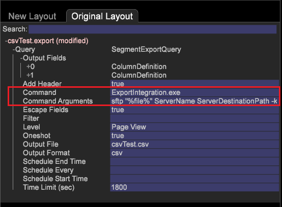

# Exportation d’un segment à l’aide d’une diffusion S/FTP{#export-a-segment-using-s-ftp-delivery}

Vous pouvez désormais utiliser les protocoles CSV, TSV, Exportation de segments et Exportation de segments avec en-tête à l’aide des protocoles FTP et SFTP pour exporter des fichiers de segments du client (station de travail) vers le serveur.

**Configuration des fichiers de configuration d’exportation S/FTP**

Pour définir la configuration de l’exportation, deux nouveaux fichiers de configuration de l’exportation ont été ajoutés pour configurer une connexion FTP ou SFTP, ce qui permet de sélectionner les détails du serveur dans le fichier *FTPServerInfo.cfg* et de sélectionner les informations d’identification dans le dossier *FTPUserCredentials* (correspondant au nom du serveur indiqué dans les arguments de commande).

* Définissez le fichier **FTPServerInfo.cfg** .

   Entrez les informations du serveur FTP et définissez les tentatives de connexion autorisées depuis le poste de travail. Modifiez à partir de la station de travail ou du serveur à l’aide du fichier [!DNL Server\Addresses\Export\] **[!DNL FTPServerInfo.cfg]** .

   ```
   FTP Servers = vector: 1 items 
     0 = ftpServerInfo:  
       Address = string:  
       Name = string:  
       Port = int: 21 
   Connect Retries = vector: 1 items 
     0 = connectServerRetries:  
       Retries = int: 0 
       Server Name = string:
   ```

* Définissez le fichier **FTPUserCredentials.cfg** .

   Entrez les informations d’identification de l’utilisateur pour vous connecter aux serveurs à l’aide du fichier [!DNL Server\Admin\Export\] **[!DNL FTPUserCredentials.cfg]** . Ce fichier contient les informations d’identification utilisateur requises pour se connecter aux serveurs et ne peut être modifié qu’à partir du serveur et non à partir du poste de travail (client).

   ```
   FTP User Credentials = vector: 1 items 
     0 = ftpUserCredInfo: 
       User Name = string:  
       User Password = EncryptedString:  
       Server Name = string:  
       Public Key Path = string:  
       Private Key Path = string:  
       Passphrase = EncryptedString:
   ```

   >[!NOTE]
   >
   >Assurez-vous que les clés SSH que vous générez pour l’authentification sont au format identique à celles générées lorsque vous utilisez la commande SSH Keygen.
   >
   >Exemple de génération de clés SSH à l’aide de keygen :
   >
   >```
   >ssh-keygen -t rsa -b 4096 -C "<label>"
   >```

   Le fichier **FTPUserCredentials.cfg** contient six paramètres requis pour divers transferts FTP ou SFTP.

   1. *Nom d’utilisateur*
   1. *Mot de passe utilisateur*
   1. *Nom du serveur*
   1. *Chemin de la clé publique*
   1. *Chemin de la clé privée*
   1. *Passphrase*
   <table id="table_4EB416DC770D4D1AA4FAD9676C0D680C"> 
    <thead> 
      <tr> 
      <th colname="col1" class="entry"> Protocole </th> 
      <th colname="col2" class="entry"> Paramètres </th> 
      </tr> 
    </thead>
    <tbody> 
      <tr> 
      <td colname="col1"> <p>FTP </p> </td> 
      <td colname="col2"> <p>Définissez les paramètres 1, 2, 3. </p> </td> 
      </tr> 
      <tr> 
      <td colname="col1"> <p>SFTP à l’aide de l’authentification par mot de passe </p> </td> 
      <td colname="col2"> <p>Définissez les paramètres 1, 2, 3 lorsque le transfert utilise l’authentification par mot de passe (-p dans les arguments de commande). </p> </td> 
      </tr> 
      <tr> 
      <td colname="col1"> <p>SFTP avec authentification de clé </p> </td> 
      <td colname="col2"> <p>Définissez les paramètres 1, 2, 3, 4, 5, 6 lorsque le transfert utilise l’authentification de clé (-k dans les arguments de commande). </p> </td> 
      </tr> 
    </tbody> 
    </table>

**Définition des commandes d’exportation FTP et SFTP**

1. Ouvrez une table d’exportation.

   Dans Workstation, cliquez avec le bouton droit sur un tableau *de* détails et choisissez l’un des types d’exportation (CSV, TSV, Exportation de segments ou Exportation de segments avec en-tête). Vous pouvez également ouvrir le [!DNL .export] fichier à partir d’une invite de commande et le modifier (voir [Configuration de segments pour l’exportation](../../../home/c-get-started/c-exp-data-seg-exp/t-config-sgts-expt.md#task-8857f221fa66463990ec9b60db6db372)).

1. Dans le champ *Commande* , définissez-le pour qu’il pointe vers le fichier exécutable d’exportation :

   ```
   ExportIntegration.exe
   ```

1. Définissez les champs Arguments *de* commande comme illustré ci-dessous pour le protocole et l’authentification requis :

   **FTP**

   ```
   <Command Arguments> set to  
   <ftp "%file%" ServerName ServerDestinationPath>
   ```

   

   **SFTP** (en cas d’utilisation d’un mot de passe pour l’authentification)

   ```
   <Command Arguments> set to  
   <sftp "%file%" ServerName ServerDestinationPath -p>
   ```

   **SFTP** (en cas d’utilisation de clés pour l’authentification)

   ```
   <Command Arguments> set to  
   <sftp "%file%" ServerName ServerDestinationPath -k>
   ```

   

Tous les arguments de commande sont obligatoires et doivent être saisis comme indiqué.

## Exportation S/FTP à l’aide de clés privées/publiques {#section-0534424d79a54a47b82594cfa7b3c17f}

Pour mettre en oeuvre l’exportation FTP et SFTP à l’aide de clés privée et publique, placez les fichiers de configuration dans les dossiers suivants :

* Placez **FTPServerInfo.cfg** dans le [!DNL Server/Addresses/Export/] dossier.
* Placez **FTPUserCredentials.cfg** dans le [!DNL Server/Admin/Export/] dossier.

Six paramètres sont inclus dans le fichier **FTPServerInfo.cfg** :

1. *Nom d’utilisateur*
1. *Mot de passe utilisateur*
1. *Nom du serveur*
1. *Chemin de la clé publique*
1. *Chemin d&#39;accès à la clé privée —* Placez le chemin d&#39;accès à la clé privée dans le fichier de configuration sans extension, par exemple :

[!DNL Private Key Path = string: E:\\Server\\campaign\\campaignprivatekey]

1. *Passphrase*

FTP utilise les paramètres 1, 2 et 3.

SFTP utilise les paramètres 1, 2 et 3 lorsque le transfert utilise l’authentification par mot de passe.

SFTP utilise les six paramètres lorsque le transfert est effectué à l’aide de l’authentification de clé. Par exemple, si vous utilisez des clés pour l’authentification :

[!DNL 'Command Arguments' = sftp "%file%" ServerName ServerDestinationPath -k]

Les fichiers de configuration doivent se trouver au bon emplacement.

>[!NOTE]
>
>Les clés publiques doivent pointer vers un fichier **.pem** et non vers un emplacement de dossier. Vous pouvez créer des clés à l&#39;aide d&#39;une fonction de génération de clés SSH à partir d&#39;applications comme Cygwin. (Putty génère des clés au format .ppk qui n’est pas pris en charge.)
