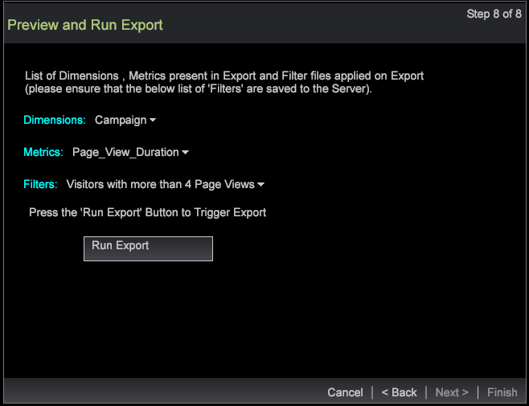

# Assistant d’exportation de segments{#segment-export-wizard}

{{eol}}

Exportation de segments à l’aide de l’assistant d’exportation de segments

L’assistant d’exportation de segments fournit un processus étape par étape pour configurer et exporter des segments plutôt que des segments. [export de segments depuis un tableau détaillé](https://experienceleague.adobe.com/docs/data-workbench/using/client/export-data/c-sgmt-expt.html).

## Exporter des segments à l’aide de l’assistant {#section-b30f2699dbc7490bad18512b91cb0cb3}

Pour ouvrir l&#39;assistant, cliquez avec le bouton droit dans un espace de travail et sélectionnez **Administration** > **Assistants** > **Assistant d’exportation de segments**.

>[!NOTE]
>
>Seuls les segments appliqués avant l’ouverture de l’assistant sont capturés. En outre, les exportations de segments créées à partir de l’assistant ne peuvent pas générer de commandes externes.

1. Sélectionnez les différents niveaux parents des dimensions et mesures à ajouter à votre exportation.

   Les niveaux affichés dépendent du profil sélectionné. Vous pouvez sélectionner plusieurs niveaux de dimension en fonction du profil.

   

1. Cliquez sur **Suivant**.
1. Sélectionnez la Dimension et les mesures pour les niveaux sélectionnés.

   Par exemple, après avoir sélectionné Page vue comme niveau parent, vous pouvez sélectionner les dimensions et mesures enfants disponibles pour l’exportation.

1. Cliquez sur **Suivant**.

   

   

1. Sélectionnez le format d&#39;export et saisissez le nom du fichier d&#39;export.

   

   Les types CSV, TSV, Exportation de segments et Exportation de segments avec des types d’en-tête ne nécessitent aucune configuration supplémentaire. Toutefois, les options Profils et Exportation d’audiences, Service d’enregistrement personnalisé et Exportation Adobe Target doivent être configurées à l’étape 3. Par exemple, consultez les champs de configuration pour l’export de profils et d’audiences. Configurez ces types d’exportation et cliquez sur **Suivant**.

   

   

   

1. Configurez le type d&#39;export sélectionné.

   En-tête : si l’en-tête est défini sur True, donnez au **Fichier de sortie** champ .

   Champ d’échappement : défini sur **True** ou **False**.

   Ordre des champs : sélectionnez un champ et déplacez-le vers le haut ou vers le bas pour définir l’ordre dans le fichier d’exportation.

   

   Cliquez sur **Suivant**.

1. Affichez le niveau et les filtres appliqués dans cette boîte de dialogue. Cliquez sur **Suivant**. 

1. If **CSV**, **TSV**, **Exportation de segments** ou **Exportation de segments avec un en-tête** est sélectionné, puis trois options sont disponibles :

   Exportation générique : le fichier de sortie sera généré par le serveur dans le dossier Server/Export .

   

   Exportation FTP : le fichier de sortie sera transféré sur le serveur sélectionné. (La liste du serveur sera sélectionnée dans le fichier FTPServerInfo.cfg .)

   

   Exportation SFTP : le fichier de sortie sera transféré en toute sécurité sur le serveur sélectionné.

1. Cliquez sur **Suivant**

   **Remarque :** Si le type d&#39;export sélectionné est **Profils et exportation d’audiences**, **Service d’enregistrement personnalisé**, et **Exportation Adobe Target**, le texte sera statique en fonction de l’exportation sélectionnée.

1. Configurez les paramètres de planification.

   **Un plan** peut être défini sur True ou False.

   **Planification avancée** Vous pouvez l’activer ou la désactiver en cliquant sur le bouton Configuration de planification avancée .

   

   Comme pour l’exportation à partir du tableau détaillé, un plan disparaît si le paramètre avancé est activé. Cliquez sur **Suivant**.

1. Prévisualisez le fichier d&#39;export, puis cliquez sur **Exécuter l’exportation**.

   

   

Les types d&#39;exports suivants sont disponibles à l&#39;aide de l&#39;assistant :

**Types d’exportation de segments**

* Générique
* FTP
* SFTP

**Exportation de segments avec un en-tête**

* Générique
* FTP
* SFTP

**Exportation CSV**

* Générique
* FTP
* SFTP

**Exportation TSV**

* Générique
* FTP
* SFTP
