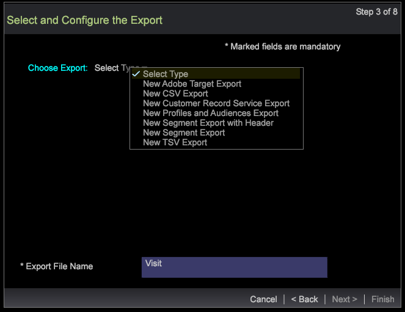
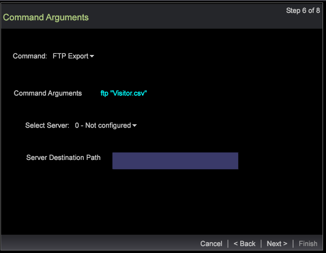

# Segment export wizard{#segment-export-wizard}

Exportation de segments à l’aide de l’assistant d’exportation de segments

L’assistant d’exportation de segments fournit un processus détaillé pour configurer et exporter des segments au lieu d’ [exporter des segments à partir d’un tableau](https://docs.adobe.com/content/help/en/data-workbench/using/client/export-data/c-sgmt-expt.html)détaillé.

## Exportation de segments à l’aide de l’assistant {#section-b30f2699dbc7490bad18512b91cb0cb3}

Pour ouvrir l’assistant, cliquez avec le bouton droit de la souris dans un espace de travail et sélectionnez **Admin** > **Assistants** > Assistant **d’exportation de** segments.

>[!NOTE]
>
>Seuls les segments appliqués avant l’ouverture de l’assistant sont capturés. En outre, les exportations de segments créées à partir de l’assistant ne peuvent pas générer de commandes externes.

1. Sélectionnez les différents niveaux parents des dimensions et des mesures à ajouter à votre exportation.

   Les niveaux affichés dépendent du profil sélectionné. Vous pouvez sélectionner plusieurs niveaux de dimension en fonction du profil.

   

1. Cliquez sur **Suivant**.
1. Sélectionnez la dimension et les mesures pour les niveaux sélectionnés.

   Par exemple, après avoir sélectionné Page vue comme niveau parent, vous pouvez sélectionner les dimensions et mesures enfants disponibles pour l’exportation.

1. Cliquez sur **Suivant**.

   

   

1. Sélectionnez le format d’exportation et saisissez le nom du fichier d’exportation.

   

   Les types CSV, TSV, Exportation de segments et Exportation de segments avec en-tête ne nécessitent aucune configuration supplémentaire. Toutefois, les options Profils et Exportation d’audience, Service d’enregistrement personnalisé et Exportation Adobe Target doivent être configurées à l’étape 3. Par exemple, voir les champs de configuration pour l’exportation Profils et audience. Configurez ces types d’exportation et cliquez sur **Suivant**.

   

   

   

1. Configurez le type d’exportation sélectionné.

   En-tête (Header): si l&#39;en-tête est True, nommez le champ Fichier **de** sortie.

   Champ d’échappement (Escape Field): défini sur **True** ou **False**.

   Ordre des champs (Order of Fields): sélectionnez un champ et déplacez-le vers le haut ou vers le bas pour définir l&#39;ordre dans le fichier d&#39;exportation.

   

   Cliquez sur **Suivant**.

1. Affichez le niveau et les filtres appliqués dans cette boîte de dialogue. Cliquez sur **Suivant**. 

1. Si **CSV**, **TSV**, Exportation de **segments ou Exportation de** **segments avec en-tête est sélectionné, trois options sont disponibles :**

   Exportation générique : le fichier de sortie sera généré par le serveur dans le dossier Server/Export.

   

   Exportation FTP : le fichier de sortie sera transféré vers le serveur sélectionné. (La liste du serveur sera sélectionnée dans le fichier FTPServerInfo.cfg.)

   

   Exportation SFTP : le fichier de sortie sera transféré en toute sécurité sur le serveur sélectionné.

1. Cliquez sur **Suivant**

   **Remarque :** Si le type d’exportation sélectionné est **Profils et Exportation** d’audience, Service **d’enregistrement** personnalisé et Exportation **** Adobe Target, le texte sera statique en fonction de l’exportation sélectionnée.

1. Configurez les paramètres de planification.

   **Un plan** peut être défini sur True ou False.

   **La planification** avancée peut être activée ou désactivée en cliquant sur le bouton Configuration de la planification avancée.

   

   Comme pour l’exportation à partir du tableau des détails, une prise de vue disparaît si le paramètre avancé est activé. Cliquez sur **Suivant**.

1. Affichez un aperçu du fichier d’exportation, puis cliquez sur **Exécuter l’exportation**.

   

   

Les types d’exportation suivants sont disponibles dans l’assistant :

**Types d’exportation de segments**

* Générique
* FTP
* SFTP

**Exportation de segments avec en-tête**

* Générique
* FTP
* SFTP

**Exportation CSV**

* Générique
* FTP
* SFTP

**Exportation TSV**

* Générique
* FTP
* SFTP

