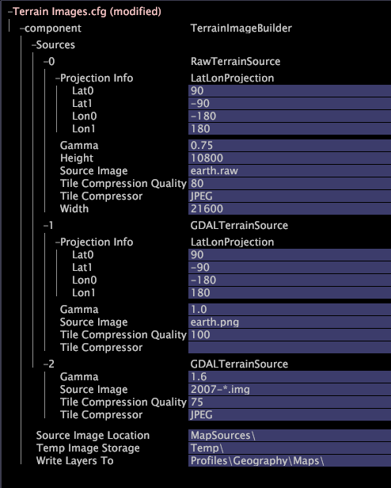

# Calques d’image du terrain{#terrain-image-layers}

Une couche d&#39;image du terrain affiche l&#39;imagerie du terrain de la Terre.

[!DNL Terrain image layers] sont stockées dans le  [!DNL Geography] profil dans un format personnalisé. Ces couches d’image peuvent être générées par Adobe ou le serveur de Data Workbench peut transformer vos images du terrain fournies par l’utilisateur en couches de terrain adaptées à la visualisation du globe.

>[!NOTE]
>
>Pour utiliser [!DNL terrain image layers], vous devez installer le fichier [!DNL Terrain Images.cfg] fourni par Adobe.

Pour définir une couche d’image du terrain, vous devez disposer des éléments suivants :

* **Un ou plusieurs** fichiers image du terrain contenant les images à afficher sur le globe.
* **Un  [!DNL Terrain Images.cfg]** fichier qui spécifie le ou les fichiers image(s) du terrain à utiliser pour le ou les calques. Le fichier [!DNL Terrain Images.cfg] vous permet d’ajouter une ou plusieurs sources pour créer une [!DNL terrain image layer]. Le format de votre fichier image du terrain détermine le type de source à ajouter. Le tableau suivant fournit des descriptions des sources de calque d’image du terrain disponibles, y compris les formats de fichiers d’image du terrain pris en charge :

<table id="table_CFDF5E61FCCD40B29A9D35FFA42F68D1"> 
 <thead> 
  <tr> 
   <th colname="col1" class="entry"> Type </th> 
   <th colname="col2" class="entry"> Description </th> 
  </tr> 
 </thead>
 <tbody> 
  <tr> 
   <td colname="col1"> 
Image brute non projetée 
 </td> 
   <td colname="col2"> 
Crée des  calques d’image du terrain à partir de fichiers RVB 24 bits sans en-tête alignés par latitude et longitude (non projetés), où le nord est le haut de l’image et l’est la droite. 
 
Format(s) d’image pris en charge : RAW 
 
 
Remarque : Cette source nécessite des informations de projection. Pour plus d’informations sur les formats de projection, voir <a href="../../../../home/c-get-started/c-im-layers/c-ter-img-layers/c-proj-info-ter-imgs.md#concept-eec35baa01744895b847a02e69dad04e"> Spécification des informations de projection pour les images du terrain</a>. 
 
 </td> 
  </tr> 
  <tr> 
   <td colname="col1"> 
Image générale, non projetée 
 </td> 
   <td colname="col2"> 
Crée  couches d’image du terrain à partir de formats d’image 24 bits alignés en latitude et longitude (non projetés), où le nord est le haut de l’image et l’est la droite. 
 
Format(s) d’image pris en charge : BMP, JPG, PNG, TIFF 
 
 
Remarque : Cette source nécessite des informations de projection. Pour plus d’informations sur les formats de projection, voir <a href="../../../../home/c-get-started/c-im-layers/c-ter-img-layers/c-proj-info-ter-imgs.md#concept-eec35baa01744895b847a02e69dad04e"> Spécification des informations de projection pour les images du terrain</a>. 
 
 </td> 
  </tr> 
  <tr> 
   <td colname="col1"> 
Image avec projection incorporée 
 </td> 
   <td colname="col2"> 
Crée des  calques d’image du terrain à partir de formats d’image qui intègrent des données géodésiques dans le fichier image. Les informations de projection sont extraites de l'image. 
 
Format(s) d’image pris en charge : Erdas (IMG), GeoTIFF 
 
 
Remarque : En règle générale, cette source ne nécessite pas d’informations de projection, mais elle prend en charge l’ajout de telles informations si nécessaire. Pour plus d’informations sur les formats de projection, voir <a href="../../../../home/c-get-started/c-im-layers/c-ter-img-layers/c-proj-info-ter-imgs.md#concept-eec35baa01744895b847a02e69dad04e"> Spécification des informations de projection pour les images du terrain</a>. 
 
 </td> 
  </tr> 
 </tbody> 
</table>

**Pour définir un calque d’image du terrain**

1. Dans Data Workbench, sur l’onglet **[!UICONTROL Admin]** > **[!UICONTROL Dataset and Profile]**, cliquez sur la miniature **[!UICONTROL Servers Manager]** pour ouvrir l’espace de travail [!DNL Servers Manager].
1. Dans la fenêtre [!DNL Servers Manager], cliquez avec le bouton droit de la souris sur l’icône du serveur de Data Workbench souhaité, puis cliquez sur **[!UICONTROL Server Files]**.
1. Dans la balise [!DNL Server Files Manager], cliquez sur **[!UICONTROL Components]** pour en visualiser le contenu. Le fichier [!DNL Terrain Images.cfg] se trouve dans ce répertoire.
1. Cliquez avec le bouton droit de la souris sur la coche dans la colonne nom du serveur pour [!DNL Terrain Images.cfg], puis cliquez sur **[!UICONTROL Make Local]**. Une coche s’affiche dans la colonne [!DNL Temp] pour [!DNL Terrain Images.cfg].
1. Cliquez avec le bouton droit sur la coche nouvellement créée dans la colonne **[!UICONTROL Temp]** et cliquez sur **[!UICONTROL Open]** > **[!UICONTROL from the workbench]**. La fenêtre [!DNL Terrain Images.cfg] s’affiche.
1. Dans la fenêtre [!DNL Terrain Images], cliquez sur **[!UICONTROL component]** pour en visualiser le contenu.
1. Cliquez avec le bouton droit de la souris sur **[!UICONTROL Sources]** > **[!UICONTROL Add new]** et sélectionnez l’un des types de sources suivants :

   * **[!UICONTROL Raw unprojected bitmap]**. (Une fois ajouté, ce type de source est intitulé RawTerrainSource dans la fenêtre [!DNL Terrain Images] .)

   * **[!UICONTROL General image, unprojected]**. (Une fois ajouté, ce type de source est libellé [!DNL GDALTerrainSource] dans la fenêtre [!DNL Terrain Images].)

   * **[!UICONTROL Image with embedded projection]**. (Une fois ajouté, ce type de source est libellé [!DNL GDALTerrainSource] dans la fenêtre [!DNL Terrain Images].)

1. Modifiez les paramètres de la source selon les besoins à l&#39;aide de l&#39;exemple de fichier suivant et du tableau de paramètres comme guides.

   

<table id="table_345ACB4C48524516AADB731D87FC6792"> 
 <thead> 
  <tr> 
   <th colname="col1" class="entry"> Paramètre </th> 
   <th colname="col2" class="entry"> Description </th> 
  </tr>
 </thead>
 <tbody> 
  <tr> 
   <td colname="col1"> 
Gamma 
 </td> 
   <td colname="col2"> 
Facultatif pour toutes les sources. Spécifie la correction gamma à appliquer à l’image source. Cela peut être souhaitable en raison du fait que Data Workbench fonctionne normalement avec un paramètre gamma élevé. La valeur par défaut est 1. 
 </td> 
  </tr> 
  <tr> 
   <td colname="col1"> 
Hauteur 
 </td> 
   <td colname="col2"> 
Requis pour les images bitmap brutes non projetées. Hauteur de l’image source en pixels. 
 </td> 
  </tr> 
  <tr> 
   <td colname="col1"> 
Infos sur la projection 
 </td> 
   <td colname="col2"> 
Requis pour les images bitmap brutes non projetées et les images générales, non projetées, mais pris en charge pour les images avec projection incorporée. Data Workbench prend en charge les projections latitude-longitude et les projections Transverse Mercator (TM) pour les couches d’image du terrain. Le format de projection par défaut est la projection latitude-longitude (LatLonProjection). 
 
Pour plus d’informations sur les formats de projection, voir <a href="../../../../home/c-get-started/c-im-layers/c-ter-img-layers/c-proj-info-ter-imgs.md#concept-eec35baa01744895b847a02e69dad04e"> Spécification des informations de projection pour les images du terrain</a>. 
 </td> 
  </tr> 
  <tr> 
   <td colname="col1"> 
Image source 
 </td> 
   <td colname="col2"> 
Requis pour toutes les sources. Nom du fichier image source. Il peut s’agir d’un nom de fichier ou d’un caractère générique. L’utilisation d’un modèle peut s’avérer utile si, par exemple, des images d’une même région à des dates différentes sont chargées, sans modification des métadonnées associées. Par conséquent, un modèle du type  Tysons Corner *.raw créerait des calques à partir de  Tysons Corner 050211.raw,  Tysons Corner 050218.raw, et ainsi de suite lorsque de nouvelles images sont ajoutées, sans configuration supplémentaire nécessaire si les paramètres des fichiers sont autrement identiques. 
 </td> 
  </tr> 
  <tr> 
   <td colname="col1"> 
Qualité de compression des mosaïques 
 </td> 
   <td colname="col2"> 
Facultatif pour toutes les sources. Pour la compression JPEG, nombre entier compris entre 0 et 100 indiquant comment équilibrer la taille et la qualité de l’image. (La valeur par défaut est zéro.) Un nombre plus élevé se traduit par une meilleure qualité d’image, mais produit des images plus volumineuses et des temps de téléchargement plus longs pour les utilisateurs Data Workbench. 
 
 
Remarque :  La compression d’images inférieures à 70 peut entraîner une dégradation de l’image. 
 
 </td> 
  </tr> 
  <tr> 
   <td colname="col1"> 
Mosaïque Compresseur 
 </td> 
   <td colname="col2"> 
Facultatif pour toutes les sources. Indique la méthode de compression utilisée pour écrire des fichiers de sortie. Les seules méthodes actuellement prises en charge sont RAWRVB (valeur par défaut, sans compression) et JPEG. Utilisez la compression JPEG pour réduire la taille des calques transmis lors de la synchronisation des profils. 
 </td> 
  </tr> 
  <tr> 
   <td colname="col1"> 
Largeur 
 </td> 
   <td colname="col2"> 
Requis pour les images bitmap brutes non projetées. Largeur de l’image source en pixels. 
 </td> 
  </tr> 
 </tbody> 
</table>

1. Modifiez les paramètres Emplacement de l’image source, Stockage de l’image temporaire et Écrire les calques vers à à l’aide du tableau suivant comme guide. Ces paramètres s’appliquent à toutes les sources d’images du terrain que vous définissez dans la section [!DNL Sources] de ce fichier.

<table id="table_103F02C54ED94C6C922450F5B2781CAE"> 
 <thead> 
  <tr> 
   <th colname="col1" class="entry"> Paramètre </th> 
   <th colname="col2" class="entry"> Description </th> 
  </tr>
 </thead>
 <tbody> 
  <tr> 
   <td colname="col1"> 
Emplacement de l’image source 
 </td> 
   <td colname="col2"> 
Obligatoire. Répertoire qui recherche les images à traduire en couches de terrain. S’il ne s’agit pas d’un chemin d’accès absolu, il est interprété par rapport au répertoire d’installation du serveur Data Workbench. 
 </td> 
  </tr> 
  <tr> 
   <td colname="col1"> 
Stockage d’image temporaire 
 </td> 
   <td colname="col2"> 
Facultatif. Nom d’un répertoire utilisé pour le stockage des fichiers temporaires utilisés dans la traduction des images sources en couches de terrain. S’il ne s’agit pas d’un chemin d’accès absolu, il est interprété par rapport au répertoire d’installation du serveur Data Workbench. L’emplacement par défaut est le répertoire  Temp. 
 </td> 
  </tr> 
  <tr> 
   <td colname="col1"> 
Écrire des calques sur 
 </td> 
   <td colname="col2"> 
Obligatoire. Répertoire vers lequel les couches de terrain sont générées. Il s’agit généralement du sous-répertoire Maps d’un répertoire de profil, de sorte que la visualisation Globe puisse trouver les calques. 
 </td> 
  </tr> 
 </tbody> 
</table>

1. Enregistrez le fichier en cliquant avec le bouton droit de la souris sur **[!UICONTROL (modified)]** en haut de la fenêtre et en cliquant sur **[!UICONTROL Save]**.
1. Pour enregistrer un fichier mis à jour sur l’ordinateur du serveur Data Workbench, dans la balise [!DNL Server Files Manager], cliquez avec le bouton droit de la souris sur la coche [!DNL Terrain Images.cfg] de la colonne [!DNL Temp], puis cliquez sur **[!UICONTROL Save to]** > *&lt;**[!UICONTROL server name]***.
