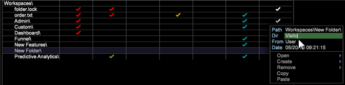

# Ajouter un onglet au plan de travail{#add-a-tab-to-the-worktop}

Ajoutez un onglet sur Worktop pour accéder rapidement à un espace de travail.

Vous pouvez ajouter un espace de travail sous la forme d’un onglet sur le plan de travail. Par exemple, vous pouvez ajouter un onglet **Visiteurs** pour accéder rapidement à un aperçu de votre trafic.

**Ajouter un dossier dans Profil Manager**

1. Ouvrez l’espace de travail à associer au nouvel onglet, puis cliquez avec le bouton droit de la souris sur **Admin** > **Gestionnaire de Profils**.
1. Dans le [!DNL Profile Manager], cliquez sur **[!UICONTROL Workspaces]** pour en vue le contenu.
1. Cliquez avec le bouton droit dans la colonne [!DNL User] pour [!DNL Workspaces] et sélectionnez **[!UICONTROL Create]** > **[!UICONTROL Folder]**.

   

   Cela crée un nouveau sous-dossier qui contient les fichiers que vous souhaitez voir disponibles via votre nouvel onglet. Un nouveau dossier s’affiche sous le nom Nouveau dossier.
1. Pour renommer, cliquez avec le bouton droit de la souris dans la colonne [!DNL User] du nouveau dossier et tapez un nom dans le paramètre Dir.

   

   Le nom du dossier s’affiche dans le plan de travail sous la forme d’un onglet.

   

1. (Facultatif) Pour mettre les modifications à la disposition de tous les utilisateurs du profil de travail, cliquez avec le bouton droit de la souris sur la coche blanche du fichier [!DNL .vw] dans la colonne [!DNL User], puis cliquez sur **[!UICONTROL Save to]** > *&lt;**[!UICONTROL working profile name]***.

   Pour afficher uniquement la version en taille réelle de l&#39;espace de travail de description et non la miniature de cet espace de travail, vous devez enregistrer l&#39;espace de travail sur le profil de travail. Pour ce faire, dans la colonne [!DNL Profile Manager], cliquez avec le bouton droit de la souris sur la coche blanche du fichier [!DNL description.vw] dans la colonne [!DNL User], puis cliquez sur **[!UICONTROL Save to]** > *&lt;**[!UICONTROL working profile name]***.
