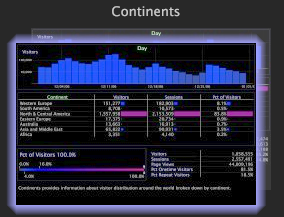

# Contrôle de version des fichiers{#file-versioning}

Worktop permet de déterminer facilement où est stocké chaque espace de travail, qu&#39;il se trouve sur le serveur Data Workbench, sur votre ordinateur local ou sur les deux.

## Identification des versions de fichier {#section-d555c96b016344f19b356c12213dd2a9}

**Serveur**

Un espace de travail serveur est stocké sur le serveur de Data Workbench connecté et est disponible pour tous les utilisateurs qui ont accès à ce profil et à cet onglet. Un espace de travail serveur s’affiche sous la forme d’une seule miniature.

Les espaces de travail du serveur sont stockés par défaut dans le sous-dossier approprié du dossier Workspaces du serveur Data Workbench connecté.

**Local**

Un espace de travail local est la version locale d&#39;un espace de travail serveur. Un espace de travail local s’affiche sous la forme de deux miniatures qui se chevauchent. La miniature en haut est initialement entourée d’une lueur, ce qui indique que des modifications récentes ont été apportées localement à l’espace de travail du serveur. Cette lueur se dissipe au fil du temps.

Les espaces de travail locaux sont stockés par défaut dans le dossier de noms [!DNL User\working profile name\Workspaces\tab] du répertoire d’installation du Data Workbench (ou d’Insight).

>[!NOTE]
>
>Lorsque vous disposez d’une version locale d’un espace de travail serveur, vous devez revenir à la version serveur avant de pouvoir télécharger une version mise à jour de l’espace de travail serveur. Pour revenir à la version du serveur sans modifications locales, cliquez avec le bouton droit de la souris sur la miniature de l&#39;espace de travail local et cliquez sur **[!UICONTROL Revert to server version]**.

**Utilisateur**

Un espace de travail utilisateur est un espace de travail qui a été créé sur l’ordinateur local et qui existe uniquement sur cet ordinateur. Un espace de travail utilisateur s’affiche sous la forme d’une seule miniature avec un contour en pointillé d’un espace de travail vide derrière lui, indiquant qu’il n’existe aucun espace de travail source sur le serveur de Data Workbench connecté.

Les espaces de travail utilisateur sont stockés par défaut dans le dossier User\*working profil name*\Workspaces\*tab name* du répertoire d’installation d’Insight.
