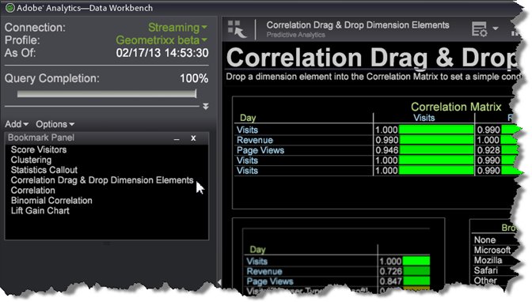

# ajouter des signets{#add-a-bookmarks}

Vous pouvez mettre en signet des espaces de travail significatifs pour passer rapidement d’une visualisation à l’autre des rapports utilisés dans votre processus.

1. Marquez un espace de travail par un signet en cliquant sur l’icône Signet  dans le coin supérieur droit de la barre d’outils.

   Avant qu’un espace de travail ne soit mis en signet, cette icône s’affiche sous la forme d’un seul livre. L&#39;icône de signet se transforme en livre avec une page marquée une fois qu&#39;un espace de travail a été mis en signet.

1. Cliquez sur **[!UICONTROL Add]** > **[!UICONTROL Bookmarks Panel]** dans le volet de gauche pour ouvrir une liste de signets.

   

1. Pour ouvrir un espace de travail mis en signet, cliquez sur le nom d&#39;un espace de travail dans le **[!UICONTROL Bookmark Panel]**.

   

   L&#39;espace de travail sélectionné s&#39;ouvre. Lorsque vous cliquez sur un autre espace de travail mis en signet, l&#39;espace de travail précédent se ferme et l&#39;espace de travail nouvellement sélectionné s&#39;ouvre, ce qui vous permet de naviguer rapidement dans votre flux de travail.

**Pour supprimer un signet :**

* Dans le panneau Signet, cliquez avec le bouton droit de la souris et sélectionnez **Supprimer`<bookmark title>`** pour supprimer un signet sélectionné ou choisissez **[!UICONTROL Clear All Bookmarks]** de supprimer tous les signets.

* Vous pouvez également cliquer avec le bouton droit de la souris sur l’espace de travail dans la vue de miniature du plan de travail et sélectionner **[!UICONTROL Clear Bookmark]**.

>[!IMPORTANT]
>
>* 25 signets peuvent être enregistrés.
>* Si vous ajoutez un signet, puis déplacez l&#39;emplacement de l&#39;espace de travail, le signet n&#39;est pas valide et doit être supprimé du panneau Signet et réinitialisé.

