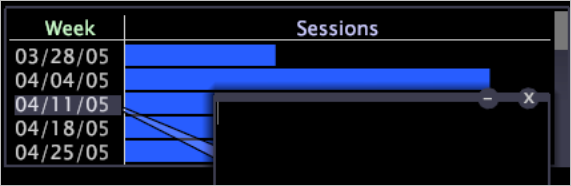
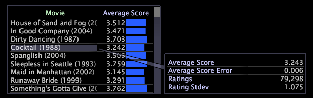

# Ajout de légendes à un espace de travail{#adding-callouts-to-a-workspace}

Les légendes sont des fenêtres que vous ajoutez à un espace de travail pour attirer l’attention sur un élément de dimension particulier en créant une nouvelle visualisation avec une sélection virtuelle de cet élément.

Les outils de données sont fournis avec un ensemble standard de types de légende. Comme votre implémentation peut être entièrement personnalisée, les types de légende disponibles qui apparaissent dans votre implémentation peuvent différer de ce qui est décrit dans ce guide.

Par défaut, les outils de données fournissent les légendes suivantes :

* [Annotation](../../../home/c-get-started/c-vis/c-call-wkspc.md#section-7b6742160b3f4aed872a09c8c023f90d)
* [Graphique en courbes vierges](../../../home/c-get-started/c-vis/c-call-wkspc.md#section-5dcc0504bdb64ed4976f880e2f7b277f)
* [Graphique de dispersion vide](../../../home/c-get-started/c-vis/c-call-wkspc.md#section-5dcc0504bdb64ed4976f880e2f7b277f)
* [Tableau vierge](../../../home/c-get-started/c-vis/c-call-wkspc.md#section-5dcc0504bdb64ed4976f880e2f7b277f)
* [Légende de la confiance](../../../home/c-get-started/c-vis/c-call-wkspc.md#section-386d1293ddc24a0c9cccb332e20db791)
* [Légende de la mesure](../../../home/c-get-started/c-vis/c-call-wkspc.md#section-daa6d372c22246d9827880a9d6e804d8)

>[!NOTE]
>
>Les légendes ne fonctionnent pas comme des sélections (c’est-à-dire qu’elles n’affectent pas d’autres visualisations dans l’espace de travail), sauf si vous effectuez une sélection dans la légende.

Vous pouvez ajouter ou modifier des définitions de légende en configurant les fichiers de légende stockés dans le dossier d’installation du nom *du* profil \Context\Callout folder of the [!DNL Server] . Voir [Configuration des légendes](../../../home/c-get-started/c-intf-anlys-ftrs/c-config-callouts.md#concept-f6e91e172f5e4c009245c9c549beb76a).

## Pour ajouter une légende d’annotation à une visualisation {#section-7b6742160b3f4aed872a09c8c023f90d}

1. Cliquez avec le bouton droit sur l’élément pour lequel vous souhaitez créer une légende, puis cliquez sur **[!UICONTROL Add Callout]** > **[!UICONTROL Annotation]** > **[!UICONTROL Image]** ou **[!UICONTROL Add Callout]** > **[!UICONTROL Annotation]** > **[!UICONTROL Text]**. Une fenêtre vide s’affiche avec une connexion visible à cet élément.

   

   Pour ajouter des légendes aux visualisations Graphique, vous devez cliquer avec le bouton droit de la souris au bas de la visualisation (l’axe de base) pour ouvrir un menu.

   

1. Selon votre sélection, effectuez l’étape appropriée :

   * Pour une annotation de texte, saisissez ou collez le texte de votre choix dans la légende, puis formatez le texte selon vos besoins. Voir [Utilisation des annotations](../../../home/c-get-started/c-analysis-vis/c-annots/c-text-annots.md#concept-55b4aa3e0c58470b8e3c9d452e12a777)de texte.
   * Pour une annotation d’image, collez l’image de votre choix dans la légende en la copiant, puis en cliquant avec le bouton droit dans la légende. Cliquez sur **[!UICONTROL Paste image]**. Voir [Utilisation des annotations](../../../home/c-get-started/c-analysis-vis/c-annots/c-image-annots.md#concept-02081ed7d91c4fdcb8fc863f2a51c962)d’image.

## Pour ajouter une légende de tableau, de graphique en courbes ou de graphique de dispersion vide à une visualisation {#section-5dcc0504bdb64ed4976f880e2f7b277f}

1. Cliquez avec le bouton droit sur l’élément pour lequel vous souhaitez créer une légende, puis cliquez sur **[!UICONTROL Add Callout]** > *&lt;**[!UICONTROL callout type]**>*.

   L’exemple suivant illustre une légende Tableau vierge.

   

1. Pour sélectionner une dimension, cliquez avec le bouton droit de la souris **[!UICONTROL None]** , puis cliquez sur **[!UICONTROL Change Dimension]** > *&lt;**[!UICONTROL dimension name]**>*.

   >[!NOTE]
   >
   >Si vous modifiez la dimension d’une visualisation comportant une légende, celle-ci passe de l’élément lié à l’élément de la dimension d’origine à l’élément lié à l’ensemble de la visualisation.

## Pour ajouter une légende de confiance à une visualisation {#section-386d1293ddc24a0c9cccb332e20db791}

1. Cliquez avec le bouton droit sur l’élément pour lequel vous souhaitez créer la légende, puis cliquez sur **[!UICONTROL Add Callout]** > **[!UICONTROL Confidence Legend]**.

   

1. Si vous le souhaitez, modifiez le [!DNL Metric or Formula] champ.

Pour les règles de syntaxe d’expression, voir Syntaxe [du langage de](../../../home/c-get-started/c-qry-lang-syntx/c-qry-lang-syntx.md#concept-15d1d3f5164a47d49468c5acb7299d9f)requête. Voir Légendes [de fiabilité](../../../home/c-get-started/c-analysis-vis/c-legends/c-conf-leg.md#concept-73db81c2c218427786c04068aa778efd).

## Pour ajouter une légende de mesure à une visualisation {#section-daa6d372c22246d9827880a9d6e804d8}

1. Cliquez avec le bouton droit sur l’élément pour lequel vous souhaitez créer la légende, puis cliquez sur **[!UICONTROL Add Callout]** > **[!UICONTROL Metric Legend]**.

   

1. Si vous le souhaitez, ajoutez des mesures à la légende de la mesure ou supprimez-les.

Voir Légendes [mesures](../../../home/c-get-started/c-analysis-vis/c-legends/c-metric-leg.md#concept-e7195bc8f7844ae295bda3a88b028d5b).
