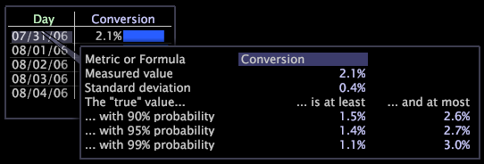

# Ajout de légendes à un espace de travail{#adding-callouts-to-a-workspace}

Les légendes sont des fenêtres que vous ajoutez à un espace de travail pour attirer l’attention sur un élément de dimension particulier en créant une nouvelle visualisation avec une sélection virtuelle de cet élément.

Le Data Workbench est livré avec un ensemble standard de types de légende. Comme votre implémentation peut être entièrement personnalisée, les types de légende disponibles qui apparaissent dans votre implémentation peuvent différer de ce qui est documenté dans ce guide.

Par défaut, Data Workbench fournit les légendes suivantes :

* [Annotation](../../../home/c-get-started/c-vis/c-call-wkspc.md#section-7b6742160b3f4aed872a09c8c023f90d)
* [Graphique en courbes vierges](../../../home/c-get-started/c-vis/c-call-wkspc.md#section-5dcc0504bdb64ed4976f880e2f7b277f)
* [Graphique de dispersion vide](../../../home/c-get-started/c-vis/c-call-wkspc.md#section-5dcc0504bdb64ed4976f880e2f7b277f)
* [Tableau vierge](../../../home/c-get-started/c-vis/c-call-wkspc.md#section-5dcc0504bdb64ed4976f880e2f7b277f)
* [Confiance : légende](../../../home/c-get-started/c-vis/c-call-wkspc.md#section-386d1293ddc24a0c9cccb332e20db791)
* [Légende Mesure](../../../home/c-get-started/c-vis/c-call-wkspc.md#section-daa6d372c22246d9827880a9d6e804d8)

>[!NOTE]
>
>Les légendes ne fonctionnent pas comme des sélections (c&#39;est-à-dire qu&#39;elles n&#39;affectent pas d&#39;autres visualisations dans l&#39;espace de travail), sauf si vous effectuez une sélection dans la légende.

Vous pouvez ajouter ou modifier des définitions de légende en configurant les fichiers de légende stockés dans le dossier d&#39;installation *profil name*\Context\Callout folder of the [!DNL Server]. Voir [Configuration des légendes](../../../home/c-get-started/c-intf-anlys-ftrs/c-config-callouts.md#concept-f6e91e172f5e4c009245c9c549beb76a).

## Pour ajouter une légende d’annotation à une visualisation {#section-7b6742160b3f4aed872a09c8c023f90d}

1. Cliquez avec le bouton droit sur l’élément pour lequel vous souhaitez créer une légende, puis cliquez sur **[!UICONTROL Add Callout]** > **[!UICONTROL Annotation]** > **[!UICONTROL Image]** ou **[!UICONTROL Add Callout]** > **[!UICONTROL Annotation]** > **[!UICONTROL Text]**. Une fenêtre vide s’affiche avec une connexion visible à cet élément.

   

   Pour ajouter des légendes aux visualisations Graphique, vous devez cliquer avec le bouton droit de la souris au bas de la visualisation (l’axe de base) pour ouvrir un menu.

   

1. Selon votre sélection, effectuez l’étape appropriée :

   * Pour une annotation de texte, tapez ou collez le texte de votre choix dans la légende, puis formatez le texte selon vos besoins. Voir [Utilisation des annotations de texte](../../../home/c-get-started/c-analysis-vis/c-annots/c-text-annots.md#concept-55b4aa3e0c58470b8e3c9d452e12a777).
   * Pour une annotation d’image, collez l’image de votre choix dans la légende en la copiant, puis en cliquant avec le bouton droit dans la légende. Cliquez sur **[!UICONTROL Paste image]**. Voir [Utilisation des annotations d’image](../../../home/c-get-started/c-analysis-vis/c-annots/c-image-annots.md#concept-02081ed7d91c4fdcb8fc863f2a51c962).

## Pour ajouter une légende vide de tableau, de graphique en courbes ou de graphique de dispersion à une visualisation {#section-5dcc0504bdb64ed4976f880e2f7b277f}

1. Cliquez avec le bouton droit sur l’élément pour lequel vous souhaitez créer une légende, puis cliquez sur **[!UICONTROL Add Callout]** > *&lt;**[!UICONTROL callout type]***.

   L’exemple suivant montre une légende Table vierge.

   

1. Pour sélectionner une dimension, cliquez avec le bouton droit de la souris sur **[!UICONTROL None]** et cliquez sur **[!UICONTROL Change Dimension]** > *&lt;**[!UICONTROL dimension name]***.

   >[!NOTE]
   >
   >Si vous modifiez la dimension dans une visualisation qui comporte une légende, celle-ci passe de la connexion à l’élément de la dimension d’origine à la connexion à la visualisation entière.

## Pour ajouter une légende de confiance à une visualisation {#section-386d1293ddc24a0c9cccb332e20db791}

1. Cliquez avec le bouton droit sur l’élément pour lequel vous souhaitez créer la légende, puis cliquez sur **[!UICONTROL Add Callout]** > **[!UICONTROL Confidence Legend]**.

   

1. Si vous le souhaitez, modifiez le champ [!DNL Metric or Formula].

Pour les règles de syntaxe d’expression, voir [Syntaxe du langage de Requête](../../../home/c-get-started/c-qry-lang-syntx/c-qry-lang-syntx.md#concept-15d1d3f5164a47d49468c5acb7299d9f). Voir [Légendes de confiance](../../../home/c-get-started/c-analysis-vis/c-legends/c-conf-leg.md#concept-73db81c2c218427786c04068aa778efd).

## Pour ajouter une légende de mesure à une visualisation {#section-daa6d372c22246d9827880a9d6e804d8}

1. Cliquez avec le bouton droit sur l’élément pour lequel vous souhaitez créer la légende, puis cliquez sur **[!UICONTROL Add Callout]** > **[!UICONTROL Metric Legend]**.

   

1. Si vous le souhaitez, ajoutez des mesures à la légende de la mesure ou supprimez-les.

Voir [Légendes des mesures](../../../home/c-get-started/c-analysis-vis/c-legends/c-metric-leg.md#concept-e7195bc8f7844ae295bda3a88b028d5b).
