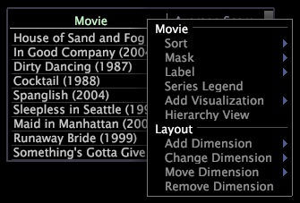

# Menus de mesure et de dimension{#metric-and-dimension-menus}

{{eol}}

Les menus accessibles en cliquant avec le bouton droit sur la mesure ou la zone de dimension dans une visualisation permettent d’accéder aux actions liées à la mesure ou à la dimension dans cette visualisation.

Pour plus d’informations sur l’utilisation de ces options de menu avec un type particulier de visualisation, consultez la section de visualisation appropriée dans [Visualisations d’analyse](../../../home/c-get-started/c-analysis-vis/c-analysis-vis.md).

## Menu Mesure {#section-115db63a26f04b57ac954a69972c6291}

Pour accéder au menu des mesures, cliquez avec le bouton droit de la souris sur une zone liée aux mesures dans une visualisation.

Ce menu propose différentes options en fonction du type de visualisation dans laquelle vous travaillez. L’exemple suivant présente certaines des options de menu disponibles, tandis que le tableau suivant répertorie toutes les options de menu disponibles.

<table id="table_81EFAC2D754843DD98C2DDF81A35A2B4"> 
 <thead> 
  <tr> 
   <th colname="col1" class="entry"> Option de menu </th> 
   <th colname="col2" class="entry"> Description </th> 
  </tr> 
 </thead>
 <tbody> 
  <tr> 
   <td colname="col1"> <i>nom de la mesure</i> </td> 
   <td colname="col2"> 
En-tête des options de menu liées aux mesures suivantes. 
 </td> 
  </tr> 
  <tr> 
   <td colname="col1"> 
Zoom sur tous 
 </td> 
   <td colname="col2"> 
Renvoie à un affichage de toutes les données du graphique. Voir <a href="../../../home/c-get-started/c-vis/c-zoom-vis.md#concept-7e33670bb5344f78a316f1a84cc20530"> Zoom dans les visualisations</a>. 
 </td> 
  </tr> 
  <tr> 
   <td colname="col1"> 
Zoom sur la sélection 
 </td> 
   <td colname="col2"> 
Applique un zoom avant sur un sous-ensemble de données sélectionné dans un graphique linéaire. Voir <a href="../../../home/c-get-started/c-vis/c-zoom-vis.md#concept-7e33670bb5344f78a316f1a84cc20530"> Zoom dans les visualisations</a>. Pour plus d’informations sur les sélections, voir <a href="../../../home/c-get-started/c-vis/c-sel-vis/c-sel-vis.md#concept-012870ec22c7476e9afbf3b8b2515746"> Réalisation de sélections dans les visualisations</a>. 
 </td> 
  </tr> 
  <tr> 
   <td colname="col1"> 
Éditeur de mesure 
 </td> 
   <td colname="col2"> 
Permet de modifier la définition de la mesure identifiée par le champ du nom de la mesure. Voir <a href="../../../home/c-get-started/c-admin-intrf/c-prof-mgr/c-drvd-mtrcs.md#section-db6d924cf4e14bcc8d57cfe1059fc797"> Modification de mesures dérivées existantes</a>. 
 </td> 
  </tr> 
  <tr> 
   <td colname="col1"> 
Mesures 
 </td> 
   <td colname="col2"> 
En-tête des options de menu liées aux mesures suivantes. 
 </td> 
  </tr> 
  <tr> 
   <td colname="col1"> 
Ajouter une mesure 
 </td> 
   <td colname="col2"> 
Ajoute une nouvelle mesure à la visualisation à gauche de la mesure sélectionnée. 
 </td> 
  </tr> 
  <tr> 
   <td colname="col1"> 
Modifier la mesure 
 </td> 
   <td colname="col2"> 
Modifie la mesure sélectionnée dans la visualisation. 
 </td> 
  </tr> 
  <tr> 
   <td colname="col1"> 
Supprimer une mesure 
 </td> 
   <td colname="col2"> 
Supprime la mesure sélectionnée de la visualisation. 
 </td> 
  </tr> 
  <tr> 
   <td colname="col1"> 
Mise en page 
 </td> 
   <td colname="col2"> 
En-tête pour les options de menu liées à la mise en page suivantes. 
 </td> 
  </tr> 
  <tr> 
   <td colname="col1"> 
Ajouter une Dimension 
 </td> 
   <td colname="col2"> 
Ajoute une autre dimension à la visualisation. 
 </td> 
  </tr> 
  <tr> 
   <td colname="col1"> 
Déplacer des mesures 
 </td> 
   <td colname="col2"> 
Déplace la mesure sélectionnée vers un autre axe de la visualisation. 
 </td> 
  </tr> 
 </tbody> 
</table>

## Utiliser le menu Dimension {#section-e09de0aa6b74459a957b627ff7d07979}

Pour accéder au menu des dimensions, cliquez avec le bouton droit de la souris sur une zone liée aux dimensions dans une visualisation.

Ce menu propose différentes options en fonction du type de visualisation dans laquelle vous travaillez. L’exemple suivant présente certaines des options de menu disponibles, tandis que le tableau suivant répertorie toutes les options de menu disponibles.

<table id="table_D8BB675B710B48A783B1C9EB206033E9"> 
 <thead> 
  <tr> 
   <th colname="col1" class="entry"> Option de menu </th> 
   <th colname="col2" class="entry"> Description </th> 
  </tr> 
 </thead>
 <tbody> 
  <tr> 
   <td colname="col1"> 
Ajouter Légende 
 </td> 
   <td colname="col2"> 
Ajoute une légende pour l’élément sélectionné, qui attire l’attention sur cet élément. Voir <a href="../../../home/c-get-started/c-vis/c-call-wkspc.md#concept-212b09e763044d938987b4a9c658adc0"> Ajout de légendes à un espace de travail</a>. 
 </td> 
  </tr> 
  <tr> 
   <td colname="col1"> 
Renommer l’élément 
 </td> 
   <td colname="col2"> 
Renomme l’élément. Cliquez sur  Rétablir pour revenir au nom d’origine. 
 </td> 
  </tr> 
  <tr> 
   <td colname="col1"> 
<i>nom de la dimension</i> 
 </td> 
   <td colname="col2"> 
En-tête des options de menu liées aux dimensions suivantes. 
 </td> 
  </tr> 
  <tr> 
   <td colname="col1"> 
Tri 
 </td> 
   <td colname="col2"> 
Trie les éléments de la dimension sélectionnée selon vos besoins. 
 </td> 
  </tr> 
  <tr> 
   <td colname="col1"> 
Masque 
 </td> 
   <td colname="col2"> 
Sélectionne un sous-ensemble des éléments de la dimension sélectionnée. 
 </td> 
  </tr> 
  <tr> 
   <td colname="col1"> 
Étiquette 
 </td> 
   <td colname="col2"> 
Permet de modifier le libellé de la dimension sélectionnée. 
 </td> 
  </tr> 
  <tr> 
   <td colname="col1"> 
Mettre en surbrillance la sélection 
 </td> 
   <td colname="col2"> 
Met en surbrillance l’élément sélectionné de la dimension. 
 </td> 
  </tr> 
  <tr> 
   <td colname="col1"> 
Effacer les éléments mis en surbrillance 
 </td> 
   <td colname="col2"> 
Efface la mise en surbrillance de tout élément de la visualisation. 
 </td> 
  </tr> 
  <tr> 
   <td colname="col1"> 
Légende des séries 
 </td> 
   <td colname="col2"> 
Code par couleurs les éléments de la dimension sélectionnée sous la forme d’une série. Voir <a href="../../../home/c-get-started/c-analysis-vis/c-tables/c-srs-leg.md#concept-c48042a705524bc4b63cd6f24874cc12"> Utilisation de légendes de séries</a>. 
 </td> 
  </tr> 
  <tr> 
   <td colname="col1"> 
Ajouter une visualisation 
 </td> 
   <td colname="col2"> 
Ajoute une visualisation qui utilise la dimension sélectionnée. 
 </td> 
  </tr> 
  <tr> 
   <td colname="col1"> 
Enregistrer la Dimension 
 </td> 
   <td colname="col2"> 
Enregistre la dimension sélectionnée de la visualisation. 
 </td> 
  </tr> 
  <tr> 
   <td colname="col1"> 
Vue Hiérarchie 
 </td> 
   <td colname="col2"> 
Modifie la visualisation de la page active en une visualisation de hiérarchie de pages, qui affiche les pages d’un site organisé hiérarchiquement par nom de fichier et triées par ordre alphabétique. Voir <a href="../../../home/c-get-started/c-analysis-vis/c-tables/c-hier-vews.md#concept-b461183424a841eb94f8143a0eaf9bff"> Application de vues de hiérarchie</a>. 
 </td> 
  </tr> 
  <tr> 
   <td colname="col1"> 
Mise en page 
 </td> 
   <td colname="col2"> 
En-tête pour les options de menu liées à la mise en page suivantes. 
 </td> 
  </tr> 
  <tr> 
   <td colname="col1"> 
Ajouter une Dimension 
 </td> 
   <td colname="col2"> 
Ajoute une autre dimension à la visualisation. 
 </td> 
  </tr> 
  <tr> 
   <td colname="col1"> 
Modifier la dimension 
 </td> 
   <td colname="col2"> 
Modifie la dimension dans la visualisation. 
 </td> 
  </tr> 
  <tr> 
   <td colname="col1"> 
Dimension Déplacer 
 </td> 
   <td colname="col2"> 
Déplace la dimension sélectionnée vers un autre axe de la visualisation. 
 </td> 
  </tr> 
  <tr> 
   <td colname="col1"> 
Supprimer la Dimension 
 </td> 
   <td colname="col2"> 
Supprime la dimension sélectionnée de la visualisation. 
 </td> 
  </tr> 
 </tbody> 
</table>
