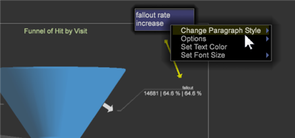

# Annotation des visualisations{#annotating-visualizations}

{{eol}}

Le calque de présentation vous permet de marquer et d’annoter vos visualisations de l’espace de travail, puis de publier avec vos légendes et commentaires. Ajoutez des descriptions de texte, des objets graphiques, des flèches de légende, des codes couleur, des images et d’autres fonctionnalités dans une superposition afin d’ajouter des annotations et de clarifier des points de données importants, puis partagez-les avec les parties prenantes.

**Ajoutez des annotations à vos visualisations :**

1. Ouvrez un espace de travail.
1. Accédez à **Fichier** > **Calque de présentation**.
1. Cliquez sur **Autoriser le calque de présentation**.

   Active/désactive la commande dans ce menu pour permettre ou non la génération d’une couche de présentation. Une coche s’affiche lorsque la couche de présentation est autorisée.

   

   Lorsque vous autorisez le calque de présentation, une icône cliquable s’affiche dans la partie droite de la barre d’outils.

    Cette icône cliquable indique que vous êtes dans la variable **Masquer le calque de présentation** , mais pas de possibilité d’afficher les annotations.

1. Cliquez sur l’icône pour basculer sur **Afficher le calque de présentation**.

   Affichez les annotations dans le calque de présentation.

    Cette icône cliquable indique que vous êtes dans la variable **Afficher le calque de présentation** mais pas de possibilité de modification.

   >[!NOTE]
   >
   >Vous pouvez également cliquer avec le bouton droit dans l’espace de travail pour modifier les modes à l’aide des commandes de menu.

   

1. **Modifiez et ajoutez des fonctions de légende.**

   Cliquez à nouveau sur l’icône pour capturer une représentation statique de la visualisation de l’espace de travail et ouvrir une superposition pour ajouter ou modifier des annotations.

    Cette icône cliquable indique que vous êtes dans la variable **Modifier le calque de présentation** pour ajouter et modifier des annotations.

   Une superposition grise s’affiche en mode d’édition.

1. **Ajout de fonctions de légende**.

   Cliquez avec le bouton droit sur la visualisation pour ajouter une nouvelle zone de texte. les flèches et autres fonctions de légende pour mettre en surbrillance et annoter pour la présentation.

   

1. **Définition des fonctionnalités graphiques**.

   Sélectionnez un objet graphique et cliquez avec le bouton droit pour définir les options. Vous pouvez définir les couleurs d’une zone ou d’un autre objet graphique, ajuster les paramètres de texte d’une zone de texte, ajouter des flèches ou définir une mise en page des lignes.

   

1. **Ajout d’images à l’espace de travail**.

   Cliquez avec le bouton droit de la souris pour ajouter vos images .png et .jpg à la superposition et redimensionner.

1. **Attribution de couleurs aux objets graphiques**.

   Vous pouvez sélectionner des objets dans le calque de présentation et attribuer des couleurs à l’aide du sélecteur de couleurs. 

1. **Exporter et partager la couche de présentation**.

   Après avoir annoté les visualisations de votre espace de travail, vous pouvez exporter la couche de présentation avec des visualisations et la partager sous la forme d’un fichier graphique .png .

   Cliquez sur **Exporter** > **Export PNG**.
