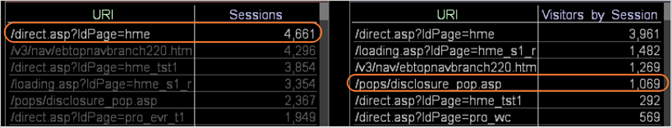

# Présentation de l’impact d’une sélection sur d’autres visualisations{#understanding-how-a-selection-affects-other-visualizations}

Dans un espace de travail, une visualisation représente un ensemble de résultats de requête.

Lorsque vous effectuez une sélection, Outils de données filtre les résultats des requêtes qu’il utilise pour produire les visualisations dans l’espace de travail. Le filtre spécifique varie selon la visualisation.

Les exemples suivants illustrent la manière dont les Outils de données appliquent une sélection à trois types différents de visualisations. L’examen de ces exemples vous aide à comprendre l’effet de filtrage des sélections sur les visualisations. Ils vous aident également à comprendre comment interpréter les résultats que vous voyez dans une visualisation filtrée.

* [Filtrage d’une visualisation avec une mesure de sessions](../../../../home/c-get-started/c-vis/c-sel-vis/c-sel-aff-vis.md#section-7cc06493ecb34cd4a696dbf0f0a7aaef)
* [Filtrage d’une visualisation avec une mesure Visiteurs](../../../../home/c-get-started/c-vis/c-sel-vis/c-sel-aff-vis.md#section-97d38c7f03e8457189a9c72d69514ed2)
* [Filtrage d’une visualisation avec une mesure Visiteurs par session](../../../../home/c-get-started/c-vis/c-sel-vis/c-sel-aff-vis.md#section-f746182311d648dcb98716b0fe846e25)

## Filtrage d’une visualisation avec une mesure de sessions {#section-7cc06493ecb34cd4a696dbf0f0a7aaef}

Dans cet exemple, l’ [!DNL /direct.asp/?ldPage=hme] URI de la visualisation à gauche filtre la mesure pour les sessions affichées dans la visualisation à droite.


* **Effet de la sélection sur la requête :** Outils de données filtre les sessions pour l’URI sélectionné. Dans cet exemple, la requête qui génère la valeur de l’ [!DNL /pops/disclosure_pop.asp] élément est filtrée comme suit :

   ```
   Sessions[ URI="/pops/disclosure_pop.asp" AND URI="/direct.asp
   /?ldPage=hme"] by Page View by Session
   ```

* **Interprétation de la visualisation :** La visualisation filtrée représente le nombre de sessions qui incluent les URI répertoriés dans la visualisation et [!DNL /direct.asp/?ldPage=hme]. Cet exemple montre qu&#39;il y a eu 1 113 sessions pendant lesquelles les visiteurs ont consulté à la fois [!DNL /pops/disclosure_pop.asp] page et [!DNL /direct.asp/?ldPage=hme] dans la même session.

## Filtrage d’une visualisation avec une mesure Visiteurs {#section-97d38c7f03e8457189a9c72d69514ed2}

Dans cet exemple, l’ [!DNL /direct.asp/?ldPage=home] URI de la visualisation à gauche filtre la mesure Visiteurs dans la visualisation à droite.


* **Effet de la sélection sur la requête :** Outils de données filtre les visiteurs pour l’URI sélectionné. Dans cet exemple, la requête qui génère la valeur pour l’ [!DNL /pops/disclosure_pop.asp] URI est filtrée comme suit :

   ```
   Visitors[ URI="/pops/disclosure_pop.asp" by Page View by Visitor 
     AND URI="/direct.asp/?ldPage=hme" by Page View by Visitor ]
   ```

* **Interprétation de la visualisation :** La visualisation filtrée représente les visiteurs qui ont consulté les URI répertoriés dans la visualisation et [!DNL /direct.asp/?ldPage=hme] (bien que pas nécessairement au cours de la même session). L’exemple ci-dessus montre que 2 041 visiteurs ont consulté à la fois [!DNL /pops/disclosure_pop.asp] et [!DNL /direct.asp/?ldPage=hme].

## Filtrage d’une visualisation avec une mesure Visiteurs par session {#section-f746182311d648dcb98716b0fe846e25}

Dans cet exemple, l’ [!DNL /direct.asp/?ldPage=hme] URI de la visualisation à gauche filtre la mesure pour chaque visiteur de la visualisation à droite.



* **Effet de la sélection sur la requête :** Les outils de données filtrent les visiteurs par session pour l’URI sélectionné. Par exemple, la requête qui génère la valeur pour l’ [!DNL /pops/disclosure_pop.asp] URI est filtrée comme suit :

   ```
   Visitors[ ( URI="/pops/disclosure_pop.asp" by Page View 
     AND URI="/direct.asp/?ldPage=hme" by Page View ) by Session ]
   ```

* **Interprétation de la visualisation :** La visualisation filtrée représente les visiteurs qui ont consulté les deux URI répertoriés dans la visualisation et [!DNL /direct.asp/?ldPage=hme] au cours de la même session. Cet exemple montre que 1 069 visiteurs ont vu à la fois [!DNL /pops/disclosure_pop.asp] et [!DNL /direct.asp/?ldPage=hme] pendant une seule session.

