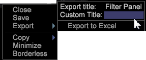

# Fenêtre, menu{#window-controls-menu}

Le menu Options de fenêtre vous permet de contrôler une fenêtre individuelle.

Cliquez avec le bouton droit de la souris sur la bordure supérieure de la fenêtre.

Ces options de menu varient en fonction du type de fenêtre. Le tableau de la procédure suivante décrit les éléments de menu de base disponibles pour la plupart des types de fenêtres. Les autres options disponibles pour des types particuliers de fenêtres sont décrites dans leurs sections respectives dans ce guide.

<table id="table_13ADF7B7E50E44D890768A5F9BAC8D06"> 
 <thead> 
  <tr> 
   <th colname="col1" class="entry"> Option de menu </th> 
   <th colname="col2" class="entry"> Description </th> 
  </tr> 
 </thead>
 <tbody> 
  <tr> 
   <td colname="col1"> Fermer </td> 
   <td colname="col2"> Ferme la fenêtre active. </td> 
  </tr> 
  <tr> 
   <td colname="col1"> Enregistrer </td> 
   <td colname="col2">Enregistre la visualisation (sous forme de fichier .vw  ) dans son état actuel. La boîte de dialogue qui s’affiche vous permet d’enregistrer la visualisation sous un autre nom ou à un autre emplacement. L’emplacement par défaut est le dossier User\<i>profile name</i>\Work dans le répertoire d’installation des outils de données. </td> 
  </tr> 
  <tr> 
   <td colname="col1"> Afficher sous </td> 
   <td colname="col2">(Disponible uniquement pour les tableaux.) Affiche les données d’un tableau sous forme de nombres, de barres ou des deux simultanément. Voir <a href="../../../home/c-get-started/c-analysis-vis/c-tables/c-chg-tbl-disp.md#concept-c515caeefce9495f88873a10dc112770"> Modification de l’affichage</a>du tableau. </td> 
  </tr> 
  <tr> 
   <td colname="col1"> Afficher </td> 
   <td colname="col2">(Disponible uniquement pour les graphiques.) Affiche les données d’un graphique sous forme de lignes ou de barres. Voir <a href="../../../home/c-get-started/c-analysis-vis/c-graphs/c-chg-graph-disp.md#concept-eaba669d90f64cfa872f1397205fe2f7"> Modification de l’affichage</a>du graphique. </td> 
  </tr> 
  <tr> 
   <td colname="col1"> Ajuster à la fenêtre </td> 
   <td colname="col2">Permet au contenu de la fenêtre de s’agrandir ou de se rétrécir automatiquement pour s’adapter à la fenêtre chaque fois que vous la redimensionnez. Voir <a href="../../../home/c-get-started/c-analysis-vis/c-annots/c-image-annots.md#concept-02081ed7d91c4fdcb8fc863f2a51c962"> Utilisation des annotations</a> d’image et <a href="../../../home/c-get-started/c-analysis-vis/c-tables/c-fit-data-win.md#concept-b812b1171fc240d9a4cf6d6d57f621a6"> Ajustement des données dans la fenêtre</a>. </td> 
  </tr> 
  <tr> 
   <td colname="col1"> Commande </td> 
   <td colname="col2"> 
Organise les calques des fenêtres dans l’espace de travail. Les commandes de commande comprennent les éléments suivants : 
     <ul id="ul_90391B26719040AE8E0F80FE33B106FD"> 
      <li id="li_D1B38998C8CC452D8B642132B94F92F7">Avant : Place la fenêtre au premier plan de l’affichage. </li> 
      <li id="li_71EEC709AA734924AE8740313031DF6E">Normal : Laisse la fenêtre à l'endroit où elle s'ouvrait. </li> 
      <li id="li_B6489677FF5540E4BD854EE1CE504CCA">Retour : Place la fenêtre derrière toute autre fenêtre ouverte dans l’affichage actuel. </li> 
     </ul> 
 
Un X apparaît à gauche de l’option active. 
 </td> 
  </tr> 
  <tr> 
   <td colname="col1"> Copier </td> 
   <td colname="col2">Copie des fenêtres individuelles dans le Presse-papiers en vue de les utiliser dans des applications tierces. Après avoir copié une fenêtre dans le Presse-papiers, elle peut être collée dans des applications bureautiques courantes, notamment Microsoft Word, Microsoft PowerPoint ou un message électronique Microsoft Outlook. Pour copier une fenêtre, cliquez avec le bouton droit sur sa bordure supérieure, cliquez sur  Copier, puis sur l’option appropriée : 
    <ul id="ul_ECCD6A70729E40998C64714E01504995"> 
     <li id="li_21D375DAE7BC4F449C8A3225296A6D26">L’arrière-plan noir copie l’espace de travail tel qu’il s’affiche. </li> 
     <li id="li_1B08C688678F42948E0952EEE0BF2B30">L’arrière-plan blanc copie les éléments de l’espace de travail en couleur et les affiche sur un arrière-plan blanc. </li> 
     <li id="li_86F497A2275C43B5835DEDD0A4BF76E8">L’arrière-plan blanc (B&amp;W) copie les éléments de l’espace de travail en niveaux de gris et les affiche sur un arrière-plan blanc. </li> 
    </ul> </td> 
  </tr> 
  <tr> 
   <td colname="col1"> Réduire </td> 
   <td colname="col2"> Réduit la taille globale de la fenêtre, tandis que tout le contenu de la fenêtre reste visible mais n’est pas mis à jour. Cliquez avec le bouton droit de la souris sur la fenêtre réduite pour rétablir sa taille d’origine. </td> 
  </tr> 
  <tr> 
   <td colname="col1"> Sans bordure </td> 
   <td colname="col2"> Supprime les bordures autour de la fenêtre sélectionnée. Cette commande est très utile lors de la création de rapports. </td> 
  </tr> 
 </tbody> 
</table>
