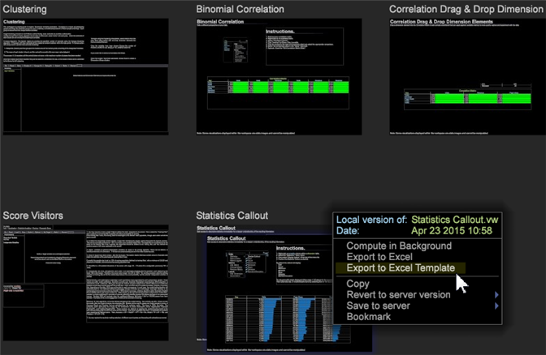

# Utilisation du menu Miniature du plan de travail{#using-the-worktop-thumbnail-menu}

Comment exporter, copier et mettre en signet à partir de Worktop.

Cliquez avec le bouton droit de la souris sur un espace de travail pour exporter, copier et mettre en signet des fonctions à partir du Worktop.

## Descriptions des interfaces {#section-fd027dd94b7d4cb6b933d70c08ccd3e2}

Les éléments suivants sont disponibles dans le menu [!DNL Worktop] de miniature :

**Espace de travail du serveur :** *nom*

S’affiche uniquement pour les espaces de travail de serveur non modifiés. Identifie l’espace de travail nommé comme l’espace de travail stocké sur le serveur.

**Date :** *jour et heure*

date et heure de la dernière ouverture de l’espace de travail.

**Version locale de :** *nom*

S’affiche uniquement pour les versions locales des espaces de travail du serveur. Identifie l’espace de travail nommé en tant que version locale modifiée d’un espace de travail stocké sur le serveur.

**Espace de travail utilisateur :** *nom*

S’affiche uniquement pour les espaces de travail utilisateur. Identifie l’espace de travail nommé comme un espace de travail qui existe uniquement sur l’ordinateur local.

**Calculer en arrière-plan**

S’affiche uniquement lorsque vous travaillez en ligne. Maintient les requêtes dans l’espace de travail sélectionné en arrière-plan pendant que vous continuez à travailler. Lorsqu’elle est sélectionnée, la miniature affiche les informations suivantes, qui indiquent la progression des requêtes :

* Travail : *n%* : indique que la requête est en cours de traitement et le pourcentage de traitement terminé.
* *n* MB Query Load - taille totale du résultat de la requête. Le chargement de requête est proportionnel à la charge totale de mémoire de votre serveur Outils de données, mais il n’est pas directement corrélé. À titre indicatif, une charge de requête supérieure ou égale à 10 Mo peut épuiser votre système. La charge de requête répertoriée ne prend pas en compte la mise en grappe.

   >[!NOTE]
   >
   >Si l’option Calculer en arrière-plan reste sélectionnée, les requêtes de l’espace de travail sélectionné deviennent des requêtes permanentes, en continuant à être mises à jour et à utiliser la charge de mémoire. Assurez-vous de désélectionner Calculer en arrière-plan lorsque vous avez terminé de travailler dans l’espace de travail.

**Exporter vers Excel**

Exportez les données de l’espace de travail dans un tableau Microsoft Excel (fichiers .xls et .xslx). Lors de l’exportation d’un espace de travail vers Excel, les outils de données exportent les données de certaines visualisations, légendes de dimension et de valeur et annotations textuelles vers un nouveau classeur Excel avec une visualisation par feuille de calcul.

**Exporter vers un modèle Excel**

Exportez vers un modèle Excel (.xltx).

**Copier**

Copie l’espace de travail. Pour plus d’informations sur le collage d’un espace de travail copié, voir [Copie et collage d’espaces](../../home/c-get-started/c-work-worksp/c-create-worksp.md#section-f91ae89b845640c9a4a52820a6110e65)de travail existants.

**Restaurer la version du serveur**

S’affiche uniquement pour les versions locales des espaces de travail du serveur. Supprime la copie locale de cet espace de travail. L’original reste sur le serveur.

**Supprimer**

S’affiche uniquement pour les espaces de travail utilisateur. Supprime l’espace de travail utilisateur, qui n’existe que sur l’ordinateur local. Pour plus d’informations sur la suppression d’espaces de travail du serveur Outils de données connecté, voir [Suppression de fichiers de votre profil](../../home/c-get-started/c-admin-intrf/c-prof-mgr/t-del-files-wkg-prof.md#task-1e29c25e6c824cc9b51cb651e835856b)de travail.

**Enregistrer sur le serveur**

S’affiche uniquement pour les versions locales des espaces de travail du serveur et des utilisateurs et fonctionne uniquement pour les utilisateurs disposant des autorisations appropriées. Enregistre la copie locale de l’espace de travail sur le serveur. Par défaut, les espaces de travail sont enregistrés dans le `<profile name>\Workspaces\<tab name>` dossier de travail approprié.

**Signet**

Mettre un espace de travail en signet pour le récupérer plus tard.

Une icône de signet  s’affiche au-dessus de l’espace de travail sur le plan de travail et le nom de l’espace de travail s’affiche dans le panneau Signet. 

