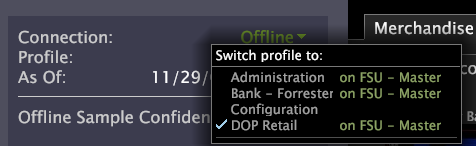

# Profils{#profiles}

Les outils de données téléchargent les profils sur votre ordinateur.

Si vous chargez un profil pour la première fois, vous devez être connecté au réseau [!DNL Data Workbench server] et travailler en ligne pour que les Outils de données puissent télécharger les fichiers nécessaires à partir du [!DNL Data Workbench server].

Le téléchargement du profil peut prendre plusieurs minutes. Vous ne devez pas commencer à travailler sur le profil tant que le cache de données n’est pas rempli, mais vous n’avez pas à attendre qu’il soit plein. Vous pouvez suivre la progression du cache de données, la progression de la synchronisation des profils et la date et l’heure des dernières données traitées en regardant les barres d’état au chargement du profil.

>[!NOTE]
>
>Les données que vous ajoutez dans les visualisations ne s’affichent pas tant que le cache de données ne commence pas à être rempli.

Lors du prochain chargement du profil, les mises à jour du profil et de ses données ne sont téléchargées que si vous disposez d’une connexion réseau au profil [!DNL Data Workbench server] et que vous travaillez en ligne. Si vous travaillez hors ligne, le profil et ses données sont chargés à partir du cache de votre ordinateur. Dans ce cas, vous affichez la version du profil et des données qui ont été téléchargées la dernière fois que vous avez travaillé en ligne avec le profil. Pour plus d’informations sur le travail en ligne par rapport à hors ligne, voir [Travail hors ligne et en ligne](../../home/c-get-started/c-off-on.md#concept-cef8758ede044b18b3558376c5eb9f54).

Lorsque vous devez modifier votre profil (à l’aide du [!DNL Profile Manager] ou du [!DNL Server Files Manager]), vous devez travailler en ligne pour vous assurer que vous disposez de la version la plus récente du profil. Pour plus d’informations sur le [!DNL Profile Manager] et le [!DNL Server Files Manager], voir Interfaces administratives.

Si vous ne parvenez pas à accéder à un profil ou à le charger, vous devrez peut-être confirmer les éléments suivants :

* Vous disposez d’une connexion réseau à l’ [!DNL Data Workbench server] ordinateur sur lequel se trouve le profil.
* Vous disposez des autorisations appropriées pour accéder au profil.

Pour obtenir de l’aide, contactez votre administrateur système.

## Chargement ou basculement de profils {#section-c50499d7d8084d7cadfada52df33f5f4}

1. Lancez Outils de données.
1. Dans la barre latérale, cliquez sur le nom du profil et cliquez sur **[!UICONTROL Switch Profile]** > *&lt;**[!UICONTROL profile name]**>*, où le nom *du* profil est le profil avec lequel vous souhaitez travailler.

   

S’il s’agit du premier chargement du profil sélectionné, le téléchargement d’un nombre suffisant de données peut prendre plusieurs minutes pour remplir une visualisation.

## Accès à un profil sur une grappe {#section-189a0ac04a8f46099c11c0f4f77b6dbb}

Utilisateurs des outils de données qui accèdent à un profil s’exécutant sur un

la grappe de serveurs de outils de données identifie uniquement le serveur maître des outils de données dans le fichier de configuration des outils de données ( [!DNL Insight.cfg]). Du point de vue de l’utilisateur des outils de données, le profil est accessible sur un seul serveur des outils de données (le serveur maître des outils de données). Toutefois, les requêtes des analystes peuvent être dirigées vers n’importe quel serveur des outils de données de la grappe.

Pour plus d’informations sur les profils s’exécutant sur une grappe de serveurs Data Workbench, voir le Guide *d’installation et d’administration des produits* serveur.
