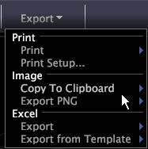

# Partager un espace de travail{#share-a-workspace}

Vous pouvez utiliser le menu Exporter l’espace de travail pour imprimer et exporter des espaces de travail vers des fichiers .png ou Excel.

Dans un espace de travail, cliquez sur **[!UICONTROL Export]**.

<table id="table_900D1AB7B08749469DA9544C5D37096F"> 
 <thead> 
  <tr> 
   <th colname="col1" class="entry"> Option de menu </th> 
   <th colname="col2" class="entry"> Description </th> 
  </tr> 
 </thead>
 <tbody> 
  <tr> 
   <td colname="col1"> Imprimer </td> 
   <td colname="col2"> Imprime l’espace de travail. Lorsque vous imprimez un espace de travail, l’arrière-plan s’imprime en blanc. Si vous imprimez sur une imprimante couleur, l’espace de travail imprime en couleur sur un arrière-plan blanc. Si vous imprimez sur une imprimante en noir et blanc, l’espace de travail s’imprime en niveaux de gris sur un arrière-plan blanc. Par défaut, la sortie imprimée est centrée horizontalement sur la page. </td> 
  </tr> 
  <tr> 
   <td colname="col1"> Configuration de l'impression </td> 
   <td colname="col2"> Définit l’orientation de la page (portrait ou paysage) et les marges. </td> 
  </tr> 
  <tr> 
   <td colname="col1"> Copier dans le Presse-papiers </td> 
   <td colname="col2"> 
Copie l'espace de travail ou la barre latérale dans le Presse-papiers. Les options suivantes sont disponibles lors de la copie des espaces de travail, des encadrés ou des deux : 
     <ul id="ul_F7338E53385B4AE39FBCF1C3A80276CE"> 
      <li id="li_9A3147A64B1C443AAE2843A5260E3273">L’option Arrière-plan sombre copie l’espace de travail tel qu’il s’affiche. </li> 
      <li id="li_516B6162FDA747CFBB2886E71DF49146">L’option Arrière-plan clair copie les éléments de l’espace de travail en couleur et les affiche sur un arrière-plan blanc. </li> 
      <li id="li_E0B5E9D31F5948238DEB0D75E235BAE3">L’option monochrome copie les éléments de l’espace de travail en niveaux de gris et les affiche sur un arrière-plan blanc. </li> 
     </ul> 
 </td> 
  </tr> 
  <tr> 
   <td colname="col1"> Exporter du fichier PNG </td> 
   <td colname="col2">Enregistre un instantané d'un espace de travail au format Portable Network Graphic (fichier .png). Voir <a href="../../../home/c-get-started/c-work-worksp/c-ex-wksp.md#section-f9fbe0f0a1c341e2b063cce106cac35e"> Exportation d’espaces de travail en tant que fichiers PNG</a>. </td> 
  </tr> 
  <tr> 
   <td colname="col1"> Excel </td> 
   <td colname="col2"> Si Microsoft Excel est installé sur l’ordinateur Data Workbench, début automatiquement Microsoft Excel et exporte les données de certaines visualisations, légendes et annotations de texte dans un nouveau fichier Excel (.xls ou .xlsx). Voir <a href="../../../home/c-get-started/c-work-worksp/c-ex-wksp.md#section-fe214e3dbc364d2eba3834d62d295acb"> Exportation de données Workspace vers Microsoft Excel</a>. </td> 
  </tr> 
  <tr> 
   <td colname="col1"> Exporter (Excel) à partir d’un modèle </td> 
   <td colname="col2"> Si Microsoft Excel est installé sur l’ordinateur Data Workbench, début automatiquement Microsoft Excel et exporte les données de certaines visualisations, légendes et annotations de texte dans le fichier Excel du modèle ( .xls ou  .xlsx) que vous sélectionnez. Voir <a href="../../../home/c-get-started/c-work-worksp/c-ex-wksp.md#section-814772929ca64cf6b92b89d3fdd02302"> Exportation vers un modèle de fichier Excel</a>. </td> 
  </tr> 
 </tbody> 
</table>
