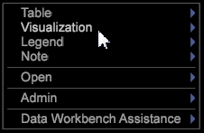

# Utilisation du menu Fenêtre de l’espace de travail{#using-the-workspace-window-menu}

Ce menu vous permet d’ajouter des visualisations disponibles à votre espace de travail.

Cliquez avec le bouton droit dans la fenêtre de l&#39;espace de travail (n&#39;importe où en arrière-plan de votre espace de travail).

>[!NOTE]
>
>Étant donné que votre implémentation de Data Workbench peut être entièrement personnalisée, les options de menu qui s’affichent peuvent différer de celles documentées dans cette section.

Le tableau suivant contient la description de chaque élément de menu.

<table id="table_00C0D3E6098E473E8D3B66F48FB635B3"> 
 <thead> 
  <tr> 
   <th colname="col1" class="entry"> Option de menu </th> 
   <th colname="col2" class="entry"> Description </th> 
  </tr> 
 </thead>
 <tbody> 
  <tr> 
   <td colname="col1"> Tableau </td> 
   <td colname="col2"> Ajoute un tableau à votre espace de travail en fonction de la dimension sélectionnée. Voir <a href="../../../home/c-get-started/c-vis/c-vis.md#concept-f6c7728d5aaa4304bbf2e4dfaed48739"> Utilisation des visualisations</a> et <a href="../../../home/c-get-started/c-analysis-vis/c-tables/c-tables.md#concept-c632cb8ad9724f90ac5c294d52ae667f"> Tableaux </a>. </td> 
  </tr> 
  <tr> 
   <td colname="col1"> Visualisation </td> 
   <td colname="col2"> Ajoute une visualisation à votre espace de travail en fonction du type de visualisation sélectionné (par exemple, un graphique ou un tableau) et de la ou des dimensions sélectionnées. Voir <a href="../../../home/c-get-started/c-vis/c-vis.md#concept-f6c7728d5aaa4304bbf2e4dfaed48739"> Utilisation des visualisations </a> et <a href="../../../home/c-get-started/c-analysis-vis/c-analysis-vis.md#concept-cb5b9716d3404b2b888a55b3efec1fa5"> Visualisations des analyses </a>. </td> 
  </tr> 
  <tr> 
   <td colname="col1"> Légende </td> 
   <td colname="col2"> Ajoute une légende à votre espace de travail. Voir <a href="../../../home/c-get-started/c-analysis-vis/c-legends/c-legends.md#concept-ba7a886967314ee5aa358f5949665494"> Légendes </a>. </td> 
  </tr> 
  <tr> 
   <td colname="col1"> Remarque </td> 
   <td colname="col2"> Ajoute une image, un texte ou une fenêtre de titre dynamique à votre espace de travail. Voir <a href="../../../home/c-get-started/c-analysis-vis/c-annots/c-annots.md#concept-ab80edcbc4204dd78c73630511f75ab0"> Annotations </a>. </td> 
  </tr> 
  <tr> 
   <td colname="col1"> Ouvrir </td> 
   <td colname="col2"> 
 
     <ul id="ul_173273B72EE24A52927B59E63F0BF19B"> 
      <li id="li_1EF395A0425047A9981891A0D9D29F07">L’option  Fichier  vous permet d’accéder à une visualisation existante et de l’ouvrir. </li> 
      <li id="li_E02E8929B8E247B0A46F6D708C51B1E2">L’option  A partir du Presse-papiers  permet d’ouvrir une fenêtre que vous avez copiée précédemment. L’ équivaut à coller une fenêtre que vous avez copiée. </li> 
     </ul> 
 </td> 
  </tr> 
  <tr> 
   <td colname="col1"> Admin </td> 
   <td colname="col2"> En-tête des interfaces administratives. Voir <a href="../../../home/c-get-started/c-admin-intrf/c-admin-intrf.md#concept-855c1a91e1a948969fab592adca15f74"> Interfaces administratives </a>. </td> 
  </tr> 
  <tr> 
   <td colname="col1"> Data (Données) </td> 
   <td colname="col2"> 
 
     <ul id="ul_CFAC2CBB10464079A78A9127C25482FF"> 
      <li id="li_78C64D2602674C2D85509422FF055D5C">(Disponible uniquement avec Site) L’option  Filtre de session rompu  permet de filtrer tous les visiteurs avec une seule page vue. Comme la plupart d’entre eux sont des robots, des araignées ou des utilisateurs qui ont désactivé les cookies, il est possible d’effectuer une analyse plus précise en filtrant ces sessions hors de l’analyse. Vous pouvez activer et désactiver le filtre en cliquant sur  Données  &gt;  Filtre de session rompu . Lorsque le  filtre de session rompu  est principal, un X apparaît à gauche de l’option de menu  Filtre de session rompu  . Le  filtre de session endommagé  est activé par défaut, mais son état est conservé séparément pour chaque espace de travail que vous chargez. par conséquent, vous pouvez l’activer ou la désactiver pour chaque espace de travail. </li> 
      <li id="li_DB69A4EAD6964CCEAE59E1B2E9CED394">L'option  Sous-ensemble  permet de sélectionner le sous-ensemble de données à afficher en cliquant sur  Données  &gt;  Sous-ensemble  &gt; <i>&lt;  nom du sous-ensemble </i>. Voir <a href="../../../home/c-get-started/c-vis/c-wk-subsets/c-wk-subsets.md#concept-43809322b6374d5cb2536630a13e943b"> Utilisation de sous-ensembles </a>. </li> 
      <li id="li_1B3C3835F1F94028AA45FC29D04F8CF8">L’option  Générer automatiquement la période de rapport  permet de maintenir la synchronisation de la mesure de la période de rapport avec le jeu de données. Elle est activée par défaut. </li> 
     </ul> 
 </td> 
  </tr> 
 </tbody> 
</table>
