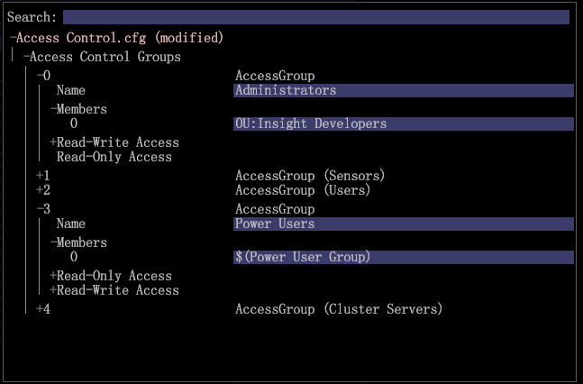

# Administration des utilisateurs de l’accès aux membres des groupes{#user-administration-of-group-member-access}

{{eol}}

Les administrateurs peuvent permettre aux utilisateurs de la station de travail de gérer de manière partielle le contrôle d’accès des groupes personnalisés.

**Auto-administration de l’accès des membres du groupe** autorise les non-administrateurs à ajouter et supprimer des membres dans un groupe personnalisé. L’administrateur crée un **Liste des utilisateurs** et configurent l’accès au groupe dans le [Access Control.cfg](https://experienceleague.adobe.com/docs/data-workbench/using/server-admin-install/admin-dwb-server/access-control/c-config-acs-ctrl.html) pour les nouveaux membres du groupe.

**Accès au gestionnaire des serveurs**

Configuration de la variable **[!DNL User List]** et de le synchroniser avec l’événement **[!DNL Communications.cfg]** est effectué dans la variable **Gestionnaire des serveurs** workspace.

1. Sur le plan de travail, cliquez sur le **Administration** onglet > **Jeu de données et profil** .

1. Ouvrez le **Gestionnaire des serveurs** workspace.
1. Cliquez avec le bouton droit de la souris >*votre nom de serveur*> dans le diagramme et sélectionnez **Fichiers**.

   Les fichiers du serveur s’ouvrent dans un tableau avec des colonnes. *Fichier*, *`<server name>`*, et *Temp*.

1. **Rendre local** en cliquant avec le bouton droit dans la colonne serveur d’un fichier serveur (pour cette fonctionnalité) **[!DNL Access Control]** et **[!DNL Components/Communications.cfg)]**.

   Une coche blanche apparaît dans la **Temp** colonne . Vous pouvez les modifier dans le dossier Temp . Cliquez ensuite avec le bouton droit de la souris sur la coche et **Enregistrer dans** le serveur. (Il devient rouge lors de la synchronisation avec le serveur).

## Création d’un fichier User List.cfg {#section-c25bcaf34f4546e6b8b65f5e7f69ac09}

L’administrateur doit créer une **[!DNL User List.cfg]** dans le fichier **[!DNL Access Control]** dossier.

1. Cliquez avec le bouton droit de la souris sur ** ligne Contrôle d’accès** dans la **Temp** et sélectionnez **Ouvrir** > **Dossier**. 

   Le dossier Contrôle d’accès dans la **Temp** ouvre la liste d’un seul dossier **[!DNL Access Control.cfg]** fichier .

1. Ajoutez un autre fichier texte à ce dossier et nommez-le. **[!DNL User List.cfg]** (en regard de la variable **[!DNL Access Control.cfg]**).

1. Ajoutez les paramètres suivants au **[!DNL User List.cfg]** fichier .

Le fichier User List doit contenir un vecteur de **AccessGroup** et chaque **AccessGroup** doit avoir un nom et un vecteur de chaînes appelé **Membres**.

```
Access Control Groups = vector: 1 items 
  0 = AccessGroup:  
    Name = string: Group 1 
    Members = vector: 1 items 
      0 = string: CN:Joe User
```

Vous pouvez ensuite modifier et ajouter les utilisateurs dans la vue de la station de travail de la **[!DNL User List.cfg]**.


Voici les paramètres les plus élémentaires à ajouter au **[!DNL User List.cfg]** fichier . Les membres peuvent ensuite être ajoutés dans la vue de la station de travail.

```
Access Control Groups = vector: 1 items 
  0 = AccessGroup:  
    Name = string:  
    Members = vector: 0 items
```

>[!IMPORTANT]
>
>Comme avec tout **[!DNL .cfg]** que vous modifiez manuellement, veillez à utiliser des espaces plutôt que des onglets et à prêter une attention particulière à l’espace blanc et à la syntaxe. Une erreur dans ce fichier provoquera *Serveur Adobe Insight* pour ignorer le fichier User List.

Le **Nom** de chaque champ **Groupe d’accès** est référencé dans la variable [!DNL Access Control.cfg] fichier .

>[!NOTE]
>
>Seuls les membres valides avec des préfixes de service d’annuaire, tels que **CN :** ou **OU :** sont acceptés et ne peuvent pas contenir de caractère générique (&#42;).

## Configuration du fichier Communications.cfg {#section-9d6f05ba81c14f15be63e361533459e8}

Un administrateur commence par activer cette fonction en ouvrant la fenêtre **[!DNL Components]>[!DNL Communications.cfg]** et ajouter une nouvelle clé avec le nom **[!DNL Access Control User List File]**. La valeur string de cette clé est le chemin d’accès à ce nouveau fichier.

1. Dans les fichiers du serveur, cliquez sur **Composants** et cliquez avec le bouton droit de la souris sur la coche dans la colonne serveur. Cliquez sur **Rendre local**.

   Une coche blanche apparaît dans la **Temp** colonne .

1. Cliquez avec le bouton droit de la souris sur la coche dans la **Temp** et sélectionnez **Ouvrir** > **dans Workstation**.

1. Dans le **Communication.cfg** fichier, clic droit **component** et sélectionnez **Ajout d’une clé personnalisée.** 

1. Saisissez le **Nom** as *Accès au fichier de liste d’utilisateurs du contrôle* et défini **Type** as *Chaîne*.

   >[!NOTE]
   >
   >Vous ne pouvez pas créer de fichier de liste sous la forme d’un chemin d’accès. Pour remédier à ce problème, vous devez enregistrer le fichier, l’ouvrir dans un éditeur (Bloc-notes) et remplacer &quot;Chaîne&quot; par &quot;Chemin&quot; :

   Avant que les valeurs de:

   ```
   component = CommServer:  
     Access Control File = Path: Access Control\\Access Control.cfg 
     Access Control User List File =  
    <string>: Access Control\\User List.cfg
   ```

   Après:

   ```
   component = CommServer:  
     Access Control File = Path: Access Control\\Access Control.cfg 
     Access Control User List File =  
    <Path>: Access Control\\User List.cfg
   ```

1. Enregistrez le **[!DNL Communications.cfg]** et (si nécessaire) enregistrez-le sur le serveur. Cela redémarrera les composants du serveur pour vous assurer que vous n’avez commis aucune erreur pouvant empêcher la variable **[!DNL Communications.cfg]** d’être analysé.
1. Si votre système comprend des serveurs de traitement, modifiez le fichier de configuration dans la variable **[!DNL Components for Processing Servers.cfg]** fichier .
1. Clic droit **[!DNL Communications.cfg]** et enregistrez sur le serveur .

L’administrateur du Data Workbench peut maintenant confirmer que le ou les utilisateurs prévus ont accès au fichier de liste d’utilisateurs et permettre aux utilisateurs de gérer le groupe. Les utilisateurs pourront ouvrir le fichier User List, le modifier, ajouter et supprimer des membres CN ou OU si nécessaire.

## Synchronisation du fichier Access Control.cfg {#section-ca6da453dfb4432bb40b86ef15ede872}

L’administrateur peut alors modifier la variable **[!DNL Access Control.cfg]** et insérer des références au(x) groupe(s) défini(s) par le *Liste des utilisateurs* fichier .

Les références au ou aux groupes doivent être insérées comme tout autre membre, mais avec la syntaxe suivante :

```
$(Group Name)
```

Où &quot;Nom de groupe&quot; correspond à ce qui est défini dans le fichier de liste d’utilisateurs, y compris les espaces blancs. 

À ce stade, l’administrateur du Data Workbench peut confirmer que certains utilisateurs du groupe ont accès au fichier de liste d’utilisateurs. Les utilisateurs sélectionnés peuvent alors ouvrir le **[!DNL User List.cfg]** fichier, modifiez-le, puis ajoutez et supprimez des membres CN ou OU si nécessaire.
