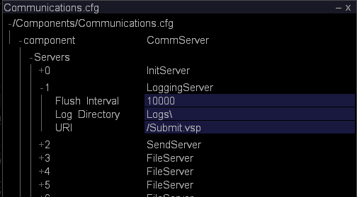

# Surveillance de l’espace de données d’événement{#monitoring-event-data-space}

Informations sur la surveillance de l’espace de données d’événement et la modification du répertoire des journaux pour les données Sensor.

**Fréquence recommandée :** Toutes les 5 à 10 minutes

[!DNL Insight Server] stocke un fichier journal par [!DNL Sensor] jour sur l’unité de traitement des données ou sur l’unité du serveur de fichiers, selon votre configuration. La taille des fichiers journaux et la quantité d’espace de stockage des données nécessaires dépendent de nombreuses variables, dont, par exemple, le nombre de sites Web enregistrés et le nombre de demandes reçues par seconde par vos serveurs Web.

Une installation type de [!DNL Insight Server] (ou d’une [!DNL Insight Server] grappe) est capable de stocker plusieurs téraoctets de données, en supposant que l’implémentation utilise le matériel recommandé par Adobe pour les [!DNL Insight Server] machines.

En règle générale, toutes les données du journal restent présentes sur l’ [!DNL Insight Server] ordinateur. S’il devient nécessaire de libérer plus d’espace de stockage de données sur l’ordinateur, vous pouvez déplacer tous les fichiers journaux de la journée, à l’exception des fichiers les plus récents, vers un autre ordinateur ou un autre support de stockage de données (lecteur zip, bande, etc.). Le déplacement des données ne nécessite pas d’arrêt [!DNL Insight Server]et n’affecte pas la fonctionnalité disponible dans les [!DNL Insights] qui peuvent être connectées [!DNL Insight Server] et travailler avec des données continues. A condition de ne pas traiter ni retraiter un jeu de données d’analyse, vous conservez l’accès à toutes les données précédentes et de nouvelles données restent disponibles dans [!DNL Insight]. Si vous traitez ou retraitez un jeu de données d’analyse, vous ne pouvez pas accéder aux données tant que le traitement n’est pas terminé.

Par défaut, les données d’événement générées par [!DNL Sensor] et transmises à [!DNL Insight Server] sont stockées dans le [!DNL Logs] dossier du répertoire [!DNL Insight Server] d’installation. Le fichier de configuration Communications [!DNL Communications.cfg]indique l’emplacement des fichiers journaux de données d’événement lus par [!DNL Insight Server].

**Pour modifier le répertoire du journal des[!DNL Sensor]données**

1. Dans [!DNL Insight]l’onglet [!DNL Admin] > [!DNL Dataset and Profile] , cliquez sur la **[!UICONTROL Servers Manager]** miniature pour ouvrir l’espace de travail Gestionnaire de serveurs.
1. Cliquez avec le bouton droit de la souris sur l’icône du [!DNL Insight Server] fichier à configurer, puis cliquez sur **[!UICONTROL Server Files]**.
1. Dans la [!DNL Server Files Manager], cliquez **[!UICONTROL Components]** pour en afficher le contenu. Le [!DNL Communications.cfg] fichier se trouve dans ce répertoire.
1. Cliquez avec le bouton droit de la souris sur la coche dans la colonne du nom *du* serveur [!DNL Communications.cfg] et cliquez sur **[!UICONTROL Make Local]**. Une coche apparaît dans la [!DNL Temp] colonne pour [!DNL Communications.cfg].
1. Cliquez avec le bouton droit sur la coche nouvellement créée dans la [!DNL Temp] colonne et cliquez sur **[!UICONTROL Open]** > **[!UICONTROL in Insight]**.
1. Dans la [!DNL Communications.cfg] fenêtre, cliquez **[!UICONTROL component]** pour en afficher le contenu.
1. Dans la [!DNL Communications.cfg] fenêtre, cliquez **[!UICONTROL Servers]** pour en afficher le contenu. Plusieurs types de serveurs peuvent apparaître : Serveurs de fichiers, serveurs de journalisation, serveurs d’initialisation, serveurs d’état, serveurs d’envoi ou serveurs de réplication.
1. Recherchez LoggingServer, qui [!DNL Sensor] écrit ses fichiers journaux à traiter par [!DNL Insight Server], puis cliquez sur son numéro pour afficher le menu.

   

   Le répertoire de journal par défaut est le [!DNL Logs] dossier du répertoire [!DNL Insight Server] d’installation.

1. Modifiez le paramètre Répertoire journal pour refléter l’emplacement souhaité des fichiers journaux.

   >[!NOTE]
   >
   >Ne modifiez aucun autre paramètre de LoggingServer.

   

   Plusieurs serveurs de fichiers peuvent être répertoriés sous le noeud Serveurs. Vous devrez peut-être consulter le contenu de plusieurs d&#39;entre eux (en cliquant sur leur numéro dans la [!DNL Servers] liste) pour trouver le serveur avec un chemin d&#39;accès local des journaux à modifier.

1. Modifiez le chemin d’accès local pour refléter l’emplacement souhaité des [!DNL .vsl] fichiers.

   >[!NOTE]
   >
   >Ne modifiez aucun autre paramètre du serveur de fichiers.

   Bien que l’emplacement des fichiers journaux ait été modifié dans le [!DNL Communications.cfg] fichier, vous pouvez mapper ces fichiers au répertoire Journaux du [!DNL Server Files Manager] en spécifiant /Logs/ comme URI pour le serveur de fichiers.

1. Enregistrez vos modifications sur le serveur en procédant comme suit :

   1. Cliquez avec le bouton droit **[!UICONTROL (modified)]** en haut de la fenêtre et cliquez sur **[!UICONTROL Save]**.

   1. Dans la [!DNL Server Files Manager], cliquez avec le bouton droit de la souris sur la coche du fichier dans la [!DNL Temp] colonne et sélectionnez **[!UICONTROL Save to]** > *&lt;**[!UICONTROL server name]**>*.

