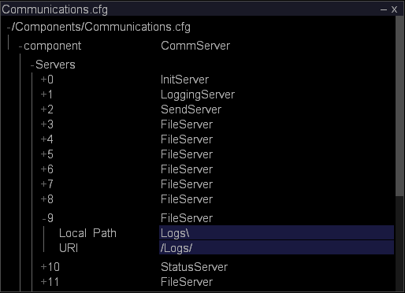

# Surveillance de l’espace des données d’événement{#monitoring-event-data-space}

Informations relatives à la surveillance de l’espace de données du événement et à la modification du répertoire des journaux pour les données Sensor.

**Fréquence recommandée :** toutes les 5 à 10 minutes

[!DNL Insight Server] stocke un fichier journal par  [!DNL Sensor] jour sur l’unité de traitement des données ou sur l’unité du serveur de fichiers, selon votre configuration. La taille des fichiers journaux et l’espace d’enregistrement des données requis pour ces derniers dépendent de nombreuses variables, notamment le nombre de sites Web enregistrés et le nombre de requêtes reçues par seconde par vos serveurs Web.

Une installation type de [!DNL Insight Server] (ou d&#39;un [!DNL Insight Server] cluster) est capable de stocker plusieurs téraoctets de données, en supposant que l&#39;implémentation utilise le matériel recommandé par l&#39;Adobe pour les machines [!DNL Insight Server].

En règle générale, toutes les données du journal restent présentes sur l&#39;ordinateur [!DNL Insight Server]. S’il devient nécessaire de libérer plus d’espace pour l’enregistrement des données sur l’ordinateur, vous pouvez déplacer tous les fichiers journaux de la journée, sauf les plus récents, vers un autre ordinateur ou un autre support d’enregistrement des données (lecteur zip, bande, etc.). Le déplacement des données n&#39;exige pas que vous arrêtiez [!DNL Insight Server], et cela n&#39;affecte pas les fonctionnalités disponibles dans les [!DNL Insights] qui peuvent être connectées à [!DNL Insight Server] et qui fonctionnent avec des données continues. Si vous ne traitez ni ne retraitez un jeu de données d&#39;analyse, vous conservez l&#39;accès à toutes les données précédentes et de nouvelles données restent disponibles dans [!DNL Insight]. Si vous traitez ou retraitez un jeu de données d&#39;analyse, vous ne pouvez pas accéder aux données tant que le traitement n&#39;est pas terminé.

Par défaut, les données de événement produites par [!DNL Sensor] et transmises à [!DNL Insight Server] sont stockées dans le dossier [!DNL Logs] du répertoire d&#39;installation de [!DNL Insight Server]. Le fichier de configuration Communications, [!DNL Communications.cfg], spécifie l&#39;emplacement des fichiers journaux de données de événement lus par [!DNL Insight Server].

**Pour modifier le répertoire des journaux de  [!DNL Sensor] données**

1. Dans [!DNL Insight], sur l&#39;onglet [!DNL Admin] > [!DNL Dataset and Profile], cliquez sur la miniature **[!UICONTROL Servers Manager]** pour ouvrir l&#39;espace de travail Servers Manager.
1. Cliquez avec le bouton droit de la souris sur l&#39;icône [!DNL Insight Server] que vous souhaitez configurer, puis cliquez sur **[!UICONTROL Server Files]**.
1. Dans le [!DNL Server Files Manager], cliquez sur **[!UICONTROL Components]** pour en vue le contenu. Le fichier [!DNL Communications.cfg] se trouve dans ce répertoire.
1. Cliquez avec le bouton droit sur la coche de la colonne *nom du serveur* pour [!DNL Communications.cfg] et cliquez sur **[!UICONTROL Make Local]**. Une coche apparaît dans la colonne [!DNL Temp] pour [!DNL Communications.cfg].
1. Cliquez avec le bouton droit sur la coche nouvellement créée dans la colonne [!DNL Temp] et cliquez sur **[!UICONTROL Open]** > **[!UICONTROL in Insight]**.
1. Dans la fenêtre [!DNL Communications.cfg], cliquez sur **[!UICONTROL component]** pour en vue le contenu.
1. Dans la fenêtre [!DNL Communications.cfg], cliquez sur **[!UICONTROL Servers]** pour en vue le contenu. Plusieurs types de serveurs peuvent apparaître : Serveurs de fichiers, serveurs de journalisation, serveurs d’initialisation, serveurs d’état, serveurs d’envoi ou serveurs de réplication.
1. Recherchez LoggingServer, où [!DNL Sensor] écrit ses fichiers journaux à traiter par [!DNL Insight Server], puis cliquez sur son numéro pour vue au menu.

   

   Le répertoire de journalisation par défaut est le dossier [!DNL Logs] situé dans le répertoire d&#39;installation de [!DNL Insight Server].

1. Modifiez le paramètre Répertoire de journaux pour refléter l’emplacement souhaité des fichiers journaux.

   >[!NOTE]
   >
   >Ne modifiez aucun autre paramètre de LoggingServer.

   

   Plusieurs serveurs de fichiers peuvent être répertoriés sous le noeud Serveurs. Vous devrez donc peut-être en vue le contenu de plusieurs d&#39;entre eux (en cliquant sur leur numéro dans la liste [!DNL Servers]) pour trouver le serveur avec un chemin local de journaux\ à modifier.

1. Modifiez le chemin d’accès local pour refléter l’emplacement souhaité des fichiers [!DNL .vsl].

   >[!NOTE]
   >
   >Ne modifiez aucun autre paramètre du serveur de fichiers.

   Bien que l&#39;emplacement des fichiers journaux ait été modifié dans le fichier [!DNL Communications.cfg], vous pouvez mapper ces fichiers au répertoire Journaux de [!DNL Server Files Manager] en spécifiant /Logs/ comme URI pour FileServer.

1. Enregistrez vos modifications sur le serveur en procédant comme suit :

   1. Cliquez avec le bouton droit **[!UICONTROL (modified)]** en haut de la fenêtre et cliquez sur **[!UICONTROL Save]**.

   1. Dans la colonne [!DNL Server Files Manager], cliquez avec le bouton droit de la souris sur la coche du fichier dans la colonne [!DNL Temp] et sélectionnez **[!UICONTROL Save to]** > *&lt;**[!UICONTROL server name]***.
