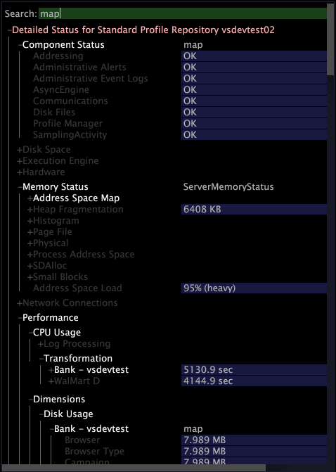

# Configuration de la connexion à Insight Server{#configuring-the-connection-to-insight-server}

{{eol}}

Après avoir installé votre logiciel Insight et votre certificat numérique, vous devez démarrer Insight et configurer sa connexion à Insight Server.

>[!NOTE]
>
>Dans certains cas, la connexion à Insight Server peut avoir été préconfigurée par les services de conseil d’Adobe ou par votre administrateur système. Si tel est le cas, vous n’avez pas besoin d’effectuer cette tâche.

Lorsque vous lancez Insight pour la première fois, il se connecte automatiquement au serveur de licences d’Adobe pour enregistrer votre certificat numérique. Pour réussir le processus d’enregistrement, votre ordinateur doit être connecté à Internet lorsque vous exécutez les étapes suivantes.

>[!NOTE]
>
>Si vous avez déjà demandé, téléchargé et installé un certificat préverrouillé comme décrit dans la section [Téléchargement et installation du certificat numérique](../../../home/c-install-insight/install-setup/c-dgtl-crtf.md#topic-fed3b44e472c4e4ca6dd5852af14cdb9), Insight ne tentera pas de se connecter au serveur de licences et vous ne recevrez pas d’erreur.

**Pour configurer la connexion à Insight Server**

Lorsque vous travaillez dans un environnement en grappe, Insight doit être configuré pour accéder au serveur Insight maître afin d’éviter des problèmes de synchronisation. Dans Insight, vous pouvez afficher des informations sur le traitement. [!DNL Insight Servers] dans votre grappe à l’aide de la fonction [!DNL Related Servers] dans le menu [Gestionnaire des serveurs](https://experienceleague.adobe.com/docs/data-workbench/using/client/admin-ui/c-svrs-mgr.html).

1. Insight Launch.
1. Sur le [!DNL Worktop], cliquez sur **[!UICONTROL Admin]**, puis **[!UICONTROL First Steps]**.

1. Cliquez sur le bouton **[!UICONTROL Configure Connection to Servers]** miniature.

   Le [!DNL Servers Manager], la variable [!DNL Insight.cfg] et des instructions pour configurer votre [!DNL Insight.cfg]s’affichent.

1. Dans le [!DNL Insight.cfg] fenêtre, clic droit **[!UICONTROL Servers]** et cliquez sur **[!UICONTROL Add new child]** > **[!UICONTROL Server]**.

   

1. Complétez ou modifiez les paramètres du serveur pour permettre à Insight d’accéder à votre serveur Insight maître. Pour obtenir des descriptions détaillées des paramètres du fichier Insight.cfg, voir [Paramètres de configuration](https://experienceleague.adobe.com/docs/data-workbench/using/client/c-insght-config-param.html).

   

1. Répétez les étapes 4 et 5 pour chaque serveur Insight auquel vous souhaitez configurer une connexion.
1. Pour enregistrer les modifications apportées à la configuration, cliquez avec le bouton droit de la souris **[!UICONTROL Insight.cfg (modified)]** dans la partie supérieure de la fenêtre, puis cliquez sur **[!UICONTROL Save as Insight.cfg]**.

   Insight tente de se connecter à la variable [!DNL Insight Server(s)] en utilisant les paramètres que vous avez spécifiés. Si une connexion est établie, un noeud vert apparaît dans la variable [!DNL Servers Manager] comme illustré sur la page suivante.

   

   * **Vert :** Indique que la connexion au serveur Insight est principale.
   * **Rouge clair :** Indique un problème potentiel avec le serveur, tel qu’un vidage sur le traitement du serveur, une utilisation élevée de la mémoire ou un espace disque insuffisant.
   * **Rouge :** Indique que la connexion au serveur Insight n’est pas principale.

   Si Insight ne parvient pas à se connecter à l’aide des paramètres spécifiés, un noeud rouge apparaît dans la variable [!DNL Servers Manager]. Si cela se produit, voir [Dépannage de la connexion](../../../home/c-install-insight/install-setup/t-conn-trbsh.md#task-034e588c5ce04c4a8f6d0097364d3b2b).

<!--
c_dir_crt_setup.xml
-->

Lorsque vous sélectionnez un profil à utiliser, les informations de profil (y compris les données associées et tout espace de travail ou visualisation spécifique défini pour le profil) sont téléchargées sur votre ordinateur. Lorsque vous téléchargez chaque profil, Insight crée un dossier dans le répertoire d’installation à l’aide du nom du profil.

Par exemple, si vous sélectionnez un profil nommé Ventes, un dossier nommé Ventes s’affiche dans votre répertoire Insight. Ce dossier contient les mesures, dimensions, espaces de travail et visualisations définis dans le profil des ventes. Après le chargement initial du profil, le profil peut être utilisé en mode hors ligne. Voir [Travail hors ligne et en ligne](https://experienceleague.adobe.com/docs/data-workbench/using/client/c-off-on.html).

En outre, lorsque vous vous connectez pour la première fois à Insight Server à partir d’Insight, Insight Server crée les répertoires suivants dans le répertoire d’installation Insight.

* **[!DNL Trace]directory:** Dans le [!DNL Trace] Le répertoire est le fichier journal Insight ( [!DNL insight.log]). Lorsque la taille de la variable [!DNL Insight.log] atteint 100 Mo, le fichier est renommé [!DNL insight-1.log]. Si un fichier du nom [!DNL insight-1.log] existe déjà, alors [!DNL insight-1.log] est renommé en [!DNL insight-2.log], etc., avec un maximum de [!DNL insight-9.log]. Le fichier [!DNL insight.log] contient toujours les informations de journal les plus récentes, et [!DNL insight-max.log] contient le plus ancien.

* **[!DNL User]directory:** Dans le [!DNL User] sont des dossiers correspondant à chaque profil utilisé à ce jour et, dans chaque dossier de profil, des dossiers nommés [!DNL Work] et [!DNL Workspaces]. Répertoire `User\*profile name*\Workspaces` est l’emplacement par défaut dans lequel les fichiers de l’espace de travail Insight sont enregistrés. `User\*profile name*\Work` est l’emplacement par défaut dans lequel sont enregistrées les visualisations Insight et les autres tâches personnalisées effectuées par l’utilisateur Insight.

Le tableau suivant répertorie les emplacements par défaut des composants fréquemment utilisés.

<table id="table_0254A8C25AF5400F89F87A242746D07E"> 
 <thead> 
  <tr> 
   <th colname="col1" class="entry"> Composant </th> 
   <th colname="col2" class="entry"> Emplacement du répertoire </th> 
  </tr>
 </thead>
 <tbody> 
  <tr> 
   <td colname="col1"> 
Visualisations enregistrées 
 </td> 
   <td colname="col2"> 
<i>Insight</i>\User\<i>nom du profil</i>\Work\ 
 </td> 
  </tr> 
  <tr> 
   <td colname="col1"> 
Enregistré  Espaces de travail 
 </td> 
   <td colname="col2"> 
<i>Insight</i>\User\<i>nom du profil</i>\Workspaces\<i>nom de l’onglet</i>\ 
 </td> 
  </tr> 
  <tr> 
   <td colname="col1"> 
Enregistré .png files 
 </td> 
   <td colname="col2"> 
<i>Insight</i>\User\<i>nom du profil</i>\Work\ 
 </td> 
  </tr> 
  <tr> 
   <td colname="col1"> 
Cache de données 
 </td> 
   <td colname="col2"> 
<i>Insight</i>\User\Cache.db 
 </td> 
  </tr> 
  <tr> 
   <td colname="col1"> 
 Insight.log fichier 
 </td> 
   <td colname="col2"> 
<i>Insight</i>\Trace\ 
 </td> 
  </tr> 
 </tbody> 
</table>

<!--
c_config_file_ent.xml
-->

Vous pouvez effectuer des recherches par nom de clé, type de clé ou valeur pour localiser rapidement une entrée, afin de ne plus avoir à faire défiler des fichiers volumineux et étendus pour obtenir des informations imbriquées. Vous pouvez localiser les noms de dimension, les noms de serveur, etc. L’exemple suivant montre les correspondances d’une recherche sur la carte de l’expression.

Saisissez une expression de recherche dans ce champ pour localiser les données. La couleur du champ varie en fonction du succès d’une correspondance. Les correspondances s’affichent en surbrillance et les non-correspondances sont grisées. S’il n’existe aucune correspondance, l’arrière-plan du champ de recherche devient rouge. Lorsque vous appuyez sur Entrée, l’arborescence de configuration s’étend à tous les endroits où il y a une correspondance et s’effondre là où il n’y a pas de correspondance.

Vous pouvez également utiliser des expressions régulières dans la variable [!DNL Search] champ . Par exemple, vous pouvez utiliser les éléments suivants : [!DNL *zip.*] pour toute entrée contenant le mot &quot;zip&quot;.

Pour effacer une recherche, appuyez sur **[!UICONTROL Escape]**.
