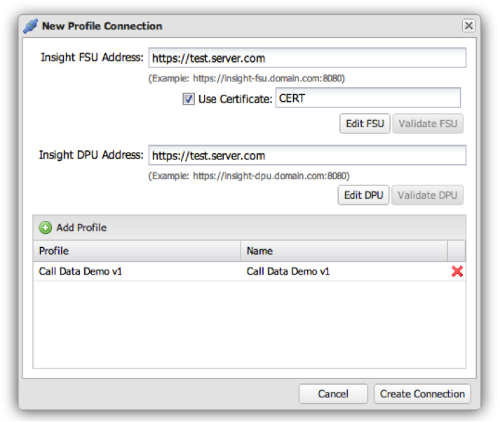

# Ajouter une connexion à Profil{#adding-a-profile-connection}

1. Cliquez sur **[!UICONTROL Add Profile Connection]** pour afficher la fenêtre **[!UICONTROL New Profile Connection]**.
1. A l’aide du formulaire ci-dessous, renseignez les champs nécessaires :

   

   1. **[!UICONTROL Insight FSU Address]**: Entrez l&#39;adresse de la FSU qui héberge le ou les profils que vous souhaitez ajouter au tableau de bord.

   1. **[!UICONTROL Use Certificate]**: Cliquez sur si l&#39;authentification est requise, ainsi que le CN du certificat (ce certificat doit être ajouté au serveur de tableau de bord à l&#39;avance à l&#39;aide du Gestionnaire de certificats Windows).
   1. **[!UICONTROL Insight DPU Address]**: Entrez l&#39;adresse de l&#39;unité de traitement des données qui héberge le ou les profils que vous souhaitez ajouter au tableau de bord.
   1. **[!UICONTROL Profiles]**: S&#39;il existe plusieurs profils sur les entrées FSU/DPU ci-dessus, vous pouvez ajouter plusieurs profils ici en cliquant sur le bouton Ajouter le Profil.
   * **[!UICONTROL Profile]**: Entrez le nom du profil tel qu’il apparaît dans Insight.
   * **[!UICONTROL Name]**: Entrez le nom du profil tel qu&#39;il doit apparaître dans le tableau de bord.

1. Une fois le formulaire configuré correctement, cliquez sur **[!UICONTROL Create Connection]** pour ajouter la connexion de profil au système.

   Si l&#39;opération a réussi, une invite s&#39;affiche indiquant que la connexion de profil a été créée.
