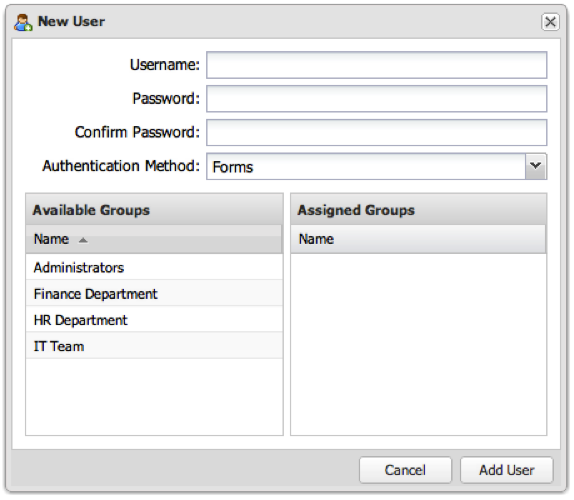

# Ajout d’un compte d’utilisateur{#adding-a-user-account}

{{eol}}

1. Cliquez sur **[!UICONTROL Add User]** pour afficher le **[!UICONTROL New User]** .

   

1. Renseignez les champs nécessaires pour remplir le formulaire.
   1. **[!UICONTROL Username]**: Saisissez le nom de l’utilisateur.
   1. **[!UICONTROL Password]**: Saisissez un mot de passe de plus de 6 caractères.
   1. **[!UICONTROL Confirm Password]**: Saisissez à nouveau le mot de passe.
   1. **[!UICONTROL Authentication Method]**: sélectionnez une option dans la liste déroulante.

      | **Forms** | Par défaut, le tableau de bord stocke le compte utilisateur et s’authentifie en interne. |
      |---|---|
      | **LDAP** | Sélectionnez cette option si l&#39;utilisateur doit être authentifié via LDAP. (L’utilisateur doit déjà exister dans l’annuaire). |
      | **Windows** | Sélectionnez cette option si l’utilisateur doit être authentifié à l’aide de l’authentification Windows (l’utilisateur doit déjà exister dans le répertoire Windows). |

1. **[!UICONTROL Assigned Groups]**: Faites votre choix parmi le groupe Administrateurs par défaut et tous les autres groupes qui ont été créés. Aucun groupe n’est requis pour l’instant et l’appartenance à un groupe de l’utilisateur peut être modifiée à tout moment.
1. Une fois le formulaire correctement configuré, cliquez sur **[!UICONTROL Add User]** pour ajouter l’utilisateur au système.

   Si l’opération a réussi, une invite s’affiche indiquant que l’utilisateur a été créé.
