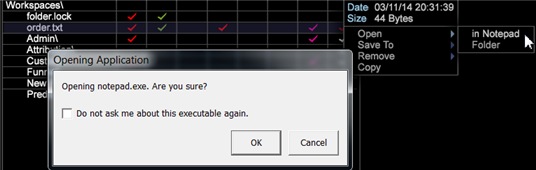

# Mise à jour de Data Workbench version 6.21{#data-workbench-update}

Data Workbench 6.2.1 fournit de nouvelles fonctionnalités et des correctifs de bogues.

## Nouvelles fonctionnalités {#section-1aacfe9a6a964c91b1d24fc1b181db34}

Data Workbench 6.2.1 comprend les nouvelles fonctionnalités suivantes :

<table id="table_E28A6D31E7D941F7A0C2048F0F0F7838"> 
 <thead> 
  <tr> 
   <th colname="col1" class="entry"> Fonctionnalités </th> 
   <th colname="col2" class="entry"> Description </th> 
  </tr> 
 </thead>
 <tbody> 
  <tr> 
   <td colname="col1"> Barres de défilement verticales dans le texte et renvoi automatique à la ligne du texte </td> 
   <td colname="col2"> Les zones de texte comportent désormais des barres de défilement verticales et du texte d’encapsulage. 
  
 </td> 
  </tr> 
  <tr> 
   <td colname="col1"> Tri des miniatures sur le plan de travail </td> 
   <td colname="col2"> Les noms triés sur le plan de travail ne sont désormais plus sensibles à la casse du caractère, car ils sont triés par ordre alphabétique AaBbCcDd au lieu d’ABCDabcd . 
  
 </td> 
  </tr> 
  <tr> 
   <td colname="col1"> Recherche de dimensions en fonction de la dimension parente </td> 
   <td colname="col2"> 
Dans le panneau de l’outil de recherche, vous pouvez maintenant cliquer avec le bouton droit sur l’onglet Dimensions, puis sélectionner Type de dimension &gt; Par parent. Une liste des dimensions parentes correspondantes s’affiche. Si vous sélectionnez l’une de ces dimensions parentes, une liste de ses dimensions subordonnées s’affiche dans les résultats de la recherche. 
  </td> 
  </tr> 
  <tr> 
   <td colname="col1"> Boîte de dialogue vous demandant d’ouvrir une application externe </td> 
   <td colname="col2"> 
Une boîte de dialogue s’affiche désormais la première fois que vous essayez d’ouvrir une application externe dans Data Workbench. 
 
Par exemple, si vous ouvrez un fichier texte dans le Bloc-notes, vous recevrez le message suivant. 
  
Un fichier local appelé InsightSES.dat est placé dans le dossier d’installation du client. 
 </td> 
  </tr> 
  <tr> 
   <td colname="col1"> Barres d’outils remplacées par des boutons </td> 
   <td colname="col2"> Vous pouvez ne pas utiliser les nouvelles icônes de barre d’outils fournies dans Data Workbench 6.2. en définissant l’argument  Toolbar Icons  dans le fichier  insight.cfg  sur  false . <code> Toolbar&amp;nbsp;Icons&amp;nbsp;=&amp;nbsp;bool:&amp;nbsp;false&amp;nbsp;&amp;nbsp;&amp;nbsp;&amp;nbsp;&amp;nbsp;&amp;nbsp; </code> 
Vous devez redémarrer le client pour que le changement entre en vigueur. 
 </td> 
  </tr> 
  <tr> 
   <td colname="col1"> Mise à jour des options de réinitialisation dans le score de propension et les arbres de décision </td> 
   <td colname="col2"> Dans les visualisations <a href="https://experienceleague.adobe.com/docs/data-workbench/using/client/analysis-visualizations/visitor-propensity/c-visitor-propensity.html" format="http" scope="external"> Score de propension </a> (  Outils &gt; Analyses prédictives &gt; Score de propension ) et <a href="https://experienceleague.adobe.com/docs/data-workbench/using/client/analysis-visualizations/decision-trees/c-decision-trees.html" format="http" scope="external"> Arborescence de décision </a> (  Visualisations &gt; Analyses prédictives &gt; Classifications &gt; Créateur d’arbre de décision ), vous disposez désormais de deux options : 
<b>Reset Models</b> (Réinitialiser les modèles) : efface les modèles mais conserve les paramètres et les entrées. Rend le bouton <b>Go</b> (Ok) sélectionnable. 
 
<b>Réinitialiser tout</b> : réinitialise tous les paramètres (comme dans la conception précédente). 
 </td> 
  </tr> 
 </tbody> 
</table>

## Corrections de bogues {#section-8704a9ac358246cd81233dd0982d534f}

* Les fichiers de recherche **[!UICONTROL Browsers]** et **[!UICONTROL Operating Systems]** ne seront pas mis à jour dans le profil **[!UICONTROL Traffic]** hérité (par exemple, [!DNL Lookups\Traffic\Browsers.txt)]. Au lieu de cela, la configuration du profil **[!UICONTROL Traffic]** utilisera le lot DeviceAtlas ( [!DNL Lookups\DeviceAtlas\DeviceAtlas.bundle]) pour fournir ces informations de configuration.
* La version 6.2.1 des Outils de données sera la dernière version à fournir un téléchargement de l’application cliente 32 bits. Tous les téléchargements d’application cliente ultérieurs seront en version 64 bits et continueront à exiger Windows 7 ou ultérieur. Les restrictions de mémoire de l’application 32 bits sont résolues avec l’introduction de l’application 64 bits à compter de la version 6.1.

   >[!NOTE]
   >
   >La version 32 bits de l’application cliente Data Workbench peut rencontrer des problèmes potentiels liés aux limitations de mémoire lors de l’exécution de modèles prédictifs à l’aide des fonctionnalités de mise en grappe et de notation.
