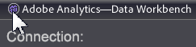

# Mise à jour de Data Workbench version 6.51{#data-workbench-update}

Les notes de mise à jour de Data Workbench 6.51 comprennent les nouvelles fonctionnalités, les exigences de mise à niveau, les bogues résolus et les problèmes connus.

Pour afficher les fonctionnalités et correctifs précédents pour les versions antérieures, consultez l’ [archive des notes de mise à jour](https://experienceleague.adobe.com/docs/data-workbench/using/release-notes/release-notes.html).

[Nouvelles fonctionnalités](../../home/c-release-notes-insight/c-6-51.md#section-e844b52c18484e99bdda5c361402247d)

[Conditions requises pour la mise à niveau](../../home/c-release-notes-insight/c-6-51.md#section-e1aa5adcf5f24a3da795574364ea196b)

[Mises à jour système](../../home/c-release-notes-insight/c-6-51.md#section-84f8f38e9c424d7788c79146fce5a6fe)

[Corrections de bogues](../../home/c-release-notes-insight/c-6-51.md#section-3c47f9177e9d40d8938a5710399dc88f)

[Problèmes connus](../../home/c-release-notes-insight/c-6-51.md#section-49ab5451d0c74f36a69ca12621251674)

## Nouvelles fonctionnalités {#section-e844b52c18484e99bdda5c361402247d}

Data Workbench 6.51 comprend les nouvelles fonctionnalités suivantes :

<table id="table_9305F30AEF5D49B2B052D1E7C9570D2C"> 
 <thead> 
  <tr> 
   <th colname="col1" class="entry"><b>Fonctionnalités de DWB 6.51  </b> </th> 
   <th colname="col2" class="entry"> Description </th> 
  </tr>
 </thead>
 <tbody> 
  <tr> 
   <td colname="col1"><b>Déploiement </b> des flux de données Avro </td> 
   <td colname="col2">Les données d’accès aux suites de rapports seront diffusées dans un nouveau format de source de données Apache Avro, fournissant des fonctionnalités et de nouveaux types de variables mis à jour pour Adobe Analytics Premium (y compris des eVars, événements personnalisés et variables de solution supplémentaires). Voir <a href="https://experienceleague.adobe.com/docs/data-workbench/using/dataset/log-proc-config-file/c-log-sources.html#section-9a824b4c3d5549e7952a7111232035b2" format="https" scope="external"> Flux de données Avro</a>. </td> 
  </tr> 
  <tr> 
   <td colname="col1"><b>Le graphique en barres améliore l’</b> affichage avec la superposition de dégradés de couleur </td> 
   <td colname="col2"> 
Pour améliorer le contraste des éléments dans la visualisation Graphique, un dégradé de couleurs peut être appliqué pour mettre en surbrillance des barres individuelles à l’aide de l’effet Cylindre ou des dégradés d’arrière-plan gauche et droite. 
 
    <ul id="ul_04C17524FE904F1CA6AE9B18F50551A9"> 
     <li id="li_D5F3B808F6BD4413A985EAC72EB89D5D"><b>Aucune superposition en dégradé</b>. Sélectionnez cette option pour afficher les barres sans superposition en dégradé appliquée. </li> 
     <li id="li_EF26B82D206643419948BD83ACF8A115"><b>Arrière-plan à gauche</b>. Sélectionnez cette option pour afficher l’ordre des couleurs sur toutes les barres de gauche à droite. </li> 
     <li id="li_3D5BE49CEC1748F68944AD2ABEFD7B23"><b>Arrière-plan à droite</b>. Sélectionnez cette option pour afficher l’ordre des couleurs sur toutes les barres de droite à gauche. </li> 
     <li id="li_2CA78F34D2F44A29BE8FD53334E0DB24"><b>Cylindre</b>. Sélectionnez cette option pour afficher l’ordre des couleurs entre le centre de chaque barre et le bord de chaque barre. </li> 
    </ul> </td> 
  </tr> 
  <tr> 
   <td colname="col1">Mises à jour de l’arborescence de modification <b>Insight.cfg</b> </td> 
   <td colname="col2"> 
La vue Nouvelle mise en page est désormais définie par défaut sur <a href="https://experienceleague.adobe.com/docs/data-workbench/using/client/c-insght-config-param.html" format="https" scope="external"> pour modifier le fichier de configuration Insight.cfg</a>. 
 
En outre, 
     <ul id="ul_9484D81C1F5A48CCBFC77204B60E3650"> 
      <li id="li_574CA325411C4482B759E60F453C15BC">Une fonction <b>Annuler</b> (Ctrl+Z) est fournie pour toutes les valeurs de niveau supérieur requises, à l’exception de celles de l’arborescence de configuration. </li> 
      <li id="li_91B8F8F12FA847FDACBB9690B9F97793">Lors de la suppression d’éléments, une boîte de dialogue s’affiche maintenant pour confirmer les actions permettant d’éviter les modifications erronées. </li> 
     </ul> 
 </td> 
  </tr> 
  <tr> 
   <td colname="col1"> Double-cliquez pour fermer le poste de travail </td> 
   <td colname="col2">Fermez rapidement la station de travail (application cliente) en double-cliquant sur le coin supérieur gauche de la barre de titre. 
 
 </td> 
  </tr> 
  <tr> 
   <td colname="col1"> Améliorations du décodeur XML </td> 
   <td colname="col2">Vous pouvez désormais utiliser la balise <i>#value</i> dans les chemins XML pour extraire la valeur d’un élément XML. </td> 
  </tr> 
 </tbody> 
</table>

## Conditions requises pour la mise à niveau {#section-e1aa5adcf5f24a3da795574364ea196b}

**Exigences d’upgrade de poste de travail (client) :**

Pour mettre à niveau la version 6.51 du poste de travail client à partir de la version 6.50, vous devez exécuter l’assistant de configuration de la station de travail afin d’installer les fichiers exécutables et de support du poste de travail (en mode ** Mise à niveau ou réparation**), ou copier ou modifier les fichiers manuellement sur votre serveur. Pour cette mise à niveau uniquement, la fonction de mise à niveau automatisée du poste de travail à partir du profil *Logiciels et documents* est désactivée (même si la valeur [!DNL Update software = true] est définie dans le fichier [!DNL Insight.cfg] de votre serveur).

**Configuration requise pour la mise à niveau du serveur :**

Mise à jour du fichier **[!DNL Adobe SC meta.cfg]** :

* Le fichier `server\Profiles\Adobe SC\Context\meta.cfg` a été renommé `server\Profiles\Adobe SC\Context\]Adobe SC meta.cfg`.

* Mise à jour du fichier `Base\Context\meta.cfg`.

Remplacez la version de votre serveur par les fichiers mis à jour.

## Mises à jour système {#section-84f8f38e9c424d7788c79146fce5a6fe}

Ces fonctionnalités ont été renommées, supprimées, ou les fichiers ou dossiers d’installation ont été restructurés dans cette version :

* **Changement de connectivité SSL**. La génération du certificat pour mettre à niveau la longueur de la clé a été modifiée à 2 048 bits et utilise SHA256. Cela élimine les chiffrements RC4 à l’aide d’algorithmes de chiffrement modernes.
* Fichiers modifiés en lecture seule.

   * base\context\serverdetails\detailed status.vw
   * base\menu\admin\detailed status for master.vw
   * base\menu\admin\detailed status for query.vw
   * base\workspaces\admin\dataset and profile\detailed status.vw

* **Signets alphabétisés**. Cliquez avec le bouton droit dans le panneau Signet et sélectionnez **Alphabétier**. Les signets s’alignent en fonction de caractères alphabétiques non sensibles à la casse pour chaque langue.

## Corrections de bogues {#section-3c47f9177e9d40d8938a5710399dc88f}

Voici des correctifs importants apportés dans Data Workbench 6.51 (depuis la version 6.5 de Data Workbench).

* Auparavant, les coefficients **Attribution algorithmique** s’affichaient comme tous les zéros lors de l’utilisation du SGD pour converger. Ce problème est maintenant corrigé.

## Problèmes connus {#section-49ab5451d0c74f36a69ca12621251674}

* L’exportation d’un tableau d’association à partir d’une visualisation [accord d’association](/help/home/c-get-started/c-analysis-vis/associations-chord.md) contenant *au moins une mesure* entraîne la duplication d’éléments dans les lignes/colonnes du tableau d’association. Pour éviter les éléments dupliqués, créez un Tableau d&#39;association et ajoutez les éléments souhaités plutôt que d&#39;exporter les éléments à partir d&#39;un accord de correspondance.

* Si vous créez un décodeur Avro, le bouton de champ par défaut ne fonctionnera pas. Contactez votre gestionnaire de compte pour obtenir la configuration appropriée à votre mise en oeuvre.
* La mise à niveau de la station de travail (client) à partir de DWB 6.50 doit être effectuée manuellement à l’aide de l’assistant de configuration du client en mode de mise à niveau). La mise à niveau automatique ne se produit pas (voir Conditions requises de mise à niveau pour le client).
* L’utilisation des packages d’installation en chinois et en japonais pour Adobe SC AVRO comme package autonome peut donner une erreur indiquant `Undefined Metric: "$Default Metric$"`. Aucun mappage n’est actuellement défini pour `$Default Metric$`. Cependant, si vous utilisez le package AVRO SC Adobe avec d’autres packages, tels que le package Attribution-Premium, cette erreur ne se produira pas.
