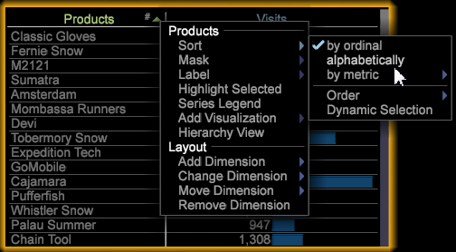

# Notes de mise à jour Data Workbench 6.1{#data-workbench-release-notes}

Les notes de mise à jour de Data Workbench 6.1 comprennent les nouvelles fonctionnalités, les exigences de mise à niveau, les correctifs de bogues et les problèmes connus.

## Nouvelles fonctionnalités {#section-1225066ea8f44cf68e42e019d0bca816}

Data Workbench 6.1 comprend les nouvelles fonctionnalités suivantes :

| Fonctionnalités | Description |
|--- |--- |
| Mise à niveau Windows 64 bits | Les composants du serveur de l’outil de données, du serveur de rapports et du client sont mis à niveau pour s’exécuter uniquement sur les systèmes d’exploitation Windows 64 bits. |
| Score de propension | Le score de votre audience vous permet d’identifier la fidélité de vos clients et de déterminer statistiquement qui est susceptible de convertir une vente ou d’interagir avec un article ou une campagne. Le score de propension inclut désormais ces visualisations dans les modèles de vue et montre la corrélation changeante des mesures sélectionnées.<ul><li>La visionneuse de modèles examine un modèle de régression logistique généré avec le score de propension, en montrant les poids de coefficient de chaque variable d&#39;entrée (y compris le terme constant) et leur plage d&#39;erreurs statistiques. </li><li>Les graphiques Effet élévateur et Gain sont utilisés pour évaluer l’augmentation potentielle d’un modèle de données notées.</li><li>La matrice de confusion présente quatre valeurs en fonction de la combinaison des valeurs Positif réel (AP), Négatif réel (AN), Positif prédit (PP) et Négatif prédit (PN).</li> <li>A partir de la version 6.1, vous disposez maintenant d’une option Enregistrer pour enregistrer les scores de propension en fonction de deux types : dimensions ou dimensions et mesures.</li><li>Vous pouvez désormais cliquer sur Ctrl-Alt et faire glisser et déposer pour ajouter des éléments dans Score de propension et dans le Créateur de grappes. Avant d’ajouter des éléments de tableau, vous deviez les faire glisser du tableau vers la zone Eléments.</li></ul> |
| Outils de données en chinois | Les outils de données prennent désormais en charge le chinois simplifié pour l’application cliente. Les outils de données prennent également en charge l’éditeur de méthode d’entrée (IME) en tant que processus de saisie de texte secondaire pour les langues internationales. |
| Fonctions mathématiques | Vous pouvez maintenant ajouter des fonctions mathématiques aux mesures, aux transformations mathématiques et aux cellules de feuille de calcul pour calculer davantage les jeux de données. |
| Légendes statistiques | Les tableaux offre désormais un appel d’offres récapitulatif des statistiques pour les colonnes de mesures. L’appel sortant peut afficher la moyenne, l’écart type, les valeurs minimale et maximale, la variance et le nombre total pour la colonne. Il peut être pris en compte dans toute sélection et évaluation. |
| Filtre Matrice de corrélation | La matrice de corrélation a été mise à jour avec un filtre binaire afin de vous permettre de limiter les valeurs pour l&#39;une ou les deux mesures corrélées, ce qui vous permet de mieux cibler votre comparaison. Vous pouvez également ajouter des éléments de Dimension à partir d’un tableau de Dimension en cliquant sur Ctrl + Alt et en faisant glisser les éléments vers la colonne de matrice ou la ligne à évaluer. |
| Masquer l’étiquette Abandon dans la visualisation de l’entonnoir | Basculez entre l’affichage et le masquage des étiquettes d’abandons dans une visualisation Entonnoir en cliquant avec le bouton droit sur le titre et en sélectionnant Masquer les abandons. |

## Tri des colonnes du tableau {#sorting-table-columns}

Trier les colonnes du tableau par ordre alphabétique ou par ordre ordinal.

Pour mieux sélectionner les éléments d&#39;un tableau de Dimension, vous pouvez classer la première colonne par ordre alphabétique ou par ordre ordinal en sélectionnant l&#39;option de menu **[!UICONTROL Sort]**.

Le caractère # s&#39;affiche lorsqu&#39;une colonne est triée par ordinaux (valeur par défaut).

**Sélectionner l’option de tri**

Pour modifier les options de tri entre ordinal et alphabet, cliquez avec le bouton droit de la souris et sélectionnez **[!UICONTROL Sort]**. Cliquez sur la flèche pour inverser l’ordre.

>[!NOTE]
>
>Vous pouvez trier les autres colonnes par ordinal en cliquant sur le nom de la colonne.

## Masquer les étiquettes d&#39;abandons dans l&#39;entonnoir

Active/désactive l’affichage des étiquettes d’abandons dans une visualisation Entonnoir.

La visualisation Entonnoir identifie où un client abandonne une campagne marketing ou s’éloigne d’un chemin de conversion défini lors de son interaction avec votre site Web ou votre campagne entre canaux. Le côté gauche de la visualisation Entonnoir affiche les résultats d’une visite ou de visiteurs, tandis que le côté droit affiche les &quot;Abandons&quot; de ceux qui abandonnent un chemin spécifié.

Dans une visualisation **[!UICONTROL Funnel]**, vous pouvez cliquer avec le bouton droit sur le titre et sélectionner **[!UICONTROL Hide Fallout]** dans le menu pour masquer les étiquettes d’abandon.

## Problèmes connus {#section-ff2180c6871c413480e15fa915c253b9}

* Lors de l’importation d’un espace de travail, un message d’erreur s’affiche même si l’importation a réussi.

   Solution : Cliquez sur OK pour ignorer l’erreur. L&#39;importation de l&#39;espace de travail a réussi.

**Problèmes de Localisation en chinois simplifié**

* Le titre et le message de la boîte de dialogue affichés après avoir cliqué sur &quot;Envoyer&quot; lors de la définition de la cible dans la visualisation Scoring sont illisibles.

   Solution : Aucun.
* Lors de l’utilisation de l’encapsulation de mot dans la visualisation Feuille de calcul, les mots localisés ne sont pas encapsulés correctement. Des caractères indésirables supplémentaires sont ajoutés à la chaîne.

   Solution : Aucun
* Impossible de lancer [!DNL Insight.exe] si le répertoire d&#39;installation est nommé avec des caractères non anglais.

   Solution : Conservez les noms par défaut ou renommez en utilisant uniquement des caractères anglais dans le chemin du dossier pour lancer les exécutables.
