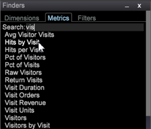
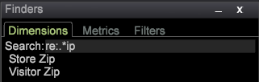

# Rechercher{#finders}

Utilisez les panneaux de recherche du Data Workbench pour sélectionner des mesures, des dimensions et des filtres. Ces panneaux offrent une prise en charge de la recherche, des options de tri et des fonctionnalités de glisser-déposer.

Un panneau de recherche peut être ouvert dans la barre latérale gauche ou dans un espace de travail.

<table id="table_3E43DBA0646842898F14F31374F9E39C"> 
 <thead> 
  <tr> 
   <th colname="col1" class="entry"> Outil de recherche de Dimensions </th> 
   <th colname="col2" class="entry"> Outil de recherche de mesures </th> 
   <th colname="col3" class="entry"> Recherche de filtres </th> 
  </tr>
 </thead>
 <tbody> 
  <tr> 
   <td colname="col1"> 
Liste de toutes les dimensions de votre modèle de requête. 
 </td> 
   <td colname="col2"> 
Liste de toutes les mesures de votre modèle de requête. 
 </td> 
   <td colname="col3"> 
Liste de tous les filtres créés pour votre organisation. 
 </td> 
  </tr> 
 </tbody> 
</table>

**Pour ouvrir un Finder :**

* Cliquez avec le bouton droit dans un espace de travail et sélectionnez **[!UICONTROL Tools]** > **[!UICONTROL Finder]**.

   Le volet de recherche qui contient des onglets pour les mesures, les Dimensions et les Filtres s’ouvre dans l’espace de travail.

* Cliquez avec le bouton droit dans la barre latérale gauche et sélectionnez **[!UICONTROL Add]** > **[!UICONTROL Finder]**.

   Le volet de recherche s&#39;ouvre dans le panneau de gauche.

Le **Finder** comprend les fonctionnalités suivantes :

<table id="table_072047E919204577AE85789BAE0F4EE8"> 
 <thead> 
  <tr> 
   <th colname="col1" class="entry"> Fonctionnalités du Finder </th> 
   <th colname="col2" class="entry"> Détails </th> 
  </tr>
 </thead>
 <tbody> 
  <tr> 
   <td colname="col1"><b>Glisser-déposer</b> </td> 
   <td colname="col2"> 
 Vous pouvez faire glisser des dimensions ou des mesures du panneau vers une visualisation dans l’espace de travail pour modifier la dimension ou ajouter de nouvelles mesures. 
 
    <ol id="ol_612DC76EC04C4FCE938B20B388C43CE8"> 
     <li id="li_7F73B781141E4B8CAE9800F580F62E44">Maintenez enfoncées les touches  &lt;Ctrl&gt; et  &lt;Alt&gt; et sélectionnez la dimension ou la mesure dans le panneau Finder. </li> 
     <li id="li_631D57976F71415AA61F33EBBFDD128A">Faites glisser une nouvelle dimension du volet et déposez-la dans la visualisation pour la modifier ou l’ajouter. </li> 
     <li id="li_5329FB82225F46EBBE3A996A641058DE">Pour ajouter des mesures, faites glisser une nouvelle mesure depuis le volet et déposez-la sur l’en-tête de mesure de la visualisation sélectionnée. </li> 
    </ol> 
Cela fonctionnera pour toutes les visualisations pertinentes, y compris les tableaux, la grappe de visiteurs, la matrice de corrélation, les tracés de dispersion et le graphique à barres 2D (selon l’axe). 
 </td> 
  </tr> 
  <tr> 
   <td colname="col1"><b>Recherche</b> </td> 
   <td colname="col2">Une zone  Rechercher dans les panneaux de recherche vous permet de filtrer les noms des Dimensions, des mesures et des Filtres. 
    <ul id="ul_0F6F377E9906472E99008EBE7483F689"> 
     <li id="li_75857895EDB045C8B2960393854B257D"> 
Correspondance de motif (recherche de gants simples). Le début qui saisit le nom d'une dimension, d'une mesure ou d'une entité de filtre requise dans le champ Rechercher et seules les chaînes correspondantes contenues n'importe où dans le nom sont filtrées et affichées dans le volet Rechercher. 
 
Par exemple, saisissez : 
 <code><b>Search:</b>click</code> 
Vous pouvez obtenir les résultats suivants dans l’outil de recherche de Dimensions : 
 
 
 
La correspondance standard des modèles vous permet d’utiliser des caractères génériques, tels que . (point), "?" , et "*" (étoile). 
 </li> 
     <li id="li_044F9EC1399B44CD81E1852F85137704"> 
Expressions régulières. Des expressions régulières plus complexes sont également prises en charge pour une fonctionnalité de recherche supplémentaire. Ajoutez le préfixe "re:" avant le terme recherché (sans espaces) pour l’interpréter comme une expression ordinaire. 
 
Par exemple, saisissez : 
 <code><b>Search:</b>re.*ip</code> 
Vous pouvez obtenir les résultats suivants dans l’outil de recherche de Dimensions : 
 
 
 </li> 
    </ul> 
Pour des informations de recherche détaillées, voir <a href="https://docs.adobe.com/content/help/en/data-workbench/using/dataset/c-reg-exp.html" format="http" scope="external"> expressions régulières</a>. 
 </td> 
  </tr> 
  <tr> 
   <td colname="col1"><b>Type de Dimension</b> </td> 
   <td colname="col2">Dans l’onglet Dimension, vous pouvez cliquer avec le bouton droit sur l’en-tête de l’onglet pour trier par type de dimension. 
 
     <ul id="ul_D36B8474730F4859BC7AA015CC1B8EF0"> 
      <li id="li_4AE1D5699D0E45AF880A134F886B8B19">Attributs : Dimensions créées en fonction des caractéristiques du visiteur, des produits, de la géographie, de l’heure, de la vidéo et d’autres attributs. </li> 
      <li id="li_0B2A08F8CBE94356AC506F95DC268C47">Clusters : Dimensions créées dans le créateur de clusters. </li> 
      <li id="li_4BC3396A680B49A4B6BDAAD066826864">Scores : Dimensions créées dans le score de propension. </li> 
     </ul> 
 </td> 
  </tr> 
  <tr> 
   <td colname="col1"><b>Étiquette</b> </td> 
   <td colname="col2">Dans chaque onglet, vous pouvez cliquer avec le bouton droit et sélectionner  Étiquette pour renommer le volet Finder. 
 
 
Les étiquettes de Dimensions, de mesures et de Filtres par défaut peuvent être changées en un nom d’onglet conforme aux conventions de votre entreprise. 
 </td> 
  </tr> 
  <tr> 
   <td colname="col1"><b>Ajouter un élément</b> </td> 
   <td colname="col2">Dans chaque onglet, vous pouvez cliquer avec le bouton droit de la souris et sélectionner  Ajouter l’élément  pour ouvrir un tableau et ajouter manuellement des Dimensions, des mesures et des Filtres. </td> 
  </tr> 
  <tr> 
   <td colname="col1"><b>Barre de recherche</b> </td> 
   <td colname="col2">Cliquez avec le bouton droit de la souris dans la barre  Rechercher de la barre latérale gauche pour ouvrir un menu contenant des fonctionnalités supplémentaires. 
 
 </td> 
  </tr> 
  <tr> 
   <td colname="col1"><b>Fermer</b> </td> 
   <td colname="col2">Cliquez avec le bouton droit dans la barre  Finders et sélectionnez  Close pour fermer un volet Finders. </td> 
  </tr> 
  <tr> 
   <td colname="col1"><b>Enregistrer</b> </td> 
   <td colname="col2">Enregistrez la liste localement en cliquant avec le bouton droit dans la barre d'en-tête et en sélectionnant l'option  Enregistrer. </td> 
  </tr> 
  <tr> 
   <td colname="col1"><b>Exporter</b> </td> 
   <td colname="col2">Vous pouvez exporter une liste de dimensions, de mesures ou de filtres sélectionnés à partir du panneau Finder en cliquant avec le bouton droit dans la barre de recherche et en sélectionnant  Exporter dans le menu. 
 Ajoutez un nom et exportez-le vers Microsoft Excel. 
 </td> 
  </tr> 
  <tr> 
   <td colname="col1"><b>Copier</b> </td> 
   <td colname="col2"> Copiez une liste de Dimensions, de mesures ou de Filtres. Vous pouvez effectuer une copie sous la forme d’un fichier ou d’un graphique dans Arrière-plan sombre, Arrière-plan clair ou Monochrome. </td> 
  </tr> 
  <tr> 
   <td colname="col1"><b>Réduire</b> </td> 
   <td colname="col2"> Minimisez le volet de recherche. Seule la barre de recherche apparaît. </td> 
  </tr> 
  <tr> 
   <td colname="col1"><b>Sans bordure</b> </td> 
   <td colname="col2"> Affiche un volet sans lignes de bordure pour les Finders dans l'espace de travail (mais pas dans la barre latérale gauche). </td> 
  </tr> 
 </tbody> 
</table>

