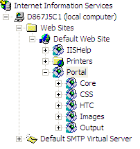

# Mappage du portail de rapports à un répertoire virtuel (IIS 6.0){#mapping-report-portal-to-a-virtual-directory-iis}

Cette section décrit la procédure à suivre pour mapper le portail de rapports à un répertoire virtuel (IIS 6.0).

Le mappage [!DNL Report Portal] à un répertoire virtuel sur IIS 6.0 implique trois tâches distinctes :

1. [Modification du fichier de configuration](../../../../home/c-rpt-oview/c-install-rpt-port/c-virtual-dir/c-map-rpt-port-vdir-6.md#section-eaf1c58935074cfa840dac33e1286520)
1. [Importer le fichier de configuration dans IIS](../../../../home/c-rpt-oview/c-install-rpt-port/c-virtual-dir/c-map-rpt-port-vdir-6.md#section-9d61f6bfa93846dcb96973fec5573b19)
1. [Activer les pages de serveur actives (ASP) sur IIS](../../../../home/c-rpt-oview/c-install-rpt-port/c-virtual-dir/c-map-rpt-port-vdir-6.md#section-a7725ec2afc64ffc854c5bd8c5c31802)

Vous devez effectuer les trois tâches.

## To Edit the Configuration File {#section-eaf1c58935074cfa840dac33e1286520}

1. Sur l’ordinateur sur lequel [!DNL Report Portal] est installé, ouvrez le fichier \*NomDuPortail*\ReportConfigurationPortail.xml dans un éditeur de texte tel que le Bloc-notes.

1. Utilisez la fonction de recherche et de remplacement de l’éditeur pour remplacer globalement (Remplacer tout) la chaîne &quot;VSVirtualPortalName&quot; par le nom de votre portail. Par exemple, si vous souhaitez utiliser &quot;VisualReportPortal&quot; comme nom de votre [!DNL Report Portal]site, recherchez &quot;VSVirtualPortalName&quot; et remplacez-le par &quot;VisualReportPortal&quot;.
1. Localisez l’élément suivant dans ce fichier :

   ```
   <IIsWebVirtualDir Location= "/LM/W3SVC/1/Root/PortalName/Output" AccessFlags="AccessRead | AccessScript” AppFriendlyName="Output" . . . >
   ```

1. Définissez l’ [!DNL Path] attribut de cet élément sur l’emplacement physique du répertoire dans lequel [!DNL Report Server] enregistre la sortie pour vos jeux de rapports.

   Le dossier de sortie peut se trouver n’importe où, peut être nommé n’importe quel nom et contient un sous-dossier pour chaque jeu de rapports.

   >[!NOTE]
   >
   >Il doit s’agir du même répertoire que celui spécifié dans le paramètre Racine de sortie du [!DNL Report.cfg] fichier pour un jeu de rapports. Pour plus d’informations, voir [Configuration des fichiers](../../../../home/c-rpt-oview/c-admin-rpt/c-config-rpt-files.md#concept-cf4b95344fcb4c8c877db91e5f1d345d)Report.cfg.

   L’exemple de code suivant montre comment définir l’ [!DNL Path] attribut si vos rapports étaient enregistrés [!DNL E:\VSReport\ReportOutput]:

   ```
   < . . . 
   AppIsolated="2" 
       AppRoot="/LM/W3SVC/1/Root/PortalName/OutputFolder" 
       DirBrowseFlags="DirBrowseShowDate | DirBrowseShowTime |...  
       Path="E:\VSReport\ReportOutput"
   ```

   >[!NOTE]
   >
   >Il est essentiel que l’ [!DNL Path] attribut soit correctement défini.

1. Si vous avez modifié la valeur par défaut [!DNL Path] de l’ [!DNL Output] élément, déplacez le [!DNL profiles.xml] fichier depuis *\PortalName*\PortalFiles\Output folder to the output directory that you specified in Step 4. Dans l’exemple ci-dessus, vous passez [!DNL profiles.xml] à [!DNL E:\VSReport\ReportOutput].

1. Vérifiez que les [!DNL Path] attributs de tous les autres [!DNL IIsWebVirtualDir] éléments sont mappés à l’emplacement correct en recherchant toutes les instances de [!DNL C:\Inetpub\wwwroot] et en les remplaçant par le chemin d’accès correct.

1. Enregistrez le fichier. Si vous souhaitez conserver le fichier d’origine, vous pouvez enregistrer le fichier de configuration sous un nouveau nom.

## Pour importer le fichier de configuration dans IIS {#section-9d61f6bfa93846dcb96973fec5573b19}

1. Sur l’ordinateur sur lequel [!DNL Report Portal] est installé, démarrez le Gestionnaire IIS à l’aide de **[!UICONTROL Start]** > **[!UICONTROL Administrative Tools]** > **[!UICONTROL Internet Information Systems (IIS) Manager]**.

1. Select **[!UICONTROL (local computer)]** > **[!UICONTROL Web Sites]** > **[!UICONTROL Default Web Site]**.

1. Cliquez avec le bouton droit de la souris **[!UICONTROL Default Web Site]** et sélectionnez **[!UICONTROL New]** > **[!UICONTROL Virtual Directory]** (à partir du fichier).

1. Sélectionnez le **[!UICONTROL ReportPortalSetup.xml]** fichier et cliquez sur **[!UICONTROL Read File]**.

1. Vérifiez que six répertoires virtuels sont répertoriés pour votre site [!DNL Report Portal] , comme illustré dans l’exemple suivant.

   

   Si vous ne voyez pas six répertoires virtuels ou si vous recevez un message d&#39;erreur, cliquez **[!UICONTROL Cancel]** et examinez le fichier de configuration pour y détecter les erreurs.

1. Sélectionnez le premier répertoire virtuel de la liste (celui qui est le parent des cinq autres) et cliquez sur **[!UICONTROL OK]**. IIS importe les mappages et ajoute les répertoires virtuels au site Web par défaut.

   Assurez-vous que la structure de répertoires résultante comporte un dossier parent (portant le même nom que votre portail) et cinq sous-répertoires, comme illustré dans l’exemple suivant.

   

1. Cliquez sur chaque répertoire virtuel pour vous assurer qu’IIS peut localiser le répertoire physique qu’il représente. Si IIS affiche une erreur, cliquez avec le bouton droit sur le nom du répertoire virtuel et vérifiez que le [!DNL Local Path] champ pointe vers le répertoire physique approprié.

## Pour activer les pages de serveur actives (ASP) sur IIS {#section-a7725ec2afc64ffc854c5bd8c5c31802}

Pour l&#39;utiliser [!DNL Report Portal], les ASP doivent être activés sur IIS. (Par défaut, les ASP sont désactivés lorsque IIS 6.0 est installé.) Procédez comme suit pour vérifier que les ASP sont activées sur vos services IIS.

1. Dans la fenêtre Gestionnaire IIS, sélectionnez **[!UICONTROL (local computer)]** > **[!UICONTROL Web Service Extensions]**.
1. Vérifiez que l’ [!DNL Active Server Pages] extension est définie sur [!DNL Allowed].

   

1. Si leur état est Interdit, sélectionnez **[!UICONTROL Active Server Pages]** et cliquez sur **[!UICONTROL Allow]**.
1. Fermez le Gestionnaire IIS.

