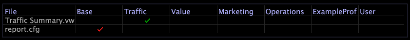

# Création d’un dossier pour le jeu de rapports{#create-a-new-folder-for-the-report-set}

Procédure de création d’un dossier de jeu de rapports.

1. Dans les outils de données, ouvrez le fichier [!DNL Profile Manager] en cliquant avec le bouton droit dans un espace de travail et en cliquant sur **[!UICONTROL Admin]** > **[!UICONTROL Profile]** > **[!UICONTROL Profile Manager]**.
1. Cliquez sur **[!UICONTROL Reports]** pour ouvrir le [!DNL Reports] dossier.

   

1. Dans la [!DNL User] colonne du dossier dans lequel vous souhaitez créer le jeu de rapports, cliquez avec le bouton droit de la souris et sélectionnez **[!UICONTROL Create]** > **[!UICONTROL Folder]**. Un dossier nommé Nouveau dossier apparaît dans la [!DNL File] colonne pour [!DNL Reports].
1. Cliquez avec le bouton droit dans la **[!UICONTROL User]** colonne du nouveau dossier, cliquez dans le **[!UICONTROL Dir]** paramètre, puis saisissez le nouveau nom du dossier.
