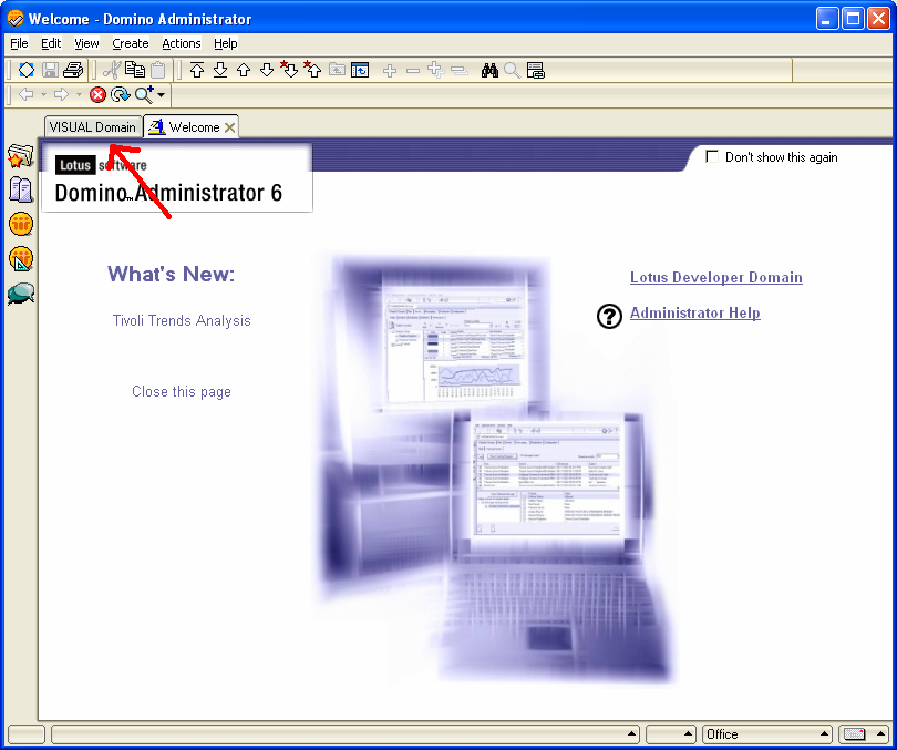
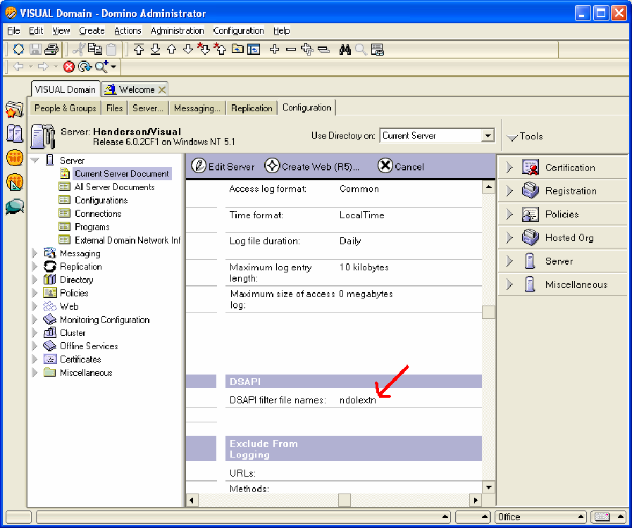

# Serveur Lotus Domino sous Windows Server 2000 ou ultérieur{#lotus-domino-server-on-windows-server-or-later}

{{eol}}

Instructions sur l’installation et la configuration de Capteur pour Lotus Domino Server 6 pour Windows 3.1 ou version ultérieure s’exécutant sous Microsoft Windows Server 2000 ou version ultérieure.

Les fichiers de programme pour Capteur sont contenus dans un fichier d’installation que vous obtenez sur le site de téléchargement de l’Adobe. Si vous ne disposez pas déjà du fichier d’installation de Capteur pour votre serveur web en particulier, téléchargez-le (ou procurez-le auprès de votre représentant d’Adobe) avant de commencer les procédures suivantes.

Pour installer et configurer Capteur, procédez comme suit :

## Installation des fichiers de programme {#section-2f3e85083b4f4aa989a85997330e86ae}

1. Sur votre ordinateur Lotus Domino, créez un répertoire pour installer les fichiers du programme Sensor. Gardez à l’esprit que votre file d’attente de disque réside également dans ce répertoire. Assurez-vous donc que le périphérique choisi dispose de suffisamment d’espace pour contenir une file d’attente de la taille dont vous avez besoin.

   ```
   C:\VisualSensor
   ```

1. Extrayez le contenu du fichier d&#39;installation dans le répertoire Lotus Domino. Au cours de cette étape, Capteur installe les fichiers suivants :

<table id="table_ABFF5F92271B4F3CB0AC68DAB6A5709F"> 
 <thead> 
  <tr> 
   <th colname="col1" class="entry"> Fichier </th> 
   <th colname="col2" class="entry"> Description </th> 
  </tr> 
 </thead>
 <tbody> 
  <tr> 
   <td colname="col1"> EventMessages.dll </td> 
   <td colname="col2"> Messages de la visionneuse d’événements </td> 
  </tr> 
  <tr> 
   <td colname="col1"> stchatlog.dll </td> 
   <td colname="col2"> Module collecteur </td> 
  </tr> 
  <tr> 
   <td colname="col1"> <p>TestExperiment.xls </p> </td> 
   <td colname="col2"> <p>Fichier de feuille de calcul Excel que les architectes peuvent utiliser pour configurer une expérience contrôlée </p> <p>Capteur n’utilise pas ce fichier. </p> </td> 
  </tr> 
  <tr> 
   <td colname="col1"> trust_ca_cert.pem </td> 
   <td colname="col2"> Certificat utilisé pour valider le certificat numérique qu’Insight Server présente pendant le processus de connexion </td> 
  </tr> 
  <tr> 
   <td colname="col1"> TXLog.exe </td> 
   <td colname="col2"> Le programme d'émetteur </td> 
  </tr> 
  <tr> 
   <td colname="col1"> <p>txlogd.conf </p> </td> 
   <td colname="col2"> Le fichier de configuration de Capteur </td> 
  </tr> 
 </tbody> 
</table>

>[!NOTE]
>
>Le package d’installation contient un fichier de feuille de calcul appelé TestExperiment.xls. Cette feuille de calcul est un outil que les architectes utilisent pour configurer une expérience contrôlée. Sensor n’utilise pas ce fichier. Il n’est donc pas nécessaire d’installer le fichier sur l’ordinateur sur lequel Sensor est exécuté (bien que vous puissiez choisir de le faire). Vous pouvez plutôt copier le fichier vers un emplacement accessible par vos architectes ou simplement extraire le fichier du package d’installation, si nécessaire. Pour plus d’informations sur l’expérimentation contrôlée, consultez le guide des expériences contrôlées Insight .

## Configuration du serveur Lotus Domino {#section-2e2f1875a5304cdfa2cbcd0680683cfd}

Procédure de configuration du serveur Lotus Domino.

1. Connectez-vous à l’administrateur Lotus Domino et cliquez sur **[!UICONTROL Domain]**.

   

1. Dans l’administrateur Lotus Domino, cliquez sur **[!UICONTROL Configuration]**.

   

1. Développez le noeud Serveur et cliquez sur **[!UICONTROL Current Server Document]**.

   

1. Cliquez sur **[!UICONTROL Current Server Document]**, puis sur **[!UICONTROL Internet Protocols]**.

   

1. Dans l’onglet HTTP, sous la section DSAPI , double-cliquez après le mot [!DNL ndolextn].

   

1. Press **[!UICONTROL Enter]** et saisissez le chemin d’accès au [!DNL dominosensor.dll] fichier .

   

1. Cliquez sur **[!UICONTROL Save & Close]**.

   

## Modification du fichier de configuration du capteur {#section-de0eb4a646394b61abb6cd5a2b706de0}

Le fichier txlogd.conf contient les paramètres de configuration de Capteur.

Vous devez modifier ce fichier pour indiquer, entre autres, la taille et l’emplacement du fichier de file d’attente du disque, l’adresse du serveur Insight et l’identifiant qui sera joint aux données d’événement générées par ce capteur.

Le fichier de configuration contient les paramètres requis et les paramètres facultatifs.

* **Paramètres requis** sont des paramètres que vous devez spécifier lors de l’installation de Capteur. Sans ces paramètres, Capteur ne s’exécute pas correctement.
* **Paramètres facultatifs** sont des paramètres qui activent par défaut des valeurs prédéfinies (que vous pouvez modifier) ou des fonctionnalités facultatives.

**Modification du fichier de configuration du capteur**

* Ouvrez le `<Sensor directory>/txlogd.conf` dans un éditeur de texte et définissez les paramètres requis ainsi que les paramètres facultatifs souhaités.
* Enregistrez le fichier, puis fermez-le.

## Démarrez l’émetteur et créez la file d’attente du disque {#section-55630de65f264274aefd771da2002852}

Après avoir configuré le fichier txlogd.conf, vous pouvez démarrer le programme d&#39;émetteur, l&#39;enregistrer en tant que service Windows et créer la file d&#39;attente du disque.

1. Dans le menu Démarrer de Windows, sélectionnez **Accessoires** > **Invite de commande**.

1. Dans la fenêtre de l’invite de commande, accédez au répertoire dans lequel vous avez installé Capteur et exécutez la commande suivante :

   ```
   txlog /regserver
   ```

   Cette commande démarre l’émetteur, crée la file d’attente du disque et enregistre Sensor en tant que service Windows.

1. Pour vérifier que l’émetteur s’exécute correctement, cliquez sur **Démarrer > Panneau de Contrôle > Outils d’administration > Services**.

   >[!NOTE]
   >
   >Cette séquence de commandes peut varier en fonction de la version de Windows utilisée.

   1. Dans la liste des services, recherchez l’entrée de Capteur et vérifiez que son état est Démarré et que son type de démarrage est Automatique.
   1. Fermez le panneau de configuration Services .

1. Pour vérifier si l&#39;émetteur a rencontré des erreurs au démarrage, cliquez sur Démarrer > Panneau de Contrôle > Outils d&#39;administration > Visionneuse d&#39;événements pour ouvrir la visionneuse d&#39;événements.

   >[!NOTE]
   >
   >Cette séquence de commandes peut varier en fonction de la version de Windows utilisée.

   1. Dans le volet gauche de la fenêtre Visionneuse d’événements , sélectionnez le Journal des applications .
   1. Dans le volet de droite, recherchez les événements avec &quot;Adobe&quot; dans la colonne Source .
   1. Si vous trouvez une erreur dans &quot;Adobe&quot;, double-cliquez sur l’erreur pour afficher la fenêtre Event Properties (Propriétés de l’événement). Cette fenêtre fournit des informations détaillées sur l’erreur.

1. Lorsque vous avez terminé d’examiner le journal des applications, fermez la visionneuse d’événements.
1. Vérifiez que l’émetteur a créé la file d’attente du disque ( [!DNL Diskq2000.log]) dans le répertoire où vous avez installé les fichiers du programme Capteur et qu’il s’agit de la taille que vous avez spécifiée dans la variable [!DNL QueueSize] du paramètre [!DNL txlogd.conf] fichier .

   Si la file d’attente n’a pas été créée correctement :

   1. Examinez le fichier txtlogd.conf et vérifiez que le paramètre QueueSize est correctement défini.
   1. Vérifiez que le périphérique sur lequel vous avez installé Capteur dispose de suffisamment d’espace disponible pour contenir un fichier de la taille spécifiée dans le paramètre QueueSize .
   1. À l’aide du panneau de configuration Services sous Windows, arrêtez l’émetteur.
   1. Supprimez le fichier de file d’attente.
   1. Réenregistrer Capteur en tant que service Windows : dans le menu Démarrer de Windows, sélectionnez Accessoires > Invite de commande. Dans la fenêtre de l’invite de commande, accédez au répertoire dans lequel vous avez installé Capteur et exécutez la commande suivante :

      ```
      txlog /regserver
      ```

      L&#39;émetteur est conçu pour fonctionner en continu. Si vous redémarrez la machine, l&#39;émetteur redémarre automatiquement. Si vous devez démarrer et arrêter l&#39;émetteur manuellement, vous pouvez le faire à l&#39;aide du panneau de configuration Services de Windows.
