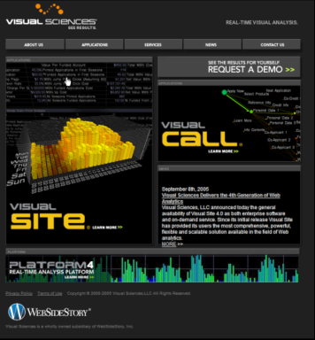

# Validation de l’expérience{#validating-the-experiment}

Une fois que vous avez déployé votre expérience, vous devez vérifier que l’expérience fonctionne correctement.

Comme expliqué dans la section [Modification du paramètre ExpCookieURL (facultatif)](../../home/c-undst-ctrld-exp/t-en-ctrld-exp/c-mod-expckurl-prm.md#concept-215bf86bab4e4ec0b0cc803ec48a8fcf), la page spécifiée dans le paramètre ExpCookieURL dans le fichier de [!DNL Sensor] configuration peut être utilisée pour vous placer dans un groupe d’expériences spécifique.

La page virtuelle par défaut est [!DNL /setcookie.htm], mais vous devez utiliser la valeur que vous définissez dans le paramètre ExpCookieURL.

## Demande de la page de test {#section-8aed3b48d47f4e6c8869c0216f8781b1}

Pour tester un groupe d’expériences spécifique pour votre site Web, votre navigateur doit être configuré pour accepter les cookies et vous ne devez pas avoir de cookie pour ce site Web.

Chaque fois que vous souhaitez tester un nouveau groupe, veillez à effacer vos cookies pour le site Web.

Pour vous placer dans un groupe spécifique au cours d’une expérience spécifique, demandez la page de test avec une chaîne de requête sous la forme suivante :

[!DNL http://] *&lt;[!DNL sitename/?Experiment Name=Group Name]>*

Par exemple :

[!DNL http://www.omniture.com/setcookie.htm?New_Homepage=index2]

Lorsque la demande d’URL virtuelle est envoyée au serveur, [!DNL Sensor] vous identifie en tant que membre du groupe spécifié dans l’expérience spécifiée, puis vous redirige vers la racine du site Web. Vous pouvez désormais accéder à l’emplacement approprié du site Web pour vérifier si le contenu correct s’affiche pour cette expérience et ce groupe.

Si vous deviez taper ce qui suit dans votre navigateur, celui-ci afficherait la page d&#39;accueil du site Web et vous placerait dans le groupe index2 dans le cadre de l&#39;expérience New_Homepage :

[!DNL http://www.omniture.com/setcookie.htm?New_Homepage=index2]

Lorsque les visiteurs du groupe index2 demandent la page d’accueil, le lien graphique &quot;Demander une démo&quot; s’affiche plus haut sur la page, comme dans le graphique suivant :

