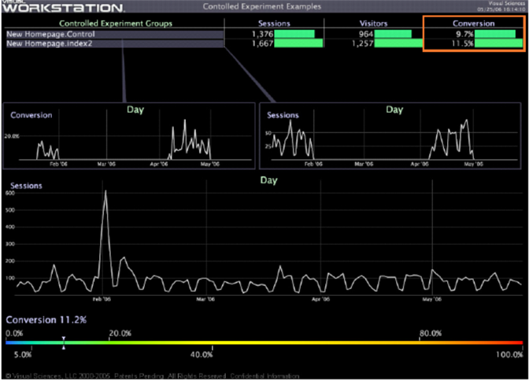

# Évaluation de l’expérience{#evaluating-the-experiment}

{{eol}}

Après avoir exécuté l’expérience jusqu’à ce que le nombre minimal requis de visiteurs ait participé à l’expérience, vous pouvez être assuré d’une fiabilité statistique suffisante pour évaluer les résultats de l’expérience.

Utilisation [!DNL Insight], comparez les mesures ou les indicateurs de performances clés définis dans le cadre de l’hypothèse afin de déterminer si l’expérience a été un succès (c’est-à-dire si l’hypothèse a été validée avec le degré de confiance spécifié).

Dans notre exemple d’expérience, notre hypothèse s’avère correcte si la conversion du visiteur augmente d’au moins 1,5 %, ce qui est le critère de réussite que nous avons défini précédemment.

L’exemple d’espace de travail suivant montre que la Conversion pour le groupe de test index2 était en fait 1,8 % plus élevée que pour la population témoin, ce qui confirme notre hypothèse.

* [Résumé des résultats de l’expérience](../../../home/c-undst-ctrld-exp/c-vw-rslts/c-ev-exp.md#section-24a496c080a04e929764094acb00bab7)
* [Agir en fonction des résultats](../../../home/c-undst-ctrld-exp/c-vw-rslts/c-ev-exp.md#section-1623e26ced524fd9beab48ac1f9165d9)
* [Surveillance de vos actions](../../../home/c-undst-ctrld-exp/c-vw-rslts/c-ev-exp.md#section-1954311950c34637800cbd7c0711983f)

## Résumé des résultats de l’expérience {#section-24a496c080a04e929764094acb00bab7}

Utilisation [!DNL Insight], vous pouvez créer des rapports détaillés pour résumer et illustrer les résultats de votre expérience.

Vous pouvez ensuite utiliser vos rapports, comme illustré dans l’exemple suivant, pour effectuer des recommandations basées sur les résultats, qui sont étayées par les informations visuelles que vous avez fournies dans vos rapports :

## Agir en fonction des résultats {#section-1623e26ced524fd9beab48ac1f9165d9}

Une fois les résultats clairs, vous êtes prêt à agir sur ces résultats en apportant des modifications au niveau de la production aux pages testées, en appliquant ces mêmes modifications à d’autres zones de votre site web, et en veillant à documenter complètement le test, ses résultats et les modifications que vous avez apportées.

## Surveillance de vos actions {#section-1954311950c34637800cbd7c0711983f}

Une fois l’expérience contrôlée terminée et que vous avez implémenté les modifications appropriées, veillez à continuer à surveiller les modifications que vous avez apportées en affichant, par exemple, les mesures de validation, en créant des graphiques de contrôle et en fournissant des mesures de tableau de bord.

Soyez toujours prêt à tester à nouveau votre hypothèse si vous pensez que les changements que vous avez testés et effectués n’ont pas d’incidence sur les résultats originaux.
