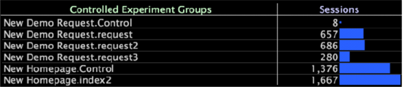

# Affichage des résultats de l’expérience{#viewing-the-experiment-results}

Après avoir ajouté le nouveau champ au fichier Log Processing.cfg et créé la nouvelle transformation Fractionnée et la dimension étendue, vous pouvez afficher la nouvelle dimension étendue que vous avez créée dès que l’étape de saisie rapide du retraitement des données est terminée.

Cette dimension affiche, par défaut, le nombre de sessions pour chacun de vos groupes d’expériences.

**Pour afficher la dimension expérimentale**

* Dans n’importe quel espace de travail de [!DNL Insight], ouvrez un tableau avec la dimension expérimentale que vous avez créée.

   Les éléments de dimension de l’expérience, qui représentent chaque expérience en cours d’exécution et chaque groupe dans chaque expérience, s’affichent avec le nombre actuel de sessions pour chaque groupe. Chaque groupe est nommé au format suivant à l’aide du nom de l’expérience suivi du nom du groupe :

   *Nom de l’expérience.Nom du groupe*

   Par exemple : [!DNL New Homepage.Control]

Le tableau suivant présente la dimension Groupes d’expériences contrôlées qui a été créée dans [!DNL Transformation.cfg] et chacune des expériences et leurs groupes.

L&#39;expérience Nouvelle page d&#39;accueil est présentée au bas du tableau avec ses deux groupes : Contrôle et index2.

Vous pouvez désormais utiliser la dimension de l’expérience et toutes les mesures pertinentes pour explorer et interpréter les résultats de l’expérience, ainsi que créer des rapports utiles détaillant ces résultats.
