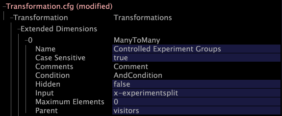

# Modification de Transformation.cfg{#modifying-transformation-cfg}

Maintenant que le champ x-expérience est disponible, vous devez créer une dimension étendue pour inclure le champ x-expérience dans votre jeu de données, ce qui vous permet d’afficher vos résultats dans Insight.

Pour ce faire, vous devez ajouter une nouvelle dimension au fichier [!DNL Transformation.cfg].

Si vous prévoyez d’exécuter plusieurs expériences, vous devez également ajouter une nouvelle transformation Partage au fichier [!DNL Transformation.cfg]. Cette transformation de division sépare les différents noms d’expérience et de groupe afin que les informations soient plus faciles à interpréter. Pour éviter de retraiter vos données si vous deviez ajouter d’autres expériences ultérieurement, Adobe vous recommande d’ajouter la transformation Partage même si vous ne prévoyez pas d’exécuter plusieurs expériences.

La procédure suivante inclut la création de la nouvelle transformation Partage et de la dimension étendue. Si vous ne souhaitez pas ajouter la transformation Partage, ignorez les étapes 5 à 7.

**Modification de Transformation.cfg**

1. Dans [!DNL Insight], ouvrez l’[!DNL Profile Manager] en cliquant avec le bouton droit dans un espace de travail et en cliquant sur **[!UICONTROL Admin]** > **[!UICONTROL Profile Manager]**, ou en ouvrant l’espace de travail Gestion des profils dans l’onglet [!DNL Admin] .
1. Dans la balise [!DNL Profile Manager], cliquez sur **[!UICONTROL Dataset]** pour en afficher le contenu.
1. Cliquez avec le bouton droit de la souris sur la coche en regard de [!DNL Transformation.cfg] et cliquez sur **[!UICONTROL Make Local]**. Une coche pour ce fichier apparaît dans la colonne [!DNL User].
1. Cliquez avec le bouton droit de la souris sur la coche nouvellement créée, puis cliquez sur **[!UICONTROL Open]** > **[!UICONTROL in Insight]**. La fenêtre [!DNL Transformation.cfg] s’affiche.
1. Cliquez sur **[!UICONTROL Transformation]** pour afficher son contenu.
1. Cliquez avec le bouton droit de la souris sur **[!UICONTROL Transformations]** et cliquez sur **[!UICONTROL Add new]** > **[!UICONTROL Split]**.
1. Complétez le nouveau partage sur la transformation des virgules comme illustré dans l’exemple suivant :

   

   >[!NOTE]
   >
   >Vous pouvez saisir n’importe quelle valeur dans le champ Nom .

1. Cliquez avec le bouton droit de la souris sur **[!UICONTROL Extended Dimensions]** et cliquez sur **[!UICONTROL Add new]** > **[!UICONTROL ManyToMany]**.
1. Renseignez la nouvelle dimension comme illustré dans l’exemple suivant :

   

   >[!NOTE]
   >
   >* Vous pouvez saisir n’importe quelle valeur dans le champ Nom .
   >* Si vous n’avez pas inclus la transformation Partage, vous devez saisir &quot;x-expérience&quot; dans le champ [!DNL Input] .

1. Cliquez avec le bouton droit de la souris sur **[!UICONTROL (modified)]** en haut de la fenêtre, puis cliquez sur **[!UICONTROL Save]**.
1. Dans la balise [!DNL Profile Manager], cliquez avec le bouton droit de la souris sur la coche [!DNL Transformation.cfg] dans la colonne [!DNL User], puis cliquez sur **[!UICONTROL Save to]** > **[!UICONTROL profile name]** pour enregistrer les modifications apportées localement au profil de travail.

   >[!NOTE]
   >
   >Le jeu de données commence à se retransformer immédiatement.

   Pour plus d’informations sur [!DNL Transformation.cfg] et les dimensions étendues, consultez le *Guide de configuration des jeux de données*.
