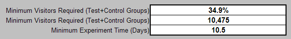

# Feuille de calcul de conception des expériences{#experiment-design-spreadsheet}

{{eol}}

Ce fichier fonctionne non seulement comme une feuille de calcul, mais aussi comme un enregistrement de vos décisions concernant l’expérience.

Si vous avez besoin d’aide pour concevoir votre expérience, vous pouvez utiliser la feuille de calcul de conception de l’expérience (nommée VS Controller Experiment Design.xls par défaut) fournie par Adobe.

La feuille de calcul de la conception de l’expérience peut fournir des inférences statistiques utiles uniquement lorsque la mesure en question est définie en tant que pourcentage de visiteurs qui répondent à certains critères. En d’autres termes, il n’est utile que lors du test d’une hypothèse de mesure basée sur les visiteurs.

**Pour concevoir votre expérience à l’aide du fichier de conception de l’expérience**

1. Si vous disposez d’un accès administrateur à vos serveurs web ou d’applications, accédez à la page [!DNL Sensor] dossier d’installation sur n’importe quel [!DNL Sensor] de votre grappe web. Si vous ne disposez pas d’un accès administrateur, contactez votre gestionnaire de compte d’Adobe pour demander le fichier.
1. Ouvrez le fichier VS managed Experiment Design.xls . (Si vous le souhaitez, vous pouvez renommer ce fichier.)

   La feuille de calcul de la page suivante est un exemple de la façon dont vous remplissez la feuille de calcul lorsque vous vous préparez à tester l’exemple d’hypothèse utilisé dans ce guide.

   

   

   

1. Saisissez le texte ou les valeurs de tous les champs en bleu de ce fichier, qui sont décrits dans le tableau suivant. Les champs calculés sont définis dans le deuxième tableau.

<table id="table_C343F7A4BF3D4E0E9A5E9739EC7C2E10"> 
 <thead> 
  <tr> 
   <th colname="col1" class="entry"> Dans ce champ... </th> 
   <th colname="col2" class="entry"> Spécifiez les  </th> 
  </tr> 
 </thead>
 <tbody> 
  <tr> 
   <td colname="col1"> Titre de l’expérience </td> 
   <td colname="col2"> Nom explicite de l’expérience. </td> 
  </tr> 
  <tr> 
   <td colname="col1"> Description de l’expérience </td> 
   <td colname="col2"> Description textuelle de l’expérience. </td> 
  </tr> 
  <tr> 
   <td colname="col1"> Mesure en cours d’analyse </td> 
   <td colname="col2"> 
Nom de la mesure sur laquelle repose l’expérience. 
 
Exemple : Conversion des visiteurs 
 </td> 
  </tr> 
  <tr> 
   <td colname="col1"> Définition de mesure </td> 
   <td colname="col2"> 
Définition de la mesure sur laquelle repose l’expérience. 
 
Format : Visiteurs[X]/Visitors 
 
Exemple :  Visiteurs[URI='conversionpage.asp']/Visitors
 </td> 
  </tr> 
  <tr> 
   <td colname="col1"> Heure de début prévue </td> 
   <td colname="col2"> Date et heure auxquelles vous souhaitez que l’expérience commence. </td> 
  </tr> 
  <tr> 
   <td colname="col1"> Heure de fin prévue </td> 
   <td colname="col2"> Date et heure auxquelles vous souhaitez que l’expérience se termine. </td> 
  </tr> 
  <tr> 
   <td colname="col1"> Sélections applicables </td> 
   <td colname="col2"> (Facultatif) Nom de dimension et jeu d’éléments ou plage selon lequel vous souhaitez segmenter davantage le jeu de données. </td> 
  </tr> 
  <tr> 
   <td colname="col1"> URI d’expérience </td> 
   <td colname="col2"> URI impliqués dans votre hypothèse. Vous définissez les URI actuels de la population témoin et les URI alternatifs que vous avez créés ou que vous allez créer pour la ou les populations test. </td> 
  </tr> 
  <tr> 
   <td colname="col1"> Mesures prévues pour les sélections d’application </td> 
   <td colname="col2"> En-tête des valeurs de mesure attendues pour votre site web. </td> 
  </tr> 
  <tr> 
   <td colname="col1"> Moyenne des visiteurs par jour </td> 
   <td colname="col2"> Nombre moyen de visiteurs sur votre site Web par jour. </td> 
  </tr> 
  <tr> 
   <td colname="col1"> Conversion des visiteurs </td> 
   <td colname="col2"> Taux de conversion moyen des visiteurs de votre site web. </td> 
  </tr> 
  <tr> 
   <td colname="col1"> L’expérience déterminera si le nom de la mesure pour les groupes de test est ... </td> 
   <td colname="col2"> En-tête de comparaison des valeurs de mesure. </td> 
  </tr> 
  <tr> 
   <td colname="col1"> Supérieur à la valeur de la population témoin ? </td> 
   <td colname="col2"> Définissez ce champ sur True si vous souhaitez pouvoir conclure que la mesure du groupe de test a augmenté pendant l’expérience. Définissez ce champ sur False pour réduire le nombre de visiteurs nécessaire pour tirer des conclusions. Adobe vous recommande de la définir sur True. </td> 
  </tr> 
  <tr> 
   <td colname="col1"> Inférieur à la valeur de la population témoin ? </td> 
   <td colname="col2"> Définissez ce champ sur True si vous souhaitez pouvoir conclure que la mesure du groupe de test a diminué au cours de l’expérience. Adobe vous recommande de la définir sur True. </td> 
  </tr> 
  <tr> 
   <td colname="col1"> Au moins (niveau de détection) </td> 
   <td colname="col2"> Pourcentage selon lequel la mesure du groupe de test doit être supérieure ou inférieure à celle du groupe de contrôle. </td> 
  </tr> 
  <tr> 
   <td colname="col1"> Avec un degré de confiance d’au moins </td> 
   <td colname="col2"> Degré de confiance souhaité pour les valeurs du groupe de test. Le degré de confiance détermine le nombre de faux positifs pour mesurer la probabilité que l’attente indiquée soit vraie. </td> 
  </tr> 
  <tr> 
   <td colname="col1"> et un niveau de puissance </td> 
   <td colname="col2"> Niveau de puissance souhaité pour les valeurs du groupe de test. Le niveau de puissance détermine le nombre de faux négatifs. </td> 
  </tr> 
  <tr> 
   <td colname="col1"> % des visiteurs </td> 
   <td colname="col2"> En-tête pour le pourcentage des valeurs de visiteurs. </td> 
  </tr> 
  <tr> 
   <td colname="col1"> Groupe de tests </td> 
   <td colname="col2"> Pourcentage des visiteurs que vous souhaitez inclure dans le groupe test. Vous pouvez lire avec ce nombre jusqu’à ce que la valeur du champ Total (généralement 100 %) de la section Visiteurs soit égale ou supérieure à la valeur du champ Minimum Visiteurs obligatoires (Test+Groupes de contrôle) , qui sont tous deux décrits dans le tableau suivant. </td> 
  </tr> 
  <tr> 
   <td colname="col1"> Groupe de contrôle </td> 
   <td colname="col2"> Pourcentage des visiteurs que vous souhaitez inclure dans la population témoin. </td> 
  </tr> 
  <tr> 
   <td colname="col1"> Autres notes de conception </td> 
   <td colname="col2"> Toutes les notes que vous souhaitez enregistrer à des fins de référence ultérieure. </td> 
  </tr> 
 </tbody> 
</table>

Les autres champs sont calculés à partir des valeurs que vous avez saisies et sont décrits dans le tableau suivant.

| Champ | Description |
|---|---|
| Mesures prévues pour les sélections d’application | En-tête des valeurs de mesure attendues pour votre site web. |
| Visiteurs prévus par période | Ce champ est normalement calculé automatiquement par la feuille de calcul. Elle part du principe que la plupart des jours, le site web reçoit beaucoup plus de nouveaux visiteurs que les visiteurs récurrents. Si ce n’est pas le cas, le calcul de cette cellule doit être remplacé par le nombre réel de visiteurs attendus pendant l’expérience. |
| Score Z calculé pour l’erreur de type I | Score Z pour un résultat faux positif. Il s’agit d’un calcul statistique intermédiaire. |
| Score Z calculé pour l’erreur de type II | Score Z pour un résultat faux négatif. Il s’agit d’un calcul statistique intermédiaire. |
| Nombre minimal de visiteurs requis (groupes de contrôle+test) | Nombre minimum de visiteurs requis dans votre expérience pour satisfaire le degré de confiance, le niveau d’alimentation et le score Z spécifié, exprimé en pourcentage de la valeur du champ Visiteurs attendus par période . |
| Nombre minimal de visiteurs requis (groupes de contrôle+test) | Nombre minimum de visiteurs nécessaires à votre expérience pour satisfaire à votre degré de confiance, à votre niveau de puissance et à votre score Z spécifié. Cette valeur doit être inférieure ou égale à la valeur du champ Total (généralement 100 %) de la section Visiteurs . |
| Durée d’expérience minimale (jours) | Nombre minimum de jours pendant lesquels vous devez exécuter l’expérience afin d’atteindre le degré de confiance, le niveau de puissance et le score Z spécifiés. Ce nombre calculé est soumis aux mêmes problèmes que ceux décrits dans le champ Visiteurs attendus par période . Dans le cas d’un site web comptant de nombreux visiteurs récurrents, le champ Durée minimale de l’expérience (jours) correspond au nombre de jours attendu avant que le nombre de visiteurs uniques soit égal à la valeur du champ Nombre minimum de visiteurs requis . |
| Visiteurs | En-tête des valeurs des visiteurs. |
| Groupe de tests | Nombre de visiteurs requis dans le groupe de test. |
| Groupe de contrôle | Nombre de visiteurs requis dans la population témoin. |
| Total (Généralement 100 %) | Nombre total de visiteurs nécessaires à l’expérience. Cette valeur doit être égale ou supérieure à la valeur du champ Minimum Visiteurs requis (Test+Groupes de contrôle) . |
| Précision du groupe de test (au niveau de confiance de la cible) | Pourcentage indiquant qu’il y a une chance égale au degré de confiance spécifié que la valeur mesurée de la mesure calculée pour le groupe de test sera comprise dans ce pourcentage de sa valeur réelle. |
| Précision de la population témoin (au niveau de confiance cible) | Pourcentage indiquant qu’il y a une chance égale au degré de confiance spécifié que la valeur mesurée de la mesure calculée pour la population témoin se trouve dans la limite de ce pourcentage de sa valeur réelle. |
| Score Z (à précision cible) | Nombre d’écarts types entre une valeur donnée et la moyenne de test. |
| Degré de confiance réel (à l’intervalle cible) | Le degré de confiance atteint pour l&#39;expérience. Le degré de confiance mesure la probabilité que l’attente déclarée soit vraie. |
| Intervalle réel (au niveau de confiance cible) | Intervalle de confiance obtenu pour l’expérience, qui fournit une plage estimée de valeurs susceptible d’inclure un paramètre de population inconnu. Cette plage est calculée à partir d’un ensemble donné de données d’exemple. |

Vous devez consulter la valeur du champ Minimum Visiteurs requis (Test+Groupes de contrôle) . . .

et comparez-la à la valeur du champ Total dans la variable [!DNL Visitors] colonne .

Pour que votre expérience soit statistiquement valide, la valeur du champ Total (généralement 100 %) doit être égale ou supérieure à la valeur du champ Minimum Visiteurs requis (Test+Groupes de contrôle) .

Étant donné les entrées fournies, ce que montre la feuille de calcul de l’exemple, c’est que 10 475 visiteurs doivent participer à cette expérience pour atteindre le taux de confiance de 95 % entré (le degré de confiance suggéré minimal pour toute expérience contrôlée, bien que vous puissiez augmenter ce nombre). L’expérience telle qu’elle est actuellement conçue comprend 30 000 visiteurs, soit bien plus que le nombre minimum de visiteurs requis.

Si vous conservez le même nombre de jours, vous pouvez augmenter le degré de confiance tant que le nombre total de visiteurs continue à satisfaire ou à dépasser le nombre minimal requis.

1. Enregistrez le fichier pour vos enregistrements, puis utilisez les informations du fichier pour configurer l’expérience à l’aide de la feuille de calcul de configuration de l’expérience. Pour plus d’informations sur cette feuille de calcul, voir [Configuration et déploiement de l’expérience](../../home/c-undst-ctrld-exp/t-crt-ctrld-exp/c-cnfg-dply-exp.md#concept-50f1de0242904698937bb72b3ea1b429).
