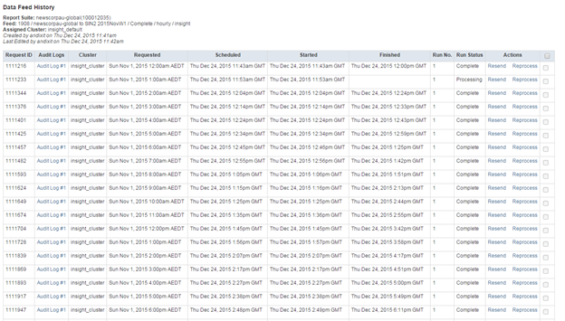

# Validation des flux de données historiques{#validating-historical-data-feeds}

Guide rapide des étapes minimales requises pour valider et configurer des flux de données historiques.

## Étapes de validation de la cohérence des flux de données {#section-777b2c627a354627a02feb9461e23038}

1. Connectez-vous à *drdents* (https://oasis.omniture.com/drteeth/)
1. Accédez à Administration de SiteCatalyst -> Définition du flux de données (nouveau)
1. Accéder à l’emplacement du serveur (Ex. Dallas, Londres...) Selon l’emplacement de votre entreprise.
1. Fournissez RSID et sélectionnez le type de flux Insight et cliquez sur *search*.

   

1. Identifiez le nom réel du flux pour votre client.
1. Cliquez sur Historique dans la section Actions. 

   Recherchez les erreurs dans le champ d’état et, si un flux est dans l’état d’erreur, sélectionnez-le et cliquez sur Retraiter. Si l’erreur s’est produite pour plusieurs requêtes, envoyez un courrier électronique à *`dataworkbench@adobe.com`* l’aide de l’ID de flux et des détails de la suite de rapports pour le retraitement.

1. Une post-validation vérifie les journaux dans le dossier brut de l&#39;emplacement NAS.

