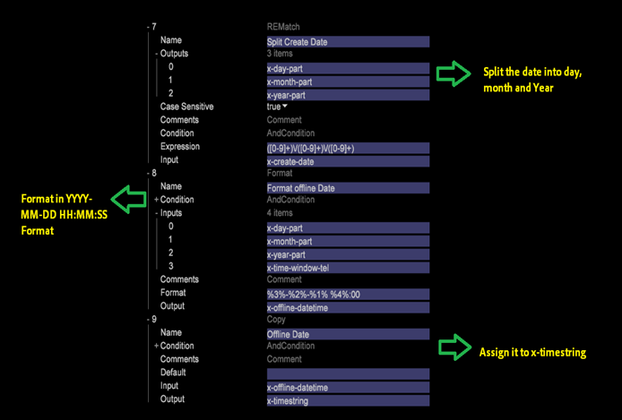

# Configuration de l’heure de l’événement{#setting-up-event-time}

{{eol}}

Cette section explique comment créer des horodatages pour un jeu de données de Data Workbench.

## Présentation de l’heure de l’événement {#section-e10ef2b5b6244dc5b215836e3c77d663}

Heure de l’événement est la date et l’heure auxquelles la requête (ou l’événement) se produit.

Généralement, pour les données en ligne, *x_hit_time_gmt* est utilisé comme champ d’horodatage. L’heure de l’appel peut être utilisée comme horodatage pour les données hors ligne (telles que les données du centre d’appels). Il s’agit d’un champ obligatoire et toutes les sources de données doivent comporter un champ pouvant être utilisé comme horodatage. Ces informations doivent être fournies par votre organisation.

Dans DWB, les variables prédéfinies suivantes capturent l’horodatage :

<table id="table_C24BD56CEB4E42F68D645EBB65585D16"> 
 <tbody> 
  <tr> 
   <td colname="col1"><i>x-timestamp</i> </td> 
   <td colname="col2"> 
 Date et heure (GMT) auxquelles la demande a été reçue par le serveur. Le temps est exprimé sous la forme du nombre de 100 nanosecondes écoulées depuis le 1er janvier 1600. 
 
Exemple : 127710989320000000 serait <i>x-timestamp</i> pour 11:28:52.0000000 le mardi 13 septembre 2005. 
 </td> 
  </tr> 
  <tr> 
   <td colname="col1"><i>x-timestring</i> </td> 
   <td colname="col2"> <i>x-timestamp</i> au format AAAA-MM-JJ HH:MM:SS.mmm. </td> 
  </tr> 
  <tr> 
   <td colname="col1"><i>x-unixtime</i> </td> 
   <td colname="col2"> <i>x-unixtime</i> est l’heure de l’époque qui représente le nombre de secondes depuis le 1er janvier 1970, à 00:00:01. </td> 
  </tr> 
 </tbody> 
</table>

En fonction du format du champ de date, l’horodatage x ou x-unixtime ou x-timestring est utilisé. Par exemple, si les données entrantes sont au format AAAA-MM-JJ, la chaîne x-timestring est utilisée.

L’horodatage est défini dans l’un des formats et DWB génère en interne les deux autres formats. En outre, il s’agit de champs DWB prédéfinis et le même nom ne doit être utilisé pour aucun autre champ.

## Fuseaux horaires définis dans DWB {#section-3cdd12254342442b917376661e1d9c9f}

Si le champ de date contient l’un des fuseaux horaires mentionnés ci-dessous, le service de traitement des données prend en compte la ligne entière de ce fuseau horaire spécifique. Par exemple, la date définie pour un fichier est 2015-01-01 00:00:00 gmtet un autre fichier a la valeur 2015-01-01 00:00:00 cst , la date du premier fichier sera prise en compte dans le fuseau horaire GMT, tandis que la date du second fichier sera dans le fuseau horaire du CST.

| Code | Fuseau horaire |
|---|---|
| gmt | Greenwich Mean |
| est | Oriest Standard |
| edt | Heure d’été de l’Est |
| cst | Central Standard |
| cdt | Central Daylight |
| mst | Mountain Standard |
| mdt | Rocheuse |
| pst | Pacifique |
| pdt | Jour Pacifique |

>[!NOTE]
>
>DWB traite uniquement les Fuseaux horaires mentionnés ci-dessus.

## Définition des fuseaux horaires personnalisés {#section-7c351921f22b439b81c73f40d5b47536}

Le DWB ne traite pas le décalage dans le fuseau horaire. Pour tenir compte du décalage dans le fuseau horaire, les données doivent être formatées dans ce fuseau horaire de décalage.

Exemple : pour prendre en compte le format de date dans le fuseau horaire du CST, les données doivent être fournies en AAAA-MM-JJ HH.:MM:SS Format UTC +/-HMM du client.

2015-10-18 05:00:00 UTC -0200

## Comment définir l’heure/l’horodatage de l’événement {#section-81507080f0b44ae6b83d3650ba019812}

En fonction du format du champ de date, *x-timestamp, x-unixtime* ou *x-timestring* est utilisée. Dans l’exemple ci-dessous, depuis la variable *x-hit_time_gmt* vient au format epoc unix, *x-unixtime* est utilisée.

Dans le DWB [!DNL foundation.cfg] (ou tout autre fichier de configuration situé sous le dossier de traitement du journal du jeu de données), utilisez la transformation Copier pour définir l’heure de l’événement comme illustré ci-dessous :

En fonction du format du champ de date, la variable x-timestamp, x-unixtime ou x-timestring est utilisée. Dans l’exemple ci-dessous, étant donné que x-hit_time_gmt est fourni au format d’époque unix, x-unixtime est utilisé.

Dans le fichier insight foundation.cfg (ou toute autre configuration sous le dossier de traitement des journaux de données), utilisez la transformation Copier pour définir l’heure de l’événement comme illustré ci-dessous : 

Si la date dans est AAAA-MM-JJ HH:MM:Format SS.mmm, la mesure x-timestring est utilisée. Exemple : Si le champ de date est dans un format autre que celui défini dans le DWB, par exemple AAAA/MM/JJ, formatez-le d’abord dans l’un des formats d’horodatage acceptés par le DWB, puis affectez-le à la variable correspondante. Dans la capture d’écran ci-dessous, la date est d’abord convertie au format AAAA-MM-JJ, puis affectée à la variable *x-timestring*. 
