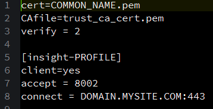
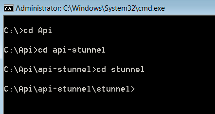

# Configuration de Query API{#query-api-setup}

{{eol}}

Guide rapide pour configurer une API de requête.

Suivez les étapes ci-dessous pour configurer l’API de requête :

1. Acquisition de certificats de l’API de requête

   Envoyer un courrier électronique à l’équipe des opérations techniques de l’Adobe de courrier électronique - `Dataworkbench@adobe.com`.

   Indiquez le nom du CN que vous souhaitez utiliser pour l’API de requête ( fournissez un nom générique comme `<Client>` API de requête).

   >[!NOTE]
   >
   >Les opérations techniques génèrent le certificat et le chargent dans une URL. Veuillez le faire savoir aux consultants Adobe après avoir reçu la notification des opérations techniques concernant la génération réussie du ticket afin que le ticket vous soit renvoyé par eux.

1. Téléchargement et extraction de l’entonnoir d’API. Recevez le fichier api-stunnel de votre consultant.

   Assurez-vous que Perl est installé sur votre ordinateur.

   Dans le dossier extrait (le chemin du dossier dans lequel vous copiez le fichier), copiez votre certificat d’API de requête dans le *stunnel* dossier.

1. Configuration du fichier Stunnel.conf

   Il doit y avoir un fichier appelé *stunnel.conf* à l’intérieur de *Stunnel* (où vous avez copié votre certificat).

   Modifiez le fichier dans le Bloc-notes.

   

   Modifiez les paramètres comme suit : 

   Deux paramètres doivent être modifiés dans ce fichier.

   * *Cert* = nom sur votre certificat. Dans cet exemple, il s’agit de Aadhithiya Ramani QAPI Client.pem.
   * *Connexion* = nom du serveur pour votre DPU principal.

1. Copie de la *Query.pm*.

   Le *Query.pm* sera disponible dans le dossier API Insight.

   Copiez le *Query.pm* et collez-le dans votre dossier de bibliothèque Perl (il s’agit généralement de *C:\Perl64\lib *, mais vérifiez où le Perl est installé sur votre ordinateur).

1. Modifiez le *api-http.pl* fichier

   Le fichier api-http.pl sera disponible dans le dossier api-stunnel.

   Un seul paramètre à modifier

   *Mon $profile* = nom du profil pour lequel vous configurez l’API de requête.

1. Installez l’API de requête.

   Ouvrez l’invite de commande dans votre système en tant qu’&quot;Administrateur&quot; et accédez au répertoire dans lequel vous avez extrait le fichier *stunnel* comme illustré : 

   Exécutez la commande suivante : *.\stunnel -install*. 

   Une fois la commande exécutée, une fenêtre s’affiche, indiquant que la fonction *stunnel* est installé.

   >[!NOTE]
   >
   >Une fois la commande exécutée, une fenêtre s’affiche, indiquant que la fonction *stunnel* est installé.

1. Test de la configuration du entonnoir de l’API de requête

   L’étape finale de ce processus consiste à tester la configuration de l’API de requête. Dans l’invite de commande que vous avez utilisée pour installer le répertoire api-stunnel. 

   Exécutez le script Perl disponible dans ce dossier à l’aide de la commande suivante* perl api-http.pl*. 

   Après l’exécution du script, les résultats doivent ressembler à la capture d’écran ci-dessous (la date, l’heure et les valeurs du résultat varient en fonction de l’heure et des autres paramètres du profil sur lequel vous avez configuré l’API de requête (à l’étape 6). 
